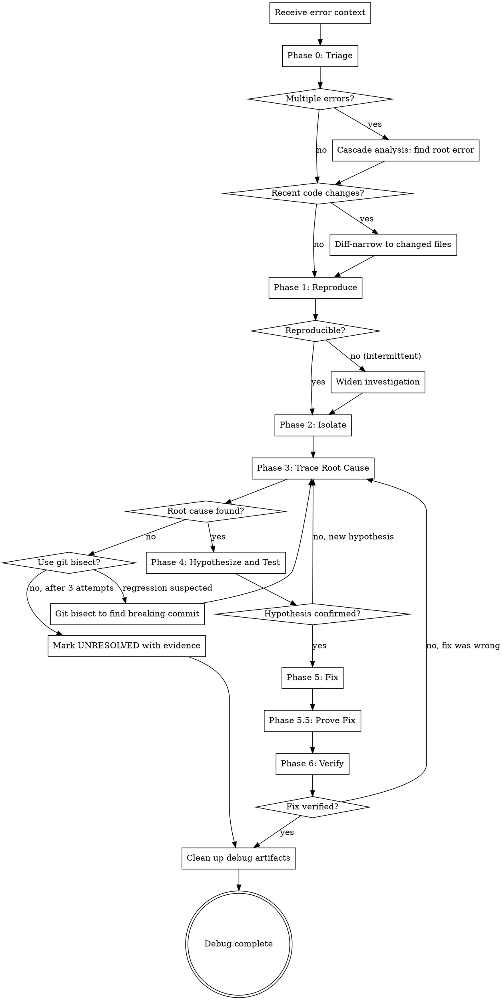
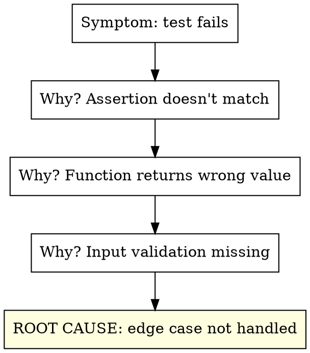
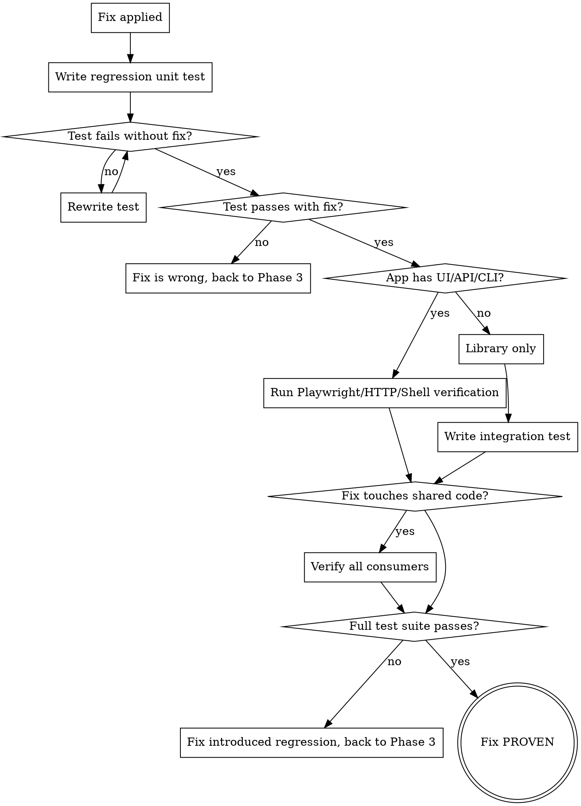

# Auto-Debug

Systematic root cause analysis and resolution for any error encountered during the implementor pipeline. Reproduces the issue, traces the root cause, forms and tests hypotheses, then implements and verifies the fix. Zero human interaction.

**Core principle:** Never guess. Reproduce first, trace second, hypothesize third, fix last. A fix without a root cause is a bandage, not a solution.

<HARD-GATE>
This skill is part of the implementor pipeline. Do NOT invoke superpowers:systematic-debugging or any other superpowers skill. The implementor handles debugging internally.
</HARD-GATE>

## Iron Law

```
NO FIX WITHOUT ROOT CAUSE INVESTIGATION FIRST
```

No exceptions. Not for "obvious" bugs. Not for "I've seen this before." Not for "the fix is simple." Investigate first, always.

Violating the letter of this rule is violating the spirit.

## When to Use

- Test failures during auto-impl or auto-test
- Build errors during auto-setup
- Runtime errors during auto-e2e
- Review issues that require debugging to understand
- Any unexpected behavior in any pipeline phase
- When invoked directly for standalone debugging

## Process



## Phase 0: Triage (Before Reproduction)

When receiving error context, classify and prioritize before diving in:

### Error Classification

Auto-detect the error category from the error output and apply the specialized strategy:

| Error Pattern | Category | Fast-Path Strategy |
|--------------|----------|-------------------|
| `TypeError`, `ReferenceError`, `undefined is not a function` | Type/Reference | Read the exact line, check variable scope and types |
| `ENOENT`, `MODULE_NOT_FOUND`, `Cannot find module` | Missing File/Module | Trace the import chain, check paths and package.json |
| `ECONNREFUSED`, `ETIMEDOUT`, `fetch failed` | Network/Connection | Check if service is running, verify URLs and ports |
| `SyntaxError`, `Unexpected token` | Parse Error | Check the file for syntax issues, often a bad merge |
| `ENOMEM`, `heap out of memory`, `Maximum call stack` | Resource Exhaustion | Look for infinite recursion, unbounded loops, memory leaks |
| `EACCES`, `Permission denied` | Permission | Check file permissions, user context, sudo requirements |
| `Timeout`, `exceeded`, `took too long` | Timeout/Hang | See Timeout Debugging section below |
| `race condition`, flaky pass/fail pattern | Concurrency | See Concurrency Debugging section below |
| `version`, `peer dep`, `conflicting` | Dependency Conflict | See Dependency Conflict Resolution section below |
| Multiple unrelated errors in output | Cascade | See Cascade Analysis section below |
| `BREAKING CHANGE`, `deprecated`, `not a function` | API Migration | Check changelog of updated dependency, find migration guide |

### Diff-Based Narrowing

**Before investigating broadly, check what changed recently:**

1. Run `git diff HEAD~5` (or since last known-good state) to see recent changes
2. Cross-reference changed files with the error's stack trace
3. If a changed file appears in the stack trace — that's your starting point
4. If no overlap — the bug may be in an unchanged dependency or environment

**This eliminates 80% of investigation time.** Most bugs are in recently changed code.

### Cascade Analysis (Multiple Errors)

When the error output contains multiple failures:

1. **Don't fix them all.** Find the root error that causes the cascade
2. **Sort errors by dependency order** — earlier failures often cause later ones
3. **Look for the first error chronologically** — not the loudest one
4. **Group errors by file** — if 10 tests in the same file fail, the file (not the tests) is broken
5. **Check for setup/teardown failures** — a broken `beforeAll` cascades to every test in the suite

```
Rule: Fix ONE error. Re-run. Count how many others disappear.
Repeat until zero errors remain.
```

**Output:** Error category, narrowed file scope (from diff), and if multiple errors: the identified root error.

## Phase 1: Reproduce

Before anything else, reproduce the error reliably:

1. Run the exact command that failed
2. Capture the full error output (stdout, stderr, exit code)
3. Note the exact error message, stack trace, and file:line references
4. Run it again to confirm it's consistent (not flaky)

**If intermittent:** Run 3 times. Note which runs fail and which pass. Look for timing dependencies, race conditions, or external state.

**Output:** Exact reproduction steps and full error output.

## Phase 2: Isolate

Narrow down where the error originates:

1. **Read the stack trace** — identify the originating file and line
2. **Read the failing code** — understand what it's trying to do
3. **Read the test** (if test failure) — understand what's being asserted
4. **Identify the boundary** — is this a code error, config error, dependency error, or environment error?

**Isolation techniques:**
- For test failures: run the single failing test in isolation
- For build errors: check the specific file that fails to compile
- For runtime errors: inject strategic logging (see Log Injection below)
- For import errors: trace the dependency chain
- For timeout errors: identify what's blocking (see Timeout Debugging below)
- For flaky tests: check for shared mutable state between tests (see Concurrency Debugging below)

### Log Injection (Tracing Execution Flow)

When the error is opaque (no clear stack trace, wrong output but no crash):

1. **Identify the code path** from input to the point of failure
2. **Add temporary `console.log`/`print` statements** at each decision point:
   ```
   console.log('[DEBUG:auto-debug] functionName entered, args:', JSON.stringify(args))
   console.log('[DEBUG:auto-debug] branch taken: else-clause at line 42')
   console.log('[DEBUG:auto-debug] value at checkpoint:', variable)
   ```
3. **Use the `[DEBUG:auto-debug]` prefix** so logs are easy to find and remove
4. **Run the failing scenario** and read the log output to trace the actual execution path
5. **Compare actual path vs expected path** — the divergence point is the bug
6. **MANDATORY: Remove all `[DEBUG:auto-debug]` log lines after debugging.** Search the codebase for the prefix and delete every one. Debug logging must never be committed.

### Git Bisect (Finding the Breaking Commit)

When the error is a regression (something that used to work):

1. Identify the last known-good commit (or estimate: `HEAD~10`, last release tag)
2. Run git bisect:
   ```bash
   git bisect start
   git bisect bad HEAD
   git bisect good <known-good-commit>
   # For each commit git checks out:
   # Run the failing test, then: git bisect good OR git bisect bad
   ```
3. Git bisect will identify the exact commit that introduced the regression
4. Read that commit's diff — the bug is in those changes
5. **Always run `git bisect reset` when done** to restore the working tree

**When to use:** When you can't tell from the current code why something broke, and the git history is available. Bisect turns an O(n) search into O(log n).

**Output:** The specific file, function, and line where the error originates, plus the error category.

## Phase 3: Trace Root Cause

Don't stop at the symptom. Trace to the actual cause:



**The Five Whys:** Ask "why?" at least 3 times. The first answer is rarely the root cause.

**Common root cause categories:**

| Category | Examples | Fix Approach |
|----------|----------|-------------|
| Logic error | Off-by-one, wrong operator, missing condition | Fix the logic |
| Missing handling | Null/undefined not checked, error not caught | Add the handling |
| Wrong assumption | API changed, data shape different, timing wrong | Update the assumption |
| Dependency issue | Version mismatch, missing package, wrong config | Fix the dependency |
| State problem | Stale cache, race condition, leaked state between tests | Fix the state management |
| Environment | Missing env var, wrong path, permission denied | Fix the environment |

**Output:** The root cause, stated as a single sentence. "The root cause is [X] because [evidence]."

## Phase 4: Hypothesize and Test

Before writing any fix:

1. **State the hypothesis:** "If I [change X], the error will be resolved because [root cause reasoning]"
2. **Predict the outcome:** "After the fix, the test should pass with [expected output]"
3. **Consider side effects:** "This change could affect [Y and Z] — I need to verify those too"

**If the hypothesis is wrong:** Don't iterate on the same theory. Go back to Phase 3 and look for a different root cause.

**Max 3 hypotheses.** If three hypotheses fail, the root cause analysis was wrong. Start over from Phase 2 with a wider scope.

## Phase 5: Fix

Apply the minimal fix that addresses the root cause:

1. Change only what's necessary to fix the root cause
2. Do NOT refactor, clean up, or "improve" unrelated code
3. **Write a regression test that reproduces the original bug** (see Phase 5.5)
4. If the fix changes behavior, update existing tests
5. Commit the fix with a descriptive message

**Minimal means minimal.** A one-line fix for a one-line bug. Don't turn a bugfix into a feature.

## Phase 5.5: Prove the Fix (MANDATORY)

<HARD-GATE>
Every fix MUST be proven through automated verification. A fix without proof is not a fix — it's a hope. Use every available verification method.
</HARD-GATE>

### Layer 1: Regression Unit Test (Always Required)

Write a unit test that:
1. **Reproduces the original bug** — the test would FAIL without your fix
2. **Passes with your fix applied** — proves the fix works
3. **Prevents future regression** — stays in the test suite permanently

```
Test name pattern: "should [expected behavior] when [condition that caused the bug]"
Example: "should return empty array when filter matches no items"
         (not: "test bug fix #42")
```

**Verify the test proves causation:**
1. Temporarily revert the fix
2. Run the regression test — it MUST fail
3. Re-apply the fix
4. Run the regression test — it MUST pass

If the test passes both with and without the fix, the test is wrong. It doesn't prove anything. Rewrite it.

### Layer 2: Runtime Verification (When Applicable)

After the unit test proves the fix at the code level, verify it works in the running application. Detect the app type and verify accordingly:

**Web applications (Playwright MCP):**
1. Start the application
2. Navigate to the affected page/flow
3. Reproduce the user action that triggered the bug
4. Use `browser_snapshot` to verify correct state
5. Use `browser_take_screenshot` to capture evidence
6. Use `browser_console_messages` to verify no JS errors
7. Use `browser_network_requests` to verify no failed requests

**API applications (HTTP):**
1. Start the server
2. Send the request that triggered the bug
3. Verify the response status, body, and headers are correct
4. Send edge-case variations of the same request
5. Capture response bodies as evidence

**CLI applications (Shell):**
1. Run the command that triggered the bug
2. Verify stdout, stderr, and exit code
3. Run edge-case variations
4. Capture all output as evidence

**Libraries (Import and call):**
1. Write an integration test that uses the library as a consumer would
2. Verify the bug scenario produces correct results
3. Run the integration test

### Layer 3: Broader Impact Verification (When Fix Touches Shared Code)

If the fix modifies shared code (utilities, middleware, base classes, config):
1. Identify all callers/consumers of the changed code
2. Run their tests specifically
3. If no tests exist for those callers, write smoke tests
4. Verify no behavior changed for existing consumers

### Verification Decision Tree



## Phase 6: Final Verification

After fix is proven:

1. Run the originally failing test/command — it should pass
2. Run the regression test from Phase 5.5 — it should pass
3. Run the full test suite — no regressions
4. If runtime verification was done (Playwright/HTTP/CLI), review evidence
5. If the error was in E2E, re-run the failing E2E scenario
6. If the error was environment-related, verify the setup phase still works
7. Verify the predicted outcome from Phase 4 matches reality
8. Commit the regression test alongside the fix

**If verification fails:** The fix was wrong or incomplete. Go back to Phase 3, not Phase 5. The root cause needs re-investigation, not a bigger patch.

## Advanced Debugging Techniques

### Concurrency Debugging (Race Conditions, Flaky Tests)

**Symptoms:** Test passes sometimes, fails sometimes. Or fails only when run with other tests but passes in isolation.

**Investigation:**

1. **Shared mutable state:** Look for global variables, singletons, module-level caches, or database state that isn't reset between tests
2. **Timing dependencies:** Look for `setTimeout`, `setInterval`, unresolved promises, or missing `await`
3. **Resource contention:** Look for tests that use the same port, file, or database table
4. **Order dependency:** Run the failing test in isolation. If it passes alone, another test is leaking state

**Techniques:**
- Run the test suite with `--randomize` or `--shuffle` flag to expose order dependencies
- Add `beforeEach`/`afterEach` cleanup to reset shared state
- For async issues: check every `async` function has a matching `await` at the call site
- For timer issues: use fake timers (`jest.useFakeTimers()`, `sinon.useFakeTimers()`)
- For promise issues: look for fire-and-forget promises (missing `await` or `.catch`)

**Root cause pattern:** "Test A mutates [shared resource] and test B reads it without reset."

### Timeout and Hang Debugging

**Symptoms:** Process hangs, test times out, command never completes.

**Investigation:**

1. **Identify what's blocking:**
   - Unresolved promise? Missing callback? Deadlocked async operation?
   - Waiting for network that will never respond? (Missing mock, wrong URL, service down)
   - Infinite loop? (Add a counter log to suspect loops)
   - Waiting for stdin/user input? (Process expects interaction that isn't coming)

2. **Narrowing technique:**
   - Add timeout logging: log a message before and after each suspect async operation
   - The last "before" log without a matching "after" is the hang point
   - For Node.js: use `--inspect` flag and check for pending async operations
   - For tests: reduce the timeout to fail fast (`jest --testTimeout=5000`)

3. **Common causes:**
   | Hang Pattern | Cause | Fix |
   |-------------|-------|-----|
   | Test hangs after all assertions pass | Open handle (server, DB connection, timer) | Close/dispose in `afterAll` |
   | Hangs on import | Circular dependency with side effects | Break the circular import |
   | Hangs on network call | No mock, real service not running | Add mock or start service |
   | Hangs intermittently | Race condition in async setup | Add proper await/synchronization |

### Dependency Conflict Resolution

**Symptoms:** `peer dep` warnings, version mismatch errors, `Cannot find module`, or subtle runtime errors after `npm install`.

**Investigation:**

1. **Check the dependency tree:**
   ```bash
   npm ls <package-name>        # Show all versions of a specific package
   npm ls --all | grep "WARN"   # Find peer dep warnings
   ```
2. **Check for version conflicts:**
   - Two packages requiring incompatible versions of the same dependency
   - A package using `require()` expecting CJS but getting ESM (or vice versa)
   - Lock file drift: `package-lock.json` doesn't match `package.json`

3. **Resolution strategies:**
   | Conflict Type | Fix |
   |--------------|-----|
   | Peer dep mismatch | Align to the version range that satisfies both peers |
   | Duplicate packages | Add `overrides` (npm) or `resolutions` (yarn) in package.json |
   | CJS/ESM mismatch | Check the package's `exports` field, use correct import syntax |
   | Lock file drift | Delete lock file + `node_modules`, reinstall from scratch |
   | Type version mismatch | Align `@types/` package version with the runtime package version |

### Environment Fingerprinting

**Symptoms:** "Works on my machine" or "Works locally but fails in CI" or "Worked yesterday."

**Capture this environment fingerprint when the error seems environment-related:**

```bash
# Runtime versions
node --version && npm --version       # Node.js
python --version && pip --version     # Python
go version                            # Go
rustc --version && cargo --version    # Rust

# OS and shell
uname -a || ver                       # OS info
echo $SHELL $BASH_VERSION             # Shell info

# Key env vars (DO NOT log secrets)
env | grep -E '^(NODE_ENV|PATH|HOME|CI|DATABASE_URL|PORT)='

# Disk and memory
df -h . && free -h                    # Space and memory (Linux)

# Package state
npm ls --depth=0 2>&1 | head -30     # Installed packages
```

**Compare fingerprints** between the working and broken environments. Differences in versions, env vars, or paths are likely the cause.

**Common environment causes:**
- `NODE_ENV=production` vs `development` (changes which dependencies load)
- Different Node/Python versions (syntax or API differences)
- Missing env vars (`.env` file not copied, secret not set in CI)
- Different OS (path separators, case sensitivity, line endings)
- Stale `node_modules` (delete and reinstall)

### Error Message Decoding

Don't take error messages at face value. Common misreadings:

| Error Says | Often Actually Means |
|-----------|---------------------|
| `Cannot find module 'X'` | X exists but has a broken export, or a transitive dep is missing |
| `X is not a function` | X was imported but is `undefined` — check the export name |
| `Maximum call stack exceeded` | Infinite recursion, often from circular references |
| `ECONNREFUSED 127.0.0.1:3000` | The server isn't running, not a network issue |
| `Unexpected token '<'` | Server returned HTML (error page) instead of JSON |
| `Cannot read property 'X' of undefined` | The PARENT object is undefined — investigate one level up |
| `EPERM: operation not permitted` | File is locked by another process, or antivirus blocking |
| `ERR_MODULE_NOT_FOUND` | ESM/CJS mismatch — file exists but wrong module system |
| `Jest encountered an unexpected token` | Missing transform for file type (JSX, TS, ESM) |
| `ENOMEM` | Not always out of memory — can be too many open files or processes |

## Integration with Pipeline

Auto-debug is called by other implementor skills when they encounter failures:

| Calling Skill | Trigger | Debug Scope |
|---------------|---------|-------------|
| `auto-setup` | Build fails, tests can't run | Environment, dependencies, config |
| `auto-impl` | Tests fail after implementation | Implementation code, test code |
| `auto-test` | New tests fail or break existing | Test logic, missing edge cases |
| `auto-e2e` | App won't start, scenarios fail | Runtime behavior, integration |
| `auto-review` | Reviewer identifies bugs | Code correctness |
| `production-readiness` | Gates fail | Whatever the gate checks |

**When called by another skill:**
- Receive the error context (command, output, file references)
- Execute the full debug process (Phases 1-6)
- Report back: RESOLVED (with fix details) or UNRESOLVED (with investigation evidence)

**When invoked standalone:**
- Receive a bug description or error report
- Execute the full debug process
- Commit the fix and report

## Dispatch as Subagent

When called from auto-impl or other skills, dispatch as a subagent:

```
Agent tool (general-purpose):
  description: "Debug: [error summary]"
  prompt: |
    You are debugging a failure in the implementor pipeline.

    ## Error Context
    [Full error output, stack trace, command that failed]

    ## Files Involved
    [Files referenced in the error]

    ## What Was Attempted
    [What the previous subagent was trying to do]

    ## Your Job
    Follow the auto-debug process:
    0. Triage: classify the error type, check git diff for recent changes, cascade-analyze if multiple errors
    1. Reproduce the error (run exact command, capture full output)
    2. Isolate to specific file/function/line (use log injection with [DEBUG:auto-debug] prefix if needed)
    3. Trace root cause (ask "why?" 3+ times, use git bisect if regression suspected)
    4. Hypothesize and predict outcome
    5. Apply minimal fix
    6. Prove the fix (MANDATORY):
       a. Write regression unit test that FAILS without fix, PASSES with fix
       b. If app has UI: use Playwright MCP (browser_navigate, browser_snapshot, browser_take_screenshot) to verify
       c. If app has API: send HTTP requests to verify correct responses
       d. If app has CLI: run commands and verify stdout/stderr/exit code
       e. If fix touches shared code: run tests for all consumers
    7. Run full test suite — no regressions
    8. Clean up: remove ALL [DEBUG:auto-debug] log lines, run git bisect reset if used

    Report:
    - **Status:** RESOLVED | UNRESOLVED
    - **Root cause:** [one sentence]
    - **Fix:** [what was changed and why]
    - **Regression test:** [test name, file path, and proof it fails without fix]
    - **Runtime verification:** [what was verified and how — Playwright/HTTP/CLI evidence]
    - **Full suite result:** [pass/fail count, any new failures]
    - **Files changed:** [list]
    - **Side effects:** [any other tests/behavior affected]
```

## Cleanup (MANDATORY)

Before declaring debug complete, clean up all debug artifacts:

1. **Remove all `[DEBUG:auto-debug]` log lines** — search the entire codebase for this prefix
2. **Run `git bisect reset`** if git bisect was used
3. **Remove any temporary test files** created during investigation
4. **Revert any temporary config changes** made for debugging (port changes, mock overrides, etc.)
5. **Verify the working tree is clean** except for the actual fix and regression test

```
Debug artifacts in committed code = tech debt. Always clean up.
```

## Red Flags - STOP

| Thought | Reality |
|---------|---------|
| "I know what's wrong, let me just fix it" | You don't know until you've reproduced and traced. Investigate. |
| "The error message says X, so it's X" | Error messages are symptoms, not diagnoses. Trace deeper. |
| "Let me try a different approach" | Don't flail. Investigate WHY the current approach failed first. |
| "I'll add a try/catch to suppress it" | Suppressing errors is not fixing them. Find the root cause. |
| "It works now, not sure why" | If you don't know why, the fix is wrong. Investigate. |
| "Let me rewrite this whole thing" | Minimal fix. Don't turn a bugfix into a rewrite. |
| "This is a flaky test, skip it" | Flaky tests have root causes too. Investigate. |
| "I've been debugging too long" | Max 3 hypotheses. Then mark UNRESOLVED with evidence. Don't spin. |

## Anti-Patterns

**Shotgun debugging:** Changing random things hoping something works. STOP. Go back to Phase 1.

**Fix-and-pray:** Applying a fix without understanding why it works. STOP. Go back to Phase 3.

**Scope creep:** "While I'm here, let me also fix..." STOP. Fix only the root cause. File other issues separately.

**Error suppression:** Wrapping in try/catch, adding `|| true`, ignoring return codes. STOP. These hide bugs, they don't fix them.

**Blame shifting:** "It's a framework bug" / "The test is wrong." Maybe. But verify with evidence before dismissing.
