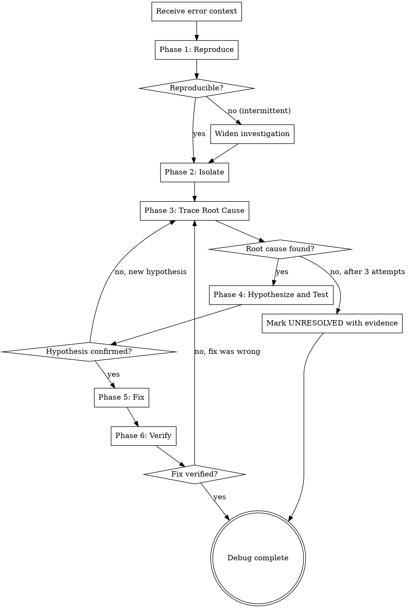
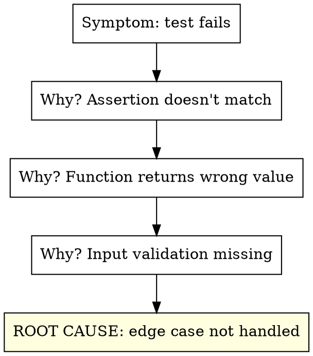

# Auto-Debug

Systematic root cause analysis and resolution for any error encountered during the implementor pipeline. Reproduces the issue, traces the root cause, forms and tests hypotheses, then implements and verifies the fix. Zero human interaction.

**Core principle:** Never guess. Reproduce first, trace second, hypothesize third, fix last. A fix without a root cause is a bandage, not a solution.

<HARD-GATE>
This skill is part of the implementor pipeline. Do NOT invoke superpowers:systematic-debugging or any other superpowers skill. The implementor handles debugging internally.
</HARD-GATE>

## Iron Law

```
NO FIX WITHOUT ROOT CAUSE INVESTIGATION FIRST
```

No exceptions. Not for "obvious" bugs. Not for "I've seen this before." Not for "the fix is simple." Investigate first, always.

Violating the letter of this rule is violating the spirit.

## When to Use

- Test failures during auto-impl or auto-test
- Build errors during auto-setup
- Runtime errors during auto-e2e
- Review issues that require debugging to understand
- Any unexpected behavior in any pipeline phase
- When invoked directly for standalone debugging

## Process



## Phase 1: Reproduce

Before anything else, reproduce the error reliably:

1. Run the exact command that failed
2. Capture the full error output (stdout, stderr, exit code)
3. Note the exact error message, stack trace, and file:line references
4. Run it again to confirm it's consistent (not flaky)

**If intermittent:** Run 3 times. Note which runs fail and which pass. Look for timing dependencies, race conditions, or external state.

**Output:** Exact reproduction steps and full error output.

## Phase 2: Isolate

Narrow down where the error originates:

1. **Read the stack trace** — identify the originating file and line
2. **Read the failing code** — understand what it's trying to do
3. **Read the test** (if test failure) — understand what's being asserted
4. **Identify the boundary** — is this a code error, config error, dependency error, or environment error?

**Isolation techniques:**
- For test failures: run the single failing test in isolation
- For build errors: check the specific file that fails to compile
- For runtime errors: add strategic logging or use the debugger
- For import errors: trace the dependency chain
- For timeout errors: identify what's blocking

**Output:** The specific file, function, and line where the error originates, plus the error category.

## Phase 3: Trace Root Cause

Don't stop at the symptom. Trace to the actual cause:



**The Five Whys:** Ask "why?" at least 3 times. The first answer is rarely the root cause.

**Common root cause categories:**

| Category | Examples | Fix Approach |
|----------|----------|-------------|
| Logic error | Off-by-one, wrong operator, missing condition | Fix the logic |
| Missing handling | Null/undefined not checked, error not caught | Add the handling |
| Wrong assumption | API changed, data shape different, timing wrong | Update the assumption |
| Dependency issue | Version mismatch, missing package, wrong config | Fix the dependency |
| State problem | Stale cache, race condition, leaked state between tests | Fix the state management |
| Environment | Missing env var, wrong path, permission denied | Fix the environment |

**Output:** The root cause, stated as a single sentence. "The root cause is [X] because [evidence]."

## Phase 4: Hypothesize and Test

Before writing any fix:

1. **State the hypothesis:** "If I [change X], the error will be resolved because [root cause reasoning]"
2. **Predict the outcome:** "After the fix, the test should pass with [expected output]"
3. **Consider side effects:** "This change could affect [Y and Z] — I need to verify those too"

**If the hypothesis is wrong:** Don't iterate on the same theory. Go back to Phase 3 and look for a different root cause.

**Max 3 hypotheses.** If three hypotheses fail, the root cause analysis was wrong. Start over from Phase 2 with a wider scope.

## Phase 5: Fix

Apply the minimal fix that addresses the root cause:

1. Change only what's necessary to fix the root cause
2. Do NOT refactor, clean up, or "improve" unrelated code
3. If the fix requires new tests, write them
4. If the fix changes behavior, update existing tests
5. Commit the fix with a descriptive message

**Minimal means minimal.** A one-line fix for a one-line bug. Don't turn a bugfix into a feature.

## Phase 6: Verify

After the fix:

1. Run the originally failing test/command — it should pass
2. Run the full test suite — no regressions
3. If the error was in E2E, re-run the failing scenario
4. If the error was environment-related, verify the setup phase still works
5. Verify the predicted outcome from Phase 4 matches reality

**If verification fails:** The fix was wrong or incomplete. Go back to Phase 3, not Phase 5. The root cause needs re-investigation, not a bigger patch.

## Integration with Pipeline

Auto-debug is called by other implementor skills when they encounter failures:

| Calling Skill | Trigger | Debug Scope |
|---------------|---------|-------------|
| `auto-setup` | Build fails, tests can't run | Environment, dependencies, config |
| `auto-impl` | Tests fail after implementation | Implementation code, test code |
| `auto-test` | New tests fail or break existing | Test logic, missing edge cases |
| `auto-e2e` | App won't start, scenarios fail | Runtime behavior, integration |
| `auto-review` | Reviewer identifies bugs | Code correctness |
| `production-readiness` | Gates fail | Whatever the gate checks |

**When called by another skill:**
- Receive the error context (command, output, file references)
- Execute the full debug process (Phases 1-6)
- Report back: RESOLVED (with fix details) or UNRESOLVED (with investigation evidence)

**When invoked standalone:**
- Receive a bug description or error report
- Execute the full debug process
- Commit the fix and report

## Dispatch as Subagent

When called from auto-impl or other skills, dispatch as a subagent:

```
Agent tool (general-purpose):
  description: "Debug: [error summary]"
  prompt: |
    You are debugging a failure in the implementor pipeline.

    ## Error Context
    [Full error output, stack trace, command that failed]

    ## Files Involved
    [Files referenced in the error]

    ## What Was Attempted
    [What the previous subagent was trying to do]

    ## Your Job
    Follow the auto-debug process:
    1. Reproduce the error
    2. Isolate to specific file/function/line
    3. Trace root cause (ask "why?" 3+ times)
    4. Hypothesize and predict outcome
    5. Apply minimal fix
    6. Verify fix + no regressions

    Report:
    - **Status:** RESOLVED | UNRESOLVED
    - Root cause: [one sentence]
    - Fix: [what was changed and why]
    - Verification: [test results after fix]
    - Files changed: [list]
    - Side effects: [any other tests/behavior affected]
```

## Red Flags - STOP

| Thought | Reality |
|---------|---------|
| "I know what's wrong, let me just fix it" | You don't know until you've reproduced and traced. Investigate. |
| "The error message says X, so it's X" | Error messages are symptoms, not diagnoses. Trace deeper. |
| "Let me try a different approach" | Don't flail. Investigate WHY the current approach failed first. |
| "I'll add a try/catch to suppress it" | Suppressing errors is not fixing them. Find the root cause. |
| "It works now, not sure why" | If you don't know why, the fix is wrong. Investigate. |
| "Let me rewrite this whole thing" | Minimal fix. Don't turn a bugfix into a rewrite. |
| "This is a flaky test, skip it" | Flaky tests have root causes too. Investigate. |
| "I've been debugging too long" | Max 3 hypotheses. Then mark UNRESOLVED with evidence. Don't spin. |

## Anti-Patterns

**Shotgun debugging:** Changing random things hoping something works. STOP. Go back to Phase 1.

**Fix-and-pray:** Applying a fix without understanding why it works. STOP. Go back to Phase 3.

**Scope creep:** "While I'm here, let me also fix..." STOP. Fix only the root cause. File other issues separately.

**Error suppression:** Wrapping in try/catch, adding `|| true`, ignoring return codes. STOP. These hide bugs, they don't fix them.

**Blame shifting:** "It's a framework bug" / "The test is wrong." Maybe. But verify with evidence before dismissing.
