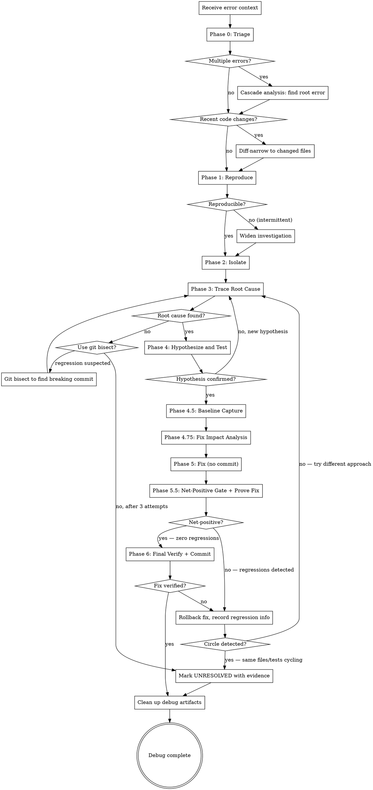
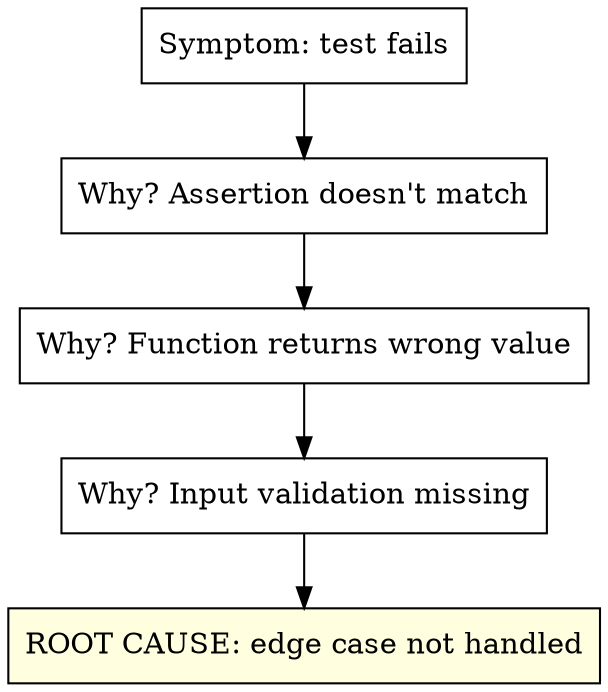
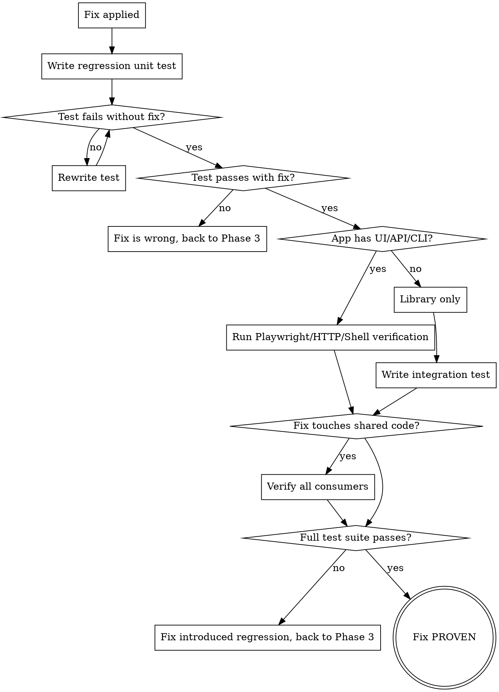

# Auto-Debug

Systematic root cause analysis and resolution for any error encountered during the implementor pipeline. Reproduces the issue, traces the root cause, forms and tests hypotheses, then implements and verifies the fix. Zero human interaction.

**Core principle:** Never guess. Reproduce first, trace second, hypothesize third, fix last. A fix without a root cause is a bandage, not a solution.

<HARD-GATE>
This skill is part of the implementor pipeline. Do NOT invoke superpowers:systematic-debugging or any other superpowers skill. The implementor handles debugging internally.
</HARD-GATE>

## Iron Law

```
NO FIX WITHOUT ROOT CAUSE INVESTIGATION FIRST
```

No exceptions. Not for "obvious" bugs. Not for "I've seen this before." Not for "the fix is simple." Investigate first, always.

Violating the letter of this rule is violating the spirit.

## When to Use

- Test failures during auto-impl or auto-test
- Build errors during auto-setup
- Runtime errors during auto-e2e
- Review issues that require debugging to understand
- Any unexpected behavior in any pipeline phase
- When invoked directly for standalone debugging

## Process



## Phase 0: Triage (Before Reproduction)

When receiving error context, classify and prioritize before diving in:

### Error Classification

Auto-detect the error category from the error output and apply the specialized strategy:

| Error Pattern | Category | Fast-Path Strategy |
|--------------|----------|-------------------|
| `TypeError`, `ReferenceError`, `undefined is not a function` | Type/Reference | Read the exact line, check variable scope and types |
| `ENOENT`, `MODULE_NOT_FOUND`, `Cannot find module` | Missing File/Module | Trace the import chain, check paths and package.json |
| `ECONNREFUSED`, `ETIMEDOUT`, `fetch failed` | Network/Connection | Check if service is running, verify URLs and ports |
| `SyntaxError`, `Unexpected token` | Parse Error | Check the file for syntax issues, often a bad merge |
| `ENOMEM`, `heap out of memory`, `Maximum call stack` | Resource Exhaustion | Look for infinite recursion, unbounded loops, memory leaks |
| `EACCES`, `Permission denied` | Permission | Check file permissions, user context, sudo requirements |
| `Timeout`, `exceeded`, `took too long` | Timeout/Hang | See Timeout Debugging section below |
| `race condition`, flaky pass/fail pattern | Concurrency | See Concurrency Debugging section below |
| `version`, `peer dep`, `conflicting` | Dependency Conflict | See Dependency Conflict Resolution section below |
| Multiple unrelated errors in output | Cascade | See Cascade Analysis section below |
| `BREAKING CHANGE`, `deprecated`, `not a function` | API Migration | Check changelog of updated dependency, find migration guide |

### Architecture Map Consumption

**Before investigating broadly, read the architecture map.** Check `docs/architecture-map.md` — if it exists:

1. **Locate the error in the module inventory** — which module does the stack trace point to?
2. **Check the dependency graph** — what feeds data/control to this module? The root cause is often in an upstream dependency, not the failing module itself
3. **Check hot spots** — if the error involves a hot spot module, the fix has high blast radius. Be extra careful with broader impact verification (Phase 5.5 Layer 3)
4. **Check interface contracts** — is the failing module receiving input that violates its expected interface? If so, trace backward through the dependency chain
5. **Check patterns** — does the error violate an established pattern? (e.g., error not following the project's AppError hierarchy, data access not using the repository pattern)

**This replaces blind grepping for root cause tracing.** Instead of searching the entire codebase, follow the dependency chain from the error's module backward to the source. In a large codebase, this reduces investigation scope dramatically.

**If no map exists:** Proceed with manual investigation as described below.

### Diff-Based Narrowing

**Before investigating broadly, check what changed recently:**

1. Run `git diff HEAD~5` (or since last known-good state) to see recent changes
2. Cross-reference changed files with the error's stack trace
3. If a changed file appears in the stack trace — that's your starting point
4. If no overlap — the bug may be in an unchanged dependency or environment

**This eliminates 80% of investigation time.** Most bugs are in recently changed code.

### Cascade Analysis (Multiple Errors)

When the error output contains multiple failures:

1. **Don't fix them all.** Find the root error that causes the cascade
2. **Sort errors by dependency order** — earlier failures often cause later ones
3. **Look for the first error chronologically** — not the loudest one
4. **Group errors by file** — if 10 tests in the same file fail, the file (not the tests) is broken
5. **Check for setup/teardown failures** — a broken `beforeAll` cascades to every test in the suite

```
Rule: Fix ONE error. Re-run. Count how many others disappear.
Repeat until zero errors remain.
```

**Output:** Error category, narrowed file scope (from diff), and if multiple errors: the identified root error.

### Project Tool Discovery (MANDATORY)

<HARD-GATE>
Before any verification, you MUST discover what tools the project already has. A project's own CLI, scripts, and utilities are the most authoritative way to verify a fix. Generic test commands are necessary but not sufficient — use the project's own tools to verify real behavior.
</HARD-GATE>

**Scan these locations for project-specific tools:**

| Location | What to Look For |
|----------|-----------------|
| `tools/`, `scripts/`, `bin/`, `cli/` directories | Custom CLI tools, utility scripts, validators, analyzers |
| `package.json` `scripts` section | Named commands: `build`, `lint`, `validate`, `check`, `analyze`, `migrate`, custom scripts |
| `Makefile`, `Taskfile.yml`, `justfile` | Build/run/test/validate targets |
| `*.sln`, `*.csproj` files | .NET projects — look for CLI projects (`*.CLI`, `*.Console`, `*.Tool`) |
| `cmd/`, `internal/cli/` (Go) | Go CLI entry points |
| `setup.py`, `pyproject.toml` `[project.scripts]` | Python CLI entry points |
| `Cargo.toml` `[[bin]]` sections | Rust binary targets |
| `docker-compose.yml` | Service definitions with health checks |
| `README.md`, `docs/` | Usage examples, "How to run" sections, verification instructions |
| `.implementor.json` | Custom `testCommand`, `coverageCommand`, `startCommand` |

**Build a tool inventory:**

```
Project Tools Found:
- CLI: dotnet run --project src/MyApp.CLI -- [args]
- Validator: tools/PackageExplorer/src/... -- [file]
- Scripts: npm run validate, npm run check-types
- Makefile: make lint, make integration-test
- Start: npm start (port 3000)
```

**Use these tools for verification in Phase 5.5 and Phase 6.** They test real behavior that unit tests cannot cover:
- A converter CLI can verify that output files are valid
- A package explorer can verify internal consistency
- A migration tool can verify data integrity
- A linter can verify code quality after changes
- A build command can verify nothing is broken

**If the project has a CLI that processes input → output:**
1. Run the CLI with a representative input file
2. Verify the output is valid using the project's own validation tools
3. Compare output before and after the fix if possible
4. Check edge cases with different inputs

**Tool discovery happens ONCE during triage, then tools are used throughout debugging.**

## Anti-Circle Detection

<HARD-GATE>
Circular fixing — where fix A breaks B, fix B breaks A — is the most dangerous failure mode in complex codebases. It wastes context, time, and can leave the codebase in a worse state than it started. Detect and break the cycle early.
</HARD-GATE>

### Fix History Tracking

Maintain a **fix history log** across all debug invocations within a pipeline run. After every fix attempt (successful or rolled back), record:

```
Fix History:
  Attempt 1: [files changed] → [result: passed / rolled back because X]
  Attempt 2: [files changed] → [result: passed / rolled back because X]
  Attempt 3: [files changed] → [result: passed / rolled back because X]
```

### Circle Detection Rules

Before applying any fix, check the fix history:

| Signal | Detection | Action |
|--------|-----------|--------|
| **Same file modified twice** | Fix N touches `src/utils/serialize.ts`, fix M also touches it | STOP. The first fix was likely wrong or incomplete. Don't patch a patch — revert to before fix N and find the real root cause. |
| **Regression is a previously-fixed test** | Fix N fixed test A. Fix M breaks test A again. | STOP. Fixes N and M are in conflict. They can't both be right. Revert both and investigate the shared dependency. |
| **Oscillating test results** | Test A: pass → fail → pass → fail across fix attempts | STOP. Something structural is wrong. The individual fixes are treating symptoms of a deeper issue. |
| **Fix count exceeds 3 for same error class** | Three different fixes attempted for the same type of failure | STOP. Mark UNRESOLVED. The root cause is not what you think it is. |
| **Net test count not improving** | After 2+ fixes, the total passing test count hasn't increased | STOP. You're trading problems, not solving them. |

### Breaking the Cycle

When circular fixing is detected:

1. **Revert ALL fixes in the cycle** — go back to the last known-good state (before the first fix in the cycle)
2. **Re-read the full error context** with fresh eyes — what are ALL the tests that fail, not just the one you were focused on?
3. **Look for the shared dependency** — circular fixes almost always mean two things depend on the same code in incompatible ways. Find that shared code.
4. **Consider a different approach entirely:**
   - If fixes keep conflicting in a utility module, the module's interface may need to change (not just its implementation)
   - If fixes keep oscillating in a data format, the format specification may be ambiguous — clarify it before fixing
   - If fixes in module A keep breaking module B, the architecture map's dependency graph may reveal a hidden coupling that needs explicit resolution
5. **If still stuck after one revert-and-rethink cycle:** Mark UNRESOLVED with the full fix history as evidence. The fix history is extremely valuable diagnostic information for a human or a future agent with fresh context.

## Debug Budget

Debugging can consume unlimited time and context. Set a budget before starting:

- **Max 3 hypotheses.** If three root cause theories fail, mark UNRESOLVED. (Already enforced.)
- **Max 3 log injection rounds.** If three rounds of strategic logging don't reveal the execution path, the bug is deeper than trace-level debugging can reach. Escalate to a different technique (git bisect, environment comparison).
- **Max 15 minutes equivalent of investigation** before you must have a hypothesis. If you're still in "I have no idea" territory after reading the stack trace, the failing code, the test, the recent diff, and injecting one round of logs — stop widening the search and formulate your best guess. A wrong hypothesis that can be tested is better than infinite exploration.
- **Context budget:** If your debug investigation has consumed more tool calls than the original implementation task, something is wrong. Either the bug is environmental (not a code fix), the plan was fundamentally flawed, or you're chasing a symptom. Step back, re-triage from Phase 0, and consider marking UNRESOLVED with evidence.

**The budget exists because debugging has diminishing returns.** The first 5 minutes find 80% of bugs. The next 20 minutes find 15%. The last 5% require a fundamentally different approach — and marking UNRESOLVED with good evidence is more valuable than an exhausted agent with no answer.

## Phase 1: Reproduce

Before anything else, reproduce the error reliably:

1. Run the exact command that failed
2. Capture the full error output (stdout, stderr, exit code)
3. Note the exact error message, stack trace, and file:line references
4. Run it again to confirm it's consistent (not flaky)

**If intermittent:** Run 3 times. Note which runs fail and which pass. Look for timing dependencies, race conditions, or external state.

**Output:** Exact reproduction steps and full error output.

## Phase 2: Isolate

Narrow down where the error originates:

1. **Read the stack trace** — identify the originating file and line
2. **Read the failing code** — understand what it's trying to do
3. **Read the test** (if test failure) — understand what's being asserted
4. **Identify the boundary** — is this a code error, config error, dependency error, or environment error?

**Isolation techniques:**
- For test failures: run the single failing test in isolation
- For build errors: check the specific file that fails to compile
- For runtime errors: inject strategic logging (see Log Injection below)
- For import errors: trace the dependency chain
- For timeout errors: identify what's blocking (see Timeout Debugging below)
- For flaky tests: check for shared mutable state between tests (see Concurrency Debugging below)

### Log Injection (Tracing Execution Flow)

When the error is opaque (no clear stack trace, wrong output but no crash):

1. **Identify the code path** from input to the point of failure
2. **Add temporary `console.log`/`print` statements** at each decision point:
   ```
   console.log('[DEBUG:auto-debug] functionName entered, args:', JSON.stringify(args))
   console.log('[DEBUG:auto-debug] branch taken: else-clause at line 42')
   console.log('[DEBUG:auto-debug] value at checkpoint:', variable)
   ```
3. **Use the `[DEBUG:auto-debug]` prefix** so logs are easy to find and remove
4. **Run the failing scenario** and read the log output to trace the actual execution path
5. **Compare actual path vs expected path** — the divergence point is the bug
6. **MANDATORY: Remove all `[DEBUG:auto-debug]` log lines after debugging.** Search the codebase for the prefix and delete every one. Debug logging must never be committed.

### Git Bisect (Finding the Breaking Commit)

When the error is a regression (something that used to work):

1. Identify the last known-good commit (or estimate: `HEAD~10`, last release tag)
2. Run git bisect:
   ```bash
   git bisect start
   git bisect bad HEAD
   git bisect good <known-good-commit>
   # For each commit git checks out:
   # Run the failing test, then: git bisect good OR git bisect bad
   ```
3. Git bisect will identify the exact commit that introduced the regression
4. Read that commit's diff — the bug is in those changes
5. **Always run `git bisect reset` when done** to restore the working tree

**When to use:** When you can't tell from the current code why something broke, and the git history is available. Bisect turns an O(n) search into O(log n).

**Output:** The specific file, function, and line where the error originates, plus the error category.

## Phase 3: Trace Root Cause

Don't stop at the symptom. Trace to the actual cause:



**The Five Whys:** Ask "why?" at least 3 times. The first answer is rarely the root cause.

**Dependency-graph-guided tracing (if architecture map exists):**
1. Identify which module the error manifests in
2. Walk backward through the dependency chain — at each hop, check if the interface contract is being violated
3. The root cause is at the module boundary where the contract breaks
4. This is faster and more reliable than grepping — especially in large codebases where the same keywords appear in dozens of files

**Common root cause categories:**

| Category | Examples | Fix Approach |
|----------|----------|-------------|
| Logic error | Off-by-one, wrong operator, missing condition | Fix the logic |
| Missing handling | Null/undefined not checked, error not caught | Add the handling |
| Wrong assumption | API changed, data shape different, timing wrong | Update the assumption |
| Dependency issue | Version mismatch, missing package, wrong config | Fix the dependency |
| State problem | Stale cache, race condition, leaked state between tests | Fix the state management |
| Environment | Missing env var, wrong path, permission denied | Fix the environment |

**Output:** The root cause, stated as a single sentence. "The root cause is [X] because [evidence]."

## Phase 4: Hypothesize and Test

Before writing any fix:

1. **State the hypothesis:** "If I [change X], the error will be resolved because [root cause reasoning]"
2. **Predict the outcome:** "After the fix, the test should pass with [expected output]"
3. **Consider side effects:** "This change could affect [Y and Z] — I need to verify those too"

**If the hypothesis is wrong:** Don't iterate on the same theory. Go back to Phase 3 and look for a different root cause.

**Max 3 hypotheses.** If three hypotheses fail, the root cause analysis was wrong. Start over from Phase 2 with a wider scope.

## Phase 4.5: Pre-Fix Baseline Capture (MANDATORY)

<HARD-GATE>
Before writing ANY fix code, capture a baseline of the current test state. A fix that solves 1 problem but breaks 2 others is a net negative. The baseline is how you detect this.
</HARD-GATE>

### Capture the Baseline

1. **Run the full test suite** and record the results:
   ```
   Baseline captured before fix:
   - Total tests: [N]
   - Passing: [N] — [list test names or file:test pairs]
   - Failing: [N] — [list test names or file:test pairs]
   - Skipped: [N]
   ```
2. **Save the passing test list.** These are the tests that MUST still pass after the fix. Any previously-passing test that fails after the fix is a **regression introduced by the fix**.
3. **Note the specific tests that are failing** — these are the ones the fix should address.

### Why This Matters

Without a baseline, you can't distinguish between:
- "This test was already failing" (not your problem)
- "This test was passing and my fix broke it" (your problem — rollback)
- "This test is new and it fails" (investigate)

**The baseline takes 30 seconds to capture and prevents hours of circular fixing.**

## Phase 4.75: Fix Impact Analysis (MANDATORY)

<HARD-GATE>
Before writing ANY fix code, analyze the blast radius of the planned change using the architecture map's dependency graph. Understand what you might break BEFORE you break it.
</HARD-GATE>

### Analyze Impact

1. **Identify the files you plan to change** — list them explicitly
2. **Map files to modules** — which modules do these files belong to? (from the architecture map)
3. **Classify the change surface:**

   | Change Type | Detection | Blast Radius |
   |------------|-----------|-------------|
   | **Public API change** | Modifying an exported function signature, public class interface, or API endpoint contract | ALL consumers must be checked — every module that imports this interface |
   | **Data model change** | Modifying fields on a shared model/entity/DTO (from map's Data Models section) | VERY HIGH — every consumer + database + serialization formats. Check if model is persisted AND serialized. |
   | **Shared config change** | Modifying a config file listed in map's Shared Configuration | ALL readers of that config must be checked |
   | **Internal implementation change** | Modifying private/internal function bodies without changing signatures | LOW — only the changed module's own tests |
   | **Build file change** | Modifying project/package/build configuration | All downstream build dependents must rebuild |

4. **Find all dependents** — using the dependency graph, identify every module that depends on the modules you're changing. For data model changes, also check the map's Data Models section for consumer count.
5. **Identify consumer tests by type** (from the map's Test Infrastructure Classification):
   - Unit tests for the changed module (always run)
   - Integration tests that cross the changed module's boundary (run for any API/model change)
   - Contract tests at the changed module's boundary (run for any interface/model change)
   - For internal-only changes: unit tests are sufficient
6. **Record the impact scope:**
   ```
   Fix Impact Analysis:
   - Files to change: [list]
   - Change type: [public API | data model | shared config | internal | build file]
   - Modules affected: [list]
   - Dependent modules: [list from dependency graph]
   - Data models affected: [list any shared models being changed, with consumer count]
   - Consumer test files: [list — these MUST pass after the fix]
   - Contract tests at boundary: [list — critical for API/model changes]
   - Hot spots touched: [list any — extra caution required]
   ```

### Impact-Based Decision

| Impact Scope | Approach |
|-------------|----------|
| Internal change, 1 file, no shared models | Apply fix, verify baseline (unit tests sufficient) |
| Public API change, < 3 dependents | Apply fix, verify baseline + run all dependent tests + contract tests explicitly |
| Data model change (any persisted + serialized model) | CAUTION. Check every consumer. Run contract tests. Verify serialization format hasn't broken. If model has > 5 consumers, consider if there's a way to fix without changing the model. |
| Shared config change | Apply fix, verify ALL modules that read the config still work |
| Fix touches hot spot with 5+ dependents | Apply fix, verify baseline + run ALL integration and contract tests in the solution |
| Fix requires changes across multiple modules | STOP. Consider if the root cause analysis is correct. Multi-module fixes for a single bug often indicate a symptomatic fix, not a root cause fix. Re-investigate. |
| Fix requires data model change + code changes in 3+ consumers | STOP. This is an atomic change group. All changes must be made together. If the fix is this broad, the bug may be architectural, not local. |

## Phase 5: Fix

Apply the minimal fix that addresses the root cause:

1. Change only what's necessary to fix the root cause
2. Do NOT refactor, clean up, or "improve" unrelated code
3. **Write a regression test that reproduces the original bug** (see Phase 5.5)
4. If the fix changes behavior, update existing tests
5. **Do NOT commit yet** — the fix must pass the Net-Positive Gate first (Phase 5.5)

**Minimal means minimal.** A one-line fix for a one-line bug. Don't turn a bugfix into a feature.

## Phase 5.5: Prove the Fix (MANDATORY)

<HARD-GATE>
Every fix MUST be proven through automated verification. A fix without proof is not a fix — it's a hope. Use every available verification method.

CRITICAL: Every fix MUST pass the Net-Positive Gate before it can be committed. A fix that introduces regressions is not a fix — it's a trade.
</HARD-GATE>

### Layer 0: Net-Positive Gate (Always Required — Run FIRST)

Before any other verification, compare the fix against the baseline captured in Phase 4.5:

1. **Run the full test suite** with the fix applied (but not yet committed)
2. **Compare against baseline:**
   ```
   Net-Positive Gate:
   - Baseline passing: [N]
   - Now passing: [M]
   - Previously passing, now failing (REGRESSIONS): [list]
   - Previously failing, now passing (FIXED): [list]
   - New tests added: [N] (passing: [N], failing: [N])
   - Net change: [+N or -N]
   ```
3. **Apply the gate:**

| Result | Verdict | Action |
|--------|---------|--------|
| All baseline-passing tests still pass + target test(s) now pass | **PASS** | Proceed to Layer 1 |
| All baseline-passing tests still pass but target test(s) still fail | **FIX INCOMPLETE** | The fix doesn't solve the problem. Back to Phase 3. |
| Some baseline-passing tests now fail (regressions introduced) | **FAIL — ROLLBACK** | The fix breaks other things. Revert ALL changes. Back to Phase 3 with new information: "fix X causes regression in Y" |
| Different tests pass now (some fixed, some regressed) | **FAIL — NET NEGATIVE** | The fix trades one problem for another. Revert. Investigate why the fix causes regressions — the root cause analysis was likely incomplete |

<HARD-GATE>
**A fix that fails the Net-Positive Gate MUST be rolled back immediately.** Do not attempt to "also fix" the regressions it introduced — that's how you get into circular fixing. Revert, understand WHY the fix caused regressions (this is new diagnostic information), and approach the root cause differently.
</HARD-GATE>

**Rollback procedure:**
```bash
git checkout -- .                    # Discard all unstaged changes
git clean -fd                        # Remove any new untracked files
```

**After rollback:** The regression information is valuable. Record it:
```
Fix Attempt N: ROLLED BACK
- Attempted: [what the fix changed]
- Regressions caused: [which tests broke and in which modules]
- Insight: [why the fix caused regressions — e.g., "changing the serializer format
  also affects the export module which expects the old format"]
```
This insight often reveals the REAL root cause — the one that can be fixed without regressions.

### Layer 1: Regression Unit Test (Always Required)

Write a unit test that:
1. **Reproduces the original bug** — the test would FAIL without your fix
2. **Passes with your fix applied** — proves the fix works
3. **Prevents future regression** — stays in the test suite permanently

```
Test name pattern: "should [expected behavior] when [condition that caused the bug]"
Example: "should return empty array when filter matches no items"
         (not: "test bug fix #42")
```

**Verify the test proves causation:**
1. Temporarily revert the fix
2. Run the regression test — it MUST fail
3. Re-apply the fix
4. Run the regression test — it MUST pass

If the test passes both with and without the fix, the test is wrong. It doesn't prove anything. Rewrite it.

### Layer 2: Runtime Verification (When Applicable)

After the unit test proves the fix at the code level, verify it works in the running application. **Use the project tools discovered in Phase 0** — they are the most authoritative verification method.

**Project-specific tools (ALWAYS check first):**
1. Refer to the tool inventory built during Phase 0 Triage
2. Run the project's own CLI/validators/analyzers against real input
3. If the project has a converter/processor: run it on a representative input and verify output
4. If the project has a validator/explorer: run it on the output to check integrity
5. If the project has custom scripts (`npm run validate`, `make check`): run them
6. Compare output before and after the fix when possible

**Web applications (Playwright MCP):**
1. Start the application (use discovered `startCommand` or `npm start`)
2. Navigate to the affected page/flow
3. Reproduce the user action that triggered the bug
4. Use `browser_snapshot` to verify correct state
5. Use `browser_take_screenshot` to capture evidence
6. Use `browser_console_messages` to verify no JS errors
7. Use `browser_network_requests` to verify no failed requests

**API applications (HTTP):**
1. Start the server
2. Send the request that triggered the bug
3. Verify the response status, body, and headers are correct
4. Send edge-case variations of the same request
5. Capture response bodies as evidence

**CLI applications (Shell):**
1. Run the project's CLI with the input that triggered the bug
2. Verify stdout, stderr, and exit code
3. Run edge-case variations with different inputs
4. If the project has output validators — run them on the output
5. Capture all output as evidence

**Libraries (Import and call):**
1. Write an integration test that uses the library as a consumer would
2. Verify the bug scenario produces correct results
3. Run the integration test

### Layer 3: Broader Impact Verification (When Fix Touches Shared Code)

If the fix modifies shared code (utilities, middleware, base classes, config):
1. Identify all callers/consumers of the changed code
2. Run their tests specifically
3. If no tests exist for those callers, write smoke tests
4. Verify no behavior changed for existing consumers

### Verification Decision Tree



## Phase 5.75: Symptomatic Fix Detector

Before final verification, honestly assess whether you fixed the root cause or just the symptom:

1. **"Did I fix where the bug manifests, or where it originates?"**
   - If your fix adds a null check at the crash site, the root cause might be: why is the value null in the first place?
   - If your fix adds a try/catch around the failing line, ask: why does it throw? Catching is not fixing.
   - If your fix changes a test assertion to match the actual output, ask: was the test wrong, or is the code wrong?

2. **"Would this bug class recur in similar code?"**
   - If the bug was a missing null check, are there other call sites with the same missing check?
   - If the bug was an off-by-one, is the same pattern used elsewhere?
   - If yes — the fix should address the pattern, not just the instance. (Don't go on a refactoring spree, but note the other locations in the report.)

3. **"Am I treating the disease or the fever?"**

| Fix Type | Symptom Fix | Root Cause Fix |
|----------|-------------|----------------|
| Null crash | Add null check at crash site | Fix the producer that emits null |
| Wrong output | Adjust the transform at the output | Fix the logic that computes the wrong value |
| Test failure | Change the assertion | Fix the code the assertion tests |
| Import error | Add a missing export | Fix the module structure that caused the gap |
| Timeout | Increase the timeout value | Fix the operation that's too slow |

**If you detect a symptomatic fix:** You don't necessarily need to redo it — sometimes a symptomatic fix is the right pragmatic choice (e.g., defensive null check is good practice). But you MUST document it in the report: "This fix addresses the symptom at [location]. The root cause is [X] at [location]. A deeper fix would involve [Y]."

## Phase 6: Final Verification

After fix is proven, net-positive gate passed, and symptomatic-fix check is done:

1. Run the originally failing test/command — it should pass
2. Run the regression test from Phase 5.5 — it should pass
3. Run the full test suite — **compare against Phase 4.5 baseline: zero regressions allowed**
4. If runtime verification was done (Playwright/HTTP/CLI), review evidence
5. If the error was in E2E, re-run the failing E2E scenario
6. If the error was environment-related, verify the setup phase still works
7. Verify the predicted outcome from Phase 4 matches reality
8. **Only now commit** the fix and regression test together with a descriptive message

**If verification fails:** Rollback the fix (`git checkout -- .`). Go back to Phase 3, not Phase 5. The root cause needs re-investigation, not a bigger patch. Record what broke as diagnostic information for the next attempt.

## Advanced Debugging Techniques

### Concurrency Debugging (Race Conditions, Flaky Tests)

**Symptoms:** Test passes sometimes, fails sometimes. Or fails only when run with other tests but passes in isolation.

**Investigation:**

1. **Shared mutable state:** Look for global variables, singletons, module-level caches, or database state that isn't reset between tests
2. **Timing dependencies:** Look for `setTimeout`, `setInterval`, unresolved promises, or missing `await`
3. **Resource contention:** Look for tests that use the same port, file, or database table
4. **Order dependency:** Run the failing test in isolation. If it passes alone, another test is leaking state

**Techniques:**
- Run the test suite with `--randomize` or `--shuffle` flag to expose order dependencies
- Add `beforeEach`/`afterEach` cleanup to reset shared state
- For async issues: check every `async` function has a matching `await` at the call site
- For timer issues: use fake timers (`jest.useFakeTimers()`, `sinon.useFakeTimers()`)
- For promise issues: look for fire-and-forget promises (missing `await` or `.catch`)

**Root cause pattern:** "Test A mutates [shared resource] and test B reads it without reset."

### Timeout and Hang Debugging

**Symptoms:** Process hangs, test times out, command never completes.

**Investigation:**

1. **Identify what's blocking:**
   - Unresolved promise? Missing callback? Deadlocked async operation?
   - Waiting for network that will never respond? (Missing mock, wrong URL, service down)
   - Infinite loop? (Add a counter log to suspect loops)
   - Waiting for stdin/user input? (Process expects interaction that isn't coming)

2. **Narrowing technique:**
   - Add timeout logging: log a message before and after each suspect async operation
   - The last "before" log without a matching "after" is the hang point
   - For Node.js: use `--inspect` flag and check for pending async operations
   - For tests: reduce the timeout to fail fast (`jest --testTimeout=5000`)

3. **Common causes:**
   | Hang Pattern | Cause | Fix |
   |-------------|-------|-----|
   | Test hangs after all assertions pass | Open handle (server, DB connection, timer) | Close/dispose in `afterAll` |
   | Hangs on import | Circular dependency with side effects | Break the circular import |
   | Hangs on network call | No mock, real service not running | Add mock or start service |
   | Hangs intermittently | Race condition in async setup | Add proper await/synchronization |

### Dependency Conflict Resolution

**Symptoms:** `peer dep` warnings, version mismatch errors, `Cannot find module`, or subtle runtime errors after `npm install`.

**Investigation:**

1. **Check the dependency tree:**
   ```bash
   npm ls <package-name>        # Show all versions of a specific package
   npm ls --all | grep "WARN"   # Find peer dep warnings
   ```
2. **Check for version conflicts:**
   - Two packages requiring incompatible versions of the same dependency
   - A package using `require()` expecting CJS but getting ESM (or vice versa)
   - Lock file drift: `package-lock.json` doesn't match `package.json`

3. **Resolution strategies:**
   | Conflict Type | Fix |
   |--------------|-----|
   | Peer dep mismatch | Align to the version range that satisfies both peers |
   | Duplicate packages | Add `overrides` (npm) or `resolutions` (yarn) in package.json |
   | CJS/ESM mismatch | Check the package's `exports` field, use correct import syntax |
   | Lock file drift | Delete lock file + `node_modules`, reinstall from scratch |
   | Type version mismatch | Align `@types/` package version with the runtime package version |

### Environment Fingerprinting

**Symptoms:** "Works on my machine" or "Works locally but fails in CI" or "Worked yesterday."

**Capture this environment fingerprint when the error seems environment-related:**

```bash
# Runtime versions
node --version && npm --version       # Node.js
python --version && pip --version     # Python
go version                            # Go
rustc --version && cargo --version    # Rust

# OS and shell
uname -a || ver                       # OS info
echo $SHELL $BASH_VERSION             # Shell info

# Key env vars (DO NOT log secrets)
env | grep -E '^(NODE_ENV|PATH|HOME|CI|DATABASE_URL|PORT)='

# Disk and memory
df -h . && free -h                    # Space and memory (Linux)

# Package state
npm ls --depth=0 2>&1 | head -30     # Installed packages
```

**Compare fingerprints** between the working and broken environments. Differences in versions, env vars, or paths are likely the cause.

**Common environment causes:**
- `NODE_ENV=production` vs `development` (changes which dependencies load)
- Different Node/Python versions (syntax or API differences)
- Missing env vars (`.env` file not copied, secret not set in CI)
- Different OS (path separators, case sensitivity, line endings)
- Stale `node_modules` (delete and reinstall)

### Error Message Decoding

Don't take error messages at face value. Common misreadings:

| Error Says | Often Actually Means |
|-----------|---------------------|
| `Cannot find module 'X'` | X exists but has a broken export, or a transitive dep is missing |
| `X is not a function` | X was imported but is `undefined` — check the export name |
| `Maximum call stack exceeded` | Infinite recursion, often from circular references |
| `ECONNREFUSED 127.0.0.1:3000` | The server isn't running, not a network issue |
| `Unexpected token '<'` | Server returned HTML (error page) instead of JSON |
| `Cannot read property 'X' of undefined` | The PARENT object is undefined — investigate one level up |
| `EPERM: operation not permitted` | File is locked by another process, or antivirus blocking |
| `ERR_MODULE_NOT_FOUND` | ESM/CJS mismatch — file exists but wrong module system |
| `Jest encountered an unexpected token` | Missing transform for file type (JSX, TS, ESM) |
| `ENOMEM` | Not always out of memory — can be too many open files or processes |

## Integration with Pipeline

Auto-debug is called by other implementor skills when they encounter failures:

| Calling Skill | Trigger | Debug Scope |
|---------------|---------|-------------|
| `auto-setup` | Build fails, tests can't run | Environment, dependencies, config |
| `auto-impl` | Tests fail after implementation | Implementation code, test code |
| `auto-test` | New tests fail or break existing | Test logic, missing edge cases |
| `auto-e2e` | App won't start, scenarios fail | Runtime behavior, integration |
| `auto-review` | Reviewer identifies bugs | Code correctness |
| `production-readiness` | Gates fail | Whatever the gate checks |

**When called by another skill:**
- Receive the error context (command, output, file references)
- Execute the full debug process (Phases 1-6)
- Report back: RESOLVED (with fix details) or UNRESOLVED (with investigation evidence)

**When invoked standalone:**
- Receive a bug description or error report
- Execute the full debug process
- Commit the fix and report

## Dispatch as Subagent

When called from auto-impl or other skills, dispatch as a subagent:

```
Agent tool (general-purpose):
  description: "Debug: [error summary]"
  prompt: |
    You are debugging a failure in the implementor pipeline.

    ## Architecture Context
    [Task-focused lens from docs/architecture-map.md — max 150 lines. Include:
     - Module where the error manifests (with interfaces and responsibilities)
     - Dependency chain leading to this module (upstream modules that feed it)
     - Hot spots in the dependency chain (if any)
     - Relevant patterns (error handling, data access conventions)
     Use the dependency graph to trace root causes — walk backward from the
     symptom module through its dependencies instead of grepping blindly.]

    ## Error Context
    [Full error output, stack trace, command that failed]

    ## Files Involved
    [Files referenced in the error, mapped to modules from the architecture map]

    ## What Was Attempted
    [What the previous subagent was trying to do]

    ## Project Tools Available
    [List any project-specific CLIs, validators, scripts discovered by the caller.
     If not provided, you MUST discover them yourself — scan: tools/, scripts/, bin/,
     package.json scripts, Makefile, *.sln/*.csproj CLI projects, README.md usage sections]

    ## Fix History (if provided)
    [Previous fix attempts in this debug cycle — files changed, results, reverts.
     Check for circular patterns: same file modified twice = likely wrong approach.
     Use regression info from rolled-back fixes as diagnostic evidence.]

    ## Your Job
    Follow the auto-debug process:
    0. Triage: classify error type, discover project tools, check git diff, cascade-analyze if multiple errors
    1. Reproduce the error (run exact command, capture full output)
    2. Isolate to specific file/function/line (use log injection with [DEBUG:auto-debug] prefix if needed)
    3. Trace root cause using dependency graph (ask "why?" 3+ times, walk backward through module dependencies, use git bisect if regression suspected)
    4. Hypothesize and predict outcome
    4.5. BASELINE CAPTURE (MANDATORY): Run the full test suite BEFORE applying the fix. Record exactly which tests pass and which fail. This is how you detect regressions.
    4.75. FIX IMPACT ANALYSIS: Use the architecture map to identify all modules that depend on the code you're about to change. Their tests must also pass after the fix.
    5. Apply minimal fix (DO NOT COMMIT YET)
    6. NET-POSITIVE GATE (MANDATORY — run BEFORE any other verification):
       a. Run full test suite with fix applied
       b. Compare against baseline from step 4.5
       c. If ANY previously-passing test now fails: ROLLBACK the fix immediately (git checkout -- .)
          Record what regressed and why — this is diagnostic info for the next attempt.
          Go back to step 3 with new information.
       d. Only proceed if all baseline-passing tests still pass AND the target test is fixed.
    7. Prove the fix:
       a. Write regression unit test that FAILS without fix, PASSES with fix
       b. Run project's own CLI/validators/analyzers on real input to verify output correctness
       c. If app has UI: use Playwright MCP (browser_navigate, browser_snapshot, browser_take_screenshot) to verify
       d. If app has API: send HTTP requests to verify correct responses
       e. If app has CLI: run the CLI with representative input and verify output with project validators
       f. If fix touches shared code: run tests for all consumers
    8. Run full test suite one final time — compare against baseline: zero regressions allowed
    9. Only now commit the fix and regression test together
    10. Clean up: remove ALL [DEBUG:auto-debug] log lines, run git bisect reset if used

    ANTI-CIRCLE RULE: If you find yourself modifying a file that was already
    changed in a previous fix attempt (check Fix History), STOP. The previous
    fix was likely wrong. Revert to before that fix and rethink the approach.

    Report:
    - **Status:** RESOLVED | UNRESOLVED
    - **Root cause:** [one sentence]
    - **Fix:** [what was changed and why]
    - **Baseline:** [test counts before fix]
    - **Net-positive gate:** [PASSED — N tests passing before, M after, zero regressions]
    - **Fix attempts:** [N — include any rolled-back attempts with reason]
    - **Regression test:** [test name, file path, and proof it fails without fix]
    - **Project tool verification:** [which project tools were used, commands run, output summary]
    - **Runtime verification:** [what was verified and how — Playwright/HTTP/CLI evidence]
    - **Full suite result:** [pass/fail count, comparison against baseline]
    - **Files changed:** [list]
    - **Side effects:** [any other tests/behavior affected]
```

## Cleanup (MANDATORY)

Before declaring debug complete, clean up all debug artifacts:

1. **Remove all `[DEBUG:auto-debug]` log lines** — search the entire codebase for this prefix
2. **Run `git bisect reset`** if git bisect was used
3. **Remove any temporary test files** created during investigation
4. **Revert any temporary config changes** made for debugging (port changes, mock overrides, etc.)
5. **Verify the working tree is clean** except for the actual fix and regression test

```
Debug artifacts in committed code = tech debt. Always clean up.
```

## Red Flags - STOP

| Thought | Reality |
|---------|---------|
| "I know what's wrong, let me just fix it" | You don't know until you've reproduced and traced. Investigate. |
| "The error message says X, so it's X" | Error messages are symptoms, not diagnoses. Trace deeper. |
| "Let me try a different approach" | Don't flail. Investigate WHY the current approach failed first. |
| "I'll add a try/catch to suppress it" | Suppressing errors is not fixing them. Find the root cause. |
| "It works now, not sure why" | If you don't know why, the fix is wrong. Investigate. |
| "Let me rewrite this whole thing" | Minimal fix. Don't turn a bugfix into a rewrite. |
| "This is a flaky test, skip it" | Flaky tests have root causes too. Investigate. |
| "I've been debugging too long" | Max 3 hypotheses. Then mark UNRESOLVED with evidence. Don't spin. |
| "The fix broke other tests, let me fix those too" | NO. Rollback. A fix that breaks things is not a fix. Find an approach that doesn't regress. |
| "I'll commit now and fix the regressions next" | NO. Net-Positive Gate must pass BEFORE commit. Never commit a regression. |
| "I already changed this file before but need to change it again" | Circular fixing detected. Revert to before the first change. Rethink the approach. |
| "I'll just update the test to match the new behavior" | Is the test wrong, or is the code wrong? Changing tests to match broken code is not fixing — it's hiding. |
| "The regressions are in unrelated code" | If they appeared after your fix, they're related. Investigate the connection. |

## Anti-Patterns

**Shotgun debugging:** Changing random things hoping something works. STOP. Go back to Phase 1.

**Fix-and-pray:** Applying a fix without understanding why it works. STOP. Go back to Phase 3.

**Scope creep:** "While I'm here, let me also fix..." STOP. Fix only the root cause. File other issues separately.

**Error suppression:** Wrapping in try/catch, adding `|| true`, ignoring return codes. STOP. These hide bugs, they don't fix them.

**Blame shifting:** "It's a framework bug" / "The test is wrong." Maybe. But verify with evidence before dismissing.

**Regression chasing:** Fix A breaks test B, so you fix test B, which breaks test C, so you fix test C... STOP. You're in a circle. Revert ALL fixes back to the last known-good state and rethink the approach. The problem is that fix A was wrong — not that it needs more fixes.

**Committing regressions:** Committing a fix that breaks previously-passing tests, intending to fix those "in the next step." STOP. Never commit a net-negative change. The Net-Positive Gate exists precisely for this.

**Trading problems:** A fix that makes different tests pass (some fixed, some regressed) is not progress — it's shuffling failure. The total passing count must strictly increase.
