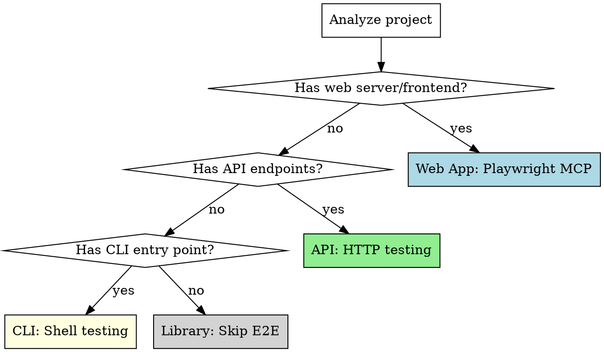

# Auto-E2E

Verify the complete user experience through end-to-end testing. Detects app type (web, API, CLI) and tests the full user journey with evidence capture.

**Core principle:** Unit tests prove components work. E2E tests prove the system works for users. Both are required.

## Iron Law

```
NO COMPLETION CLAIM WITHOUT USER-FACING VERIFICATION
```

If a user can interact with it, it must be tested the way a user would interact with it. Screenshots, response bodies, exit codes — evidence, not assumptions.

## When to Use

- After `implementor:auto-test` has verified unit test coverage
- When invoked by `implementor:run` as the E2E phase
- When you need to verify user-facing behavior of any application type

## App Type Detection



**Detection signals:**
- Web: `index.html`, React/Vue/Svelte/Angular imports, Express/Fastify/Next.js with views, `vite.config`, `webpack.config`
- API: Express/Fastify/Flask/Django routes without views, OpenAPI spec, REST/GraphQL endpoints
- CLI: `bin/` directory, `commander`/`yargs`/`argparse`/`clap` imports, shebang lines
- Library: Only exports, no entry point, published to package registry

**If both web and API:** Test both. Web tests for user-facing pages, API tests for programmatic endpoints.

## Process

### Phase 1: App Analysis

1. Read `.implementor.json` if present — check `e2eType` (overrides auto-detection) and `startCommand`
2. If `skipPhases` includes `"e2e"`, skip this entire skill with documented justification
3. Detect app type (see detection above, unless overridden by config)
4. Find the start command (`npm start`, `python app.py`, `go run .`, etc.)
5. Identify the entry URL/port/command
6. Read the original task description to understand what user flows exist

### Phase 2: Scenario Generation

Derive test scenarios from:
- Original task description and acceptance criteria
- The implementation plan's task list
- Detected routes/pages/commands

**For each scenario, define:**
- Name: descriptive of the user action
- Steps: ordered user interactions
- Expected outcome: what the user should see/receive
- Evidence: what to capture (screenshot, response, output)

### Phase 3: Test Execution

#### Web Apps (Playwright MCP)

Use these MCP tools in sequence:

1. `browser_navigate` - Go to the page
2. `browser_snapshot` - Capture the accessibility tree (verify elements exist)
3. `browser_click` / `browser_fill_form` / `browser_type` - Interact
4. `browser_snapshot` - Verify state after interaction
5. `browser_take_screenshot` - Capture visual evidence
6. `browser_console_messages` - Check for JS errors
7. `browser_network_requests` - Verify API calls succeeded

**Test these flows:**
- Navigation: all pages load, links work, routing correct
- Forms: submission, validation errors, success states
- Error states: 404, server errors, network failures
- Responsiveness: resize to mobile (375px) and tablet (768px)
- Accessibility: verify ARIA labels, focus order, keyboard navigation via snapshots

#### API Testing

Use `curl` or language-specific HTTP clients via Bash:

1. Test each endpoint with valid input (200/201 responses)
2. Test with invalid input (400 responses with useful error messages)
3. Test authentication flows (401/403 for unauthorized)
4. Test edge cases (empty body, missing fields, oversized payload)
5. Verify response schemas match expectations
6. Check headers (CORS, content-type, cache-control)

#### CLI Testing

Use Bash tool:

1. Test with valid arguments (correct output, exit code 0)
2. Test with invalid arguments (helpful error message, exit code != 0)
3. Test with no arguments (usage message)
4. Test --help flag
5. Test edge cases (empty input, very long input, special characters)
6. Verify output format (JSON, table, plain text as expected)

### Phase 4: Evidence Collection

**For every scenario, capture:**
- Web: screenshots at key states, console errors, network failures
- API: full response bodies for failures, status codes, response times
- CLI: stdout, stderr, exit codes

**Store evidence in report with inline references.**

### Phase 5: Results

Report all scenarios with pass/fail and evidence. If any critical scenario fails, mark E2E phase as failed.

## Starting the Application

Before testing, start the app:
1. Run the start command in background
2. Wait for the server to be ready (poll health endpoint or check port)
3. Set a timeout (30s default) — if app doesn't start, fail E2E with startup error
4. After all tests, stop the app

**For web apps that need building first:** Run build command, then start.

## Red Flags - STOP

| Thought | Reality |
|---------|---------|
| "Unit tests already cover this" | Unit tests cover components. E2E tests cover user flows. Different. |
| "It's just an API, no UI to test" | APIs have users too. Test the contract. |
| "The app starts fine locally" | "Works on my machine" is not evidence. Test it. |
| "Screenshots are overkill" | Screenshots are evidence. Evidence is required. |
| "I'll just check one happy path" | Users don't only follow happy paths. Test errors too. |
| "This is a library, skip E2E" | Correct. Libraries skip E2E. But verify it's truly a library. |

## Prompt Template

See `./e2e-tester-prompt.md` for the subagent prompt template.
