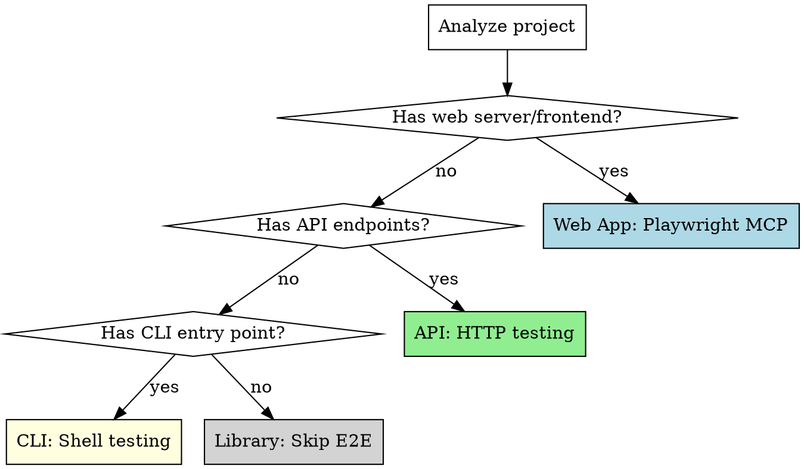

# Auto-E2E

Verify the complete user experience through end-to-end testing. Detects app type (web, API, CLI) and tests the full user journey with evidence capture.

**Core principle:** Unit tests prove components work. E2E tests prove the system works for users. Both are required.

<HARD-GATE>
This skill is part of the shipwright pipeline. Do NOT invoke any superpowers orchestration skill. The shipwright handles E2E testing internally.
</HARD-GATE>

## Iron Law

```
NO COMPLETION CLAIM WITHOUT USER-FACING VERIFICATION
```

If a user can interact with it, it must be tested the way a user would interact with it. Screenshots, response bodies, exit codes — evidence, not assumptions.

## When to Use

- After `shipwright:auto-test` has verified unit test coverage
- When invoked by `shipwright:run` as the E2E phase
- When you need to verify user-facing behavior of any application type

## App Type Detection



**Detection signals:**
- Web: `index.html`, React/Vue/Svelte/Angular imports, Express/Fastify/Next.js with views, `vite.config`, `webpack.config`
- API: Express/Fastify/Flask/Django routes without views, OpenAPI spec, REST/GraphQL endpoints
- CLI: `bin/` directory, `commander`/`yargs`/`argparse`/`clap` imports, shebang lines
- Library: Only exports, no entry point, published to package registry

**If both web and API:** Test both. Web tests for user-facing pages, API tests for programmatic endpoints.

## Process

### Phase 1: App Analysis

1. Read `.shipwright.json` if present — check `e2eType` (overrides auto-detection) and `startCommand`
2. If `skipPhases` includes `"e2e"`, skip this entire skill with documented justification
3. Detect app type (see detection above, unless overridden by config)
4. Find the start command (`npm start`, `python app.py`, `go run .`, etc.)
5. Identify the entry URL/port/command
6. Read the original task description to understand what user flows exist

### Phase 2: Scenario Generation

Derive test scenarios from:
- Original task description and acceptance criteria
- The implementation plan's task list
- Detected routes/pages/commands

**For each scenario, define:**
- Name: descriptive of the user action
- Steps: ordered user interactions
- Expected outcome: what the user should see/receive
- Evidence: what to capture

### Phase 2.5: Scenario Completeness Audit

Before executing scenarios, audit them for completeness and honesty:

1. **"Would a real user do only these things?"**
   - Real users don't follow prescribed flows. They click back, double-submit forms, paste invalid data, navigate directly to deep URLs, open multiple tabs.
   - Add at least one "adversarial user" scenario per feature: wrong input, interrupted flow, unexpected navigation.

2. **"Do these scenarios test the feature, or do they test that the page loads?"**
   - A scenario that navigates to a page and takes a screenshot does not test the feature. It tests that the page renders.
   - Every scenario must exercise the *specific behavior* that was implemented. If the task was "add user search," the scenario must search for a user and verify the results are correct — not just verify the search page exists.

3. **"Am I testing against acceptance criteria or against my assumptions?"**
   - Cross-reference every scenario against the original task's acceptance criteria.
   - Every acceptance criterion must have at least one scenario that directly verifies it.
   - If an acceptance criterion can't be verified through E2E testing, document why (e.g., "rate limiting can't be tested in E2E without hitting the API 1000 times").

4. **"What happens when the feature fails?"**
   - Every feature has failure modes. If the search returns no results, what does the user see? If the API times out, what does the UI show?
   - Add at least one failure-mode scenario per feature.

5. **"Am I testing isolated interactions or real user journeys?"**
   - Most E2E scenarios test one interaction in isolation: click button, verify result. Real users perform multi-step journeys with state: log in → search → add to cart → modify cart → checkout.
   - For every feature that involves state changes, write at least one **stateful journey scenario** that chains multiple interactions and verifies state persists correctly between them.

**Adversarial scenario patterns** (use these as templates, not the vague "add adversarial scenarios"):

| Category | Web | API | CLI |
|----------|-----|-----|-----|
| Double-submit | Click submit twice rapidly. Second should either be blocked or idempotent. | POST the same request twice. Check for duplicate creation. | Run command twice on same input. Verify idempotent or correctly errored. |
| Invalid input | Paste `<script>alert(1)</script>` in text fields. Paste 10MB of text. Leave required fields empty. | Send `null` body, wrong content-type, oversized payload, unicode in IDs. | Pass `--count=-1`, empty string args, paths with spaces and special chars. |
| Interrupted flow | Navigate away mid-form. Press back after submit. Refresh during loading. | Cancel request mid-stream (if applicable). | Ctrl+C during processing. Check for partial output or cleanup. |
| Authorization | Access admin pages without auth. Access other users' data. Replay expired tokens. | Hit protected endpoints without token. Try horizontal privilege escalation. | Run privileged commands as unprivileged user. |
| Unexpected navigation | Deep-link to a page that requires prior state (e.g., /checkout without cart). Bookmark and revisit a dynamic URL. | Call endpoints in wrong order. Skip required flow steps. | Pipe output to another command. Run with and without TTY. |

**Stateful journey templates:**

- **CRUD journey:** Create item → verify in list → edit item → verify changes → delete item → verify removal
- **Auth journey:** Register → verify email (if applicable) → log in → access protected resource → log out → verify access denied
- **Search+Action journey:** Search → select result → perform action on result → verify action persisted → return to search → verify state reflects action
- **Error+Recovery journey:** Trigger an error → verify error state is clean → retry the operation → verify success

**Output:** Validated scenario list with completeness verdict. If scenarios only test "page loads" without exercising real behavior, add behavioral scenarios before proceeding.

### Phase 2.75: Expected-Result Derivation

For each scenario, explicitly document *how you know what the correct result is*:

1. **From acceptance criteria:** "The spec says searching for 'Alice' should return 2 results." → Assert exactly 2 results.
2. **From seed data:** "The database has 3 users matching 'test'." → Assert 3 rows in the response.
3. **From computation:** "Adding items costing $10 and $20 with 10% tax should total $33." → Assert total is $33.
4. **From contract:** "The API docs say this endpoint returns `{data: [], meta: {total: N}}`." → Assert that shape and verify `total` matches actual count.
5. **Unknown:** If you genuinely can't determine the correct result, document why and test at least that the output is *consistent* (same input → same output) and *reasonable* (not empty, not an error, right data type).

**If most expected results are "Unknown":** Your scenarios are superficial. Go back to the acceptance criteria and the seed data to derive concrete expectations.

### Phase 3: Test Execution

#### Web Apps (Playwright MCP)

Use these MCP tools in sequence:

1. `browser_navigate` - Go to the page
2. `browser_snapshot` - Capture the accessibility tree (verify elements exist)
3. `browser_click` / `browser_fill_form` / `browser_type` - Interact
4. `browser_snapshot` - Verify state after interaction
5. `browser_take_screenshot` - Capture visual evidence
6. `browser_console_messages` - Check for JS errors
7. `browser_network_requests` - Verify API calls succeeded

**Test these flows:**
- Navigation: all pages load, links work, routing correct
- Forms: submission, validation errors, success states
- Error states: 404, server errors, network failures
- Responsiveness: resize to mobile (375px) and tablet (768px)
- Accessibility: verify ARIA labels, focus order, keyboard navigation via snapshots

#### API Testing

Use `curl` or language-specific HTTP clients via Bash:

1. Test each endpoint with valid input (200/201 responses)
2. Test with invalid input (400 responses with useful error messages)
3. Test authentication flows (401/403 for unauthorized)
4. Test edge cases (empty body, missing fields, oversized payload)
5. Verify response schemas match expectations
6. Check headers (CORS, content-type, cache-control)

#### CLI Testing

Use Bash tool:

1. Test with valid arguments (correct output, exit code 0)
2. Test with invalid arguments (helpful error message, exit code != 0)
3. Test with no arguments (usage message)
4. Test --help flag
5. Test edge cases (empty input, very long input, special characters)
6. Verify output format (JSON, table, plain text as expected)

### Phase 4: Evidence Collection

**For every scenario, capture:**
- Web: screenshots at key states, console errors, network failures
- API: full response bodies for failures, status codes, response times
- CLI: stdout, stderr, exit codes

**Store evidence in report with inline references.**

### Phase 5: Evidence Evaluation Gate

Before declaring scenarios as passed, evaluate the evidence:

1. **"Does this evidence actually prove the feature works?"**
   - A screenshot of a page loading proves the page loads. It does not prove the feature works.
   - A 200 response proves the server responded. It does not prove the response content is correct.
   - An exit code of 0 proves the CLI didn't crash. It does not prove the output is right.
   - For each piece of evidence, state explicitly what it proves and what it doesn't.

2. **"Would this evidence convince a skeptical reviewer?"**
   - If someone asked "how do you know the search feature works?", would "I took a screenshot of the search page" be a convincing answer?
   - Evidence must show *correct results*, not just *running without errors*.

3. **"Did I verify computed output, not just presence?"**
   - For web: Did I verify the search results are correct for the query, or just that result elements appear?
   - For API: Did I verify the response body has the right data, or just that it's 200 OK?
   - For CLI: Did I verify the output content, or just that something was printed?

**Verdicts per scenario:**
- **PROVEN:** Evidence demonstrates the feature works correctly with verified output.
- **SUPERFICIAL:** Evidence shows the feature runs without errors but doesn't verify correctness. Acceptable only for infrastructure scenarios (page loads, server starts).
- **INSUFFICIENT:** Evidence doesn't demonstrate anything meaningful. Must add more substantive verification.

If any feature-behavior scenario is SUPERFICIAL or INSUFFICIENT, add more verification steps and re-evaluate.

### Phase 6: Results

Report all scenarios with pass/fail, evidence, and evidence evaluation. If any critical scenario fails, mark E2E phase as failed.

## Starting the Application

Before testing, start the app:
1. Run the start command in background
2. Wait for the server to be ready (poll health endpoint or check port)
3. Set a timeout (30s default) — if app doesn't start, invoke `shipwright:auto-debug` with the startup error context
4. After all tests, stop the app

**For web apps that need building first:** Run build command, then start.

## Anti-Patterns

**Do NOT write E2E scenarios that:**
- Only verify pages load without testing feature behavior
- Assert only HTTP status codes without checking response content
- Take screenshots as proof without verifying what's in the screenshot
- Test only the happy path and declare the feature "works"
- Skip failure-mode testing ("what happens when it goes wrong?")
- Duplicate unit test coverage instead of testing user journeys

**Do NOT:**
- Declare E2E passed based on "no errors in console"
- Accept a screenshot of a blank page as evidence
- Skip the evidence evaluation because "it obviously works"
- Generate scenarios only from the plan without reading the actual acceptance criteria

## Red Flags - STOP

| Thought | Reality |
|---------|---------|
| "Unit tests already cover this" | Unit tests cover components. E2E tests cover user flows. Different. |
| "It's just an API, no UI to test" | APIs have users too. Test the contract. |
| "The app starts fine locally" | "Works on my machine" is not evidence. Test it. |
| "Screenshots are overkill" | Screenshots are evidence. But evidence of *what*? A screenshot proves the page renders, not that it works. |
| "I'll just check one happy path" | Users don't only follow happy paths. Test errors too. |
| "This is a library, skip E2E" | Correct. Libraries skip E2E. But verify it's truly a library. |
| "The page loaded, so the feature works" | Loading and working are different things. Verify the output. |
| "200 OK means it's correct" | 200 means the server didn't crash. Check the response body. |
| "No console errors = working" | Absence of errors is not presence of correctness. |

## Integration

Auto-e2e verifies user-facing behavior after unit tests pass:

| Relationship | Skill | Data Flow |
|-------------|-------|-----------|
| **Consumes from** | `auto-test` | Unit test results — E2E focuses on integration paths, not re-testing unit-covered logic |
| **Consumes from** | `auto-plan` | Plan's acceptance criteria — scenarios are derived from these |
| **Consumes from** | `auto-setup` | Start command, app type detection |
| **Produces for** | `production-readiness` | E2E evidence and verdicts (Gate 3), evidence evaluation verdicts (PROVEN/SUPERFICIAL/INSUFFICIENT) |
| **Produces for** | `auto-review` | E2E results inform spec compliance — did the feature actually work for users? |
| **Invokes** | `auto-debug` | When the app fails to start, scenarios crash, or unexpected runtime errors occur |

**Invoked by:** `shipwright:run` (Phase 5)
**Invokes:** `shipwright:auto-debug` (on app startup failure or scenario crashes)
**Signals produced:** E2E scenario results with evidence, evidence evaluation verdicts, app type classification
**Signals consumed:** Task description, acceptance criteria, start command, `.shipwright.json` e2eType config

## Prompt Template

See `./e2e-tester-prompt.md` for the subagent prompt template.
