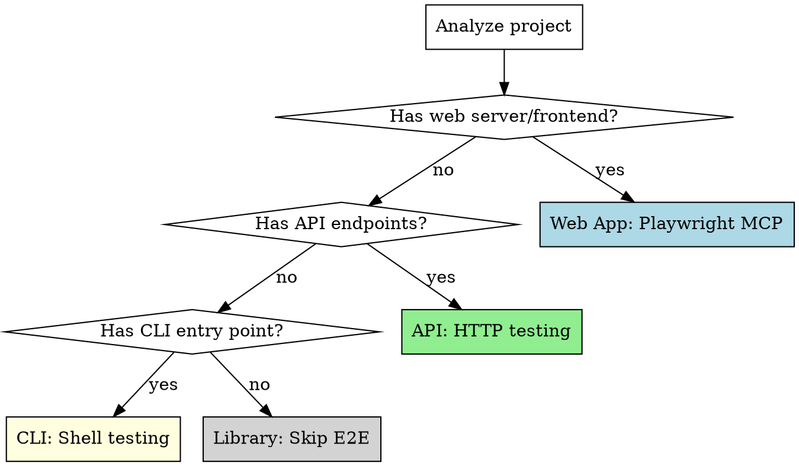

# Auto-E2E

Verify the complete user experience through end-to-end testing. Detects app type (web, API, CLI) and tests the full user journey with evidence capture.

**Core principle:** Unit tests prove components work. E2E tests prove the system works for users. Both are required.

<HARD-GATE>
This skill is part of the shipwright pipeline. Do NOT invoke any superpowers orchestration skill. The shipwright handles E2E testing internally.
</HARD-GATE>

## Iron Law

```
NO COMPLETION CLAIM WITHOUT USER-FACING VERIFICATION
```

If a user can interact with it, it must be tested the way a user would interact with it. Screenshots, response bodies, exit codes — evidence, not assumptions.

## When to Use

- After `shipwright:auto-test` has verified unit test coverage
- When invoked by `shipwright:run` as the E2E phase
- When you need to verify user-facing behavior of any application type

## App Type Detection



**Detection signals:**
- Web: `index.html`, React/Vue/Svelte/Angular imports, Express/Fastify/Next.js with views, `vite.config`, `webpack.config`
- API: Express/Fastify/Flask/Django routes without views, OpenAPI spec, REST/GraphQL endpoints
- CLI: `bin/` directory, `commander`/`yargs`/`argparse`/`clap` imports, shebang lines
- Library: Only exports, no entry point, published to package registry

**If both web and API:** Test both. Web tests for user-facing pages, API tests for programmatic endpoints.

## Process

### Phase 1: App Analysis

1. Read `.shipwright.json` if present — check `e2eType` (overrides auto-detection) and `startCommand`
2. If `skipPhases` includes `"e2e"`, skip this entire skill with documented justification
3. Detect app type (see detection above, unless overridden by config)
4. Find the start command (`npm start`, `python app.py`, `go run .`, etc.)
5. Identify the entry URL/port/command
6. Read the original task description to understand what user flows exist

### Phase 2: Scenario Generation

Derive test scenarios from:
- Original task description and acceptance criteria
- The implementation plan's task list
- Detected routes/pages/commands

**For each scenario, define:**
- Name: descriptive of the user action
- Steps: ordered user interactions
- Expected outcome: what the user should see/receive
- Evidence: what to capture

### Phase 2.5: Scenario Validation

Before executing scenarios, validate them for completeness and groundedness:

1. **Adversarial coverage:** Real users don't follow prescribed flows. Add at least one adversarial scenario per feature (wrong input, interrupted flow, unexpected navigation) and one failure-mode scenario (what happens when the feature fails?).

2. **Behavioral depth:** Every scenario must exercise the *specific behavior* that was implemented, not just verify a page loads or an endpoint responds. Cross-reference every scenario against the original task's acceptance criteria — every criterion needs at least one scenario.

3. **Stateful journeys:** For features involving state changes, include at least one multi-step journey (e.g., create → verify → edit → verify → delete → verify).

4. **Expected results grounded in evidence:** For each scenario, document *how you know what the correct result is*:
   - From acceptance criteria, seed data, computation, or contract documentation
   - If you can't determine the correct result, test at least for consistency and reasonableness

**Adversarial scenario patterns:**

| Category | Web | API | CLI |
|----------|-----|-----|-----|
| Double-submit | Click submit twice rapidly | POST same request twice | Run command twice on same input |
| Invalid input | Paste script tags, 10MB text, empty required fields | `null` body, wrong content-type, oversized payload | Negative numbers, empty strings, paths with special chars |
| Interrupted flow | Navigate away mid-form, back after submit | Cancel request mid-stream | Ctrl+C during processing |
| Authorization | Access admin pages without auth | Hit protected endpoints without token | Run privileged commands as unprivileged user |

### Phase 3: Test Execution

#### Web Apps (Playwright MCP)

Use these MCP tools in sequence:

1. `browser_navigate` - Go to the page
2. `browser_snapshot` - Capture the accessibility tree (verify elements exist)
3. `browser_click` / `browser_fill_form` / `browser_type` - Interact
4. `browser_snapshot` - Verify state after interaction
5. `browser_take_screenshot` - Capture visual evidence
6. `browser_console_messages` - Check for JS errors
7. `browser_network_requests` - Verify API calls succeeded

**Test these flows:**
- Navigation: all pages load, links work, routing correct
- Forms: submission, validation errors, success states
- Error states: 404, server errors, network failures
- Responsiveness: resize to mobile (375px) and tablet (768px)
- Accessibility: verify ARIA labels, focus order, keyboard navigation via snapshots

#### API Testing

Use `curl` or language-specific HTTP clients via Bash:

1. Test each endpoint with valid input (200/201 responses)
2. Test with invalid input (400 responses with useful error messages)
3. Test authentication flows (401/403 for unauthorized)
4. Test edge cases (empty body, missing fields, oversized payload)
5. Verify response schemas match expectations
6. Check headers (CORS, content-type, cache-control)

#### CLI Testing

Use Bash tool:

1. Test with valid arguments (correct output, exit code 0)
2. Test with invalid arguments (helpful error message, exit code != 0)
3. Test with no arguments (usage message)
4. Test --help flag
5. Test edge cases (empty input, very long input, special characters)
6. Verify output format (JSON, table, plain text as expected)

### Phase 4: Evidence Collection

**For every scenario, capture:**
- Web: screenshots at key states, console errors, network failures
- API: full response bodies for failures, status codes, response times
- CLI: stdout, stderr, exit codes

**Store evidence in report with inline references.**

### Phase 5: Evidence Evaluation

Before declaring scenarios passed, evaluate the evidence honestly:

1. **"Does this evidence prove the feature works, or just that the system responds?"** A screenshot of a page loading, a 200 status, or exit code 0 prove the system runs — not that the feature is correct.

2. **"Did I verify computed output, not just presence?"** Check that results are *correct* for the query, not just that result elements appear.

3. **"Would this evidence convince a skeptical reviewer?"** Evidence must show correct results, not just absence of errors.

If any feature-behavior scenario lacks evidence of correct output, add more verification steps before proceeding.

### Phase 6: Results

Report all scenarios with pass/fail, evidence, and evidence evaluation. If any critical scenario fails, mark E2E phase as failed.

## Starting the Application

Before testing, start the app:
1. Run the start command in background
2. Wait for the server to be ready (poll health endpoint or check port)
3. Set a timeout (30s default) — if app doesn't start, invoke `shipwright:auto-debug` with the startup error context
4. After all tests, stop the app

**For web apps that need building first:** Run build command, then start.

## Anti-Patterns

**Do NOT write E2E scenarios that:**
- Only verify pages load without testing feature behavior
- Assert only HTTP status codes without checking response content
- Take screenshots as proof without verifying what's in the screenshot
- Test only the happy path and declare the feature "works"
- Skip failure-mode testing ("what happens when it goes wrong?")
- Duplicate unit test coverage instead of testing user journeys

## Red Flags - STOP

| Thought | Reality |
|---------|---------|
| "The page loaded, so the feature works" | Loading and working are different things. Verify the output. |
| "200 OK means it's correct" | 200 means the server didn't crash. Check the response body. |
| "Screenshots are overkill" | Screenshots prove the page renders, not that it works. Verify content. |
| "I'll just check one happy path" | Users don't only follow happy paths. Test errors too. |
| "Unit tests already cover this" | Unit tests cover components. E2E tests cover user flows. Different. |

## Integration

Auto-e2e verifies user-facing behavior after unit tests pass:

| Relationship | Skill | Data Flow |
|-------------|-------|-----------|
| **Consumes from** | `auto-test` | Unit test results — E2E focuses on integration paths, not re-testing unit-covered logic |
| **Consumes from** | `auto-plan` | Plan's acceptance criteria — scenarios are derived from these |
| **Consumes from** | `auto-setup` | Start command, app type detection |
| **Produces for** | `production-readiness` | E2E evidence and verdicts (Gate 3), evidence evaluation verdicts (PROVEN/SUPERFICIAL/INSUFFICIENT) |
| **Produces for** | `auto-review` | E2E results inform spec compliance — did the feature actually work for users? |
| **Invokes** | `auto-debug` | When the app fails to start, scenarios crash, or unexpected runtime errors occur |

**Invoked by:** `shipwright:run` (Phase 5)
**Invokes:** `shipwright:auto-debug` (on app startup failure or scenario crashes)
**Signals produced:** E2E scenario results with evidence, evidence evaluation verdicts, app type classification
**Signals consumed:** Task description, acceptance criteria, start command, `.shipwright.json` e2eType config

## Prompt Template

See `./e2e-tester-prompt.md` for the subagent prompt template.
