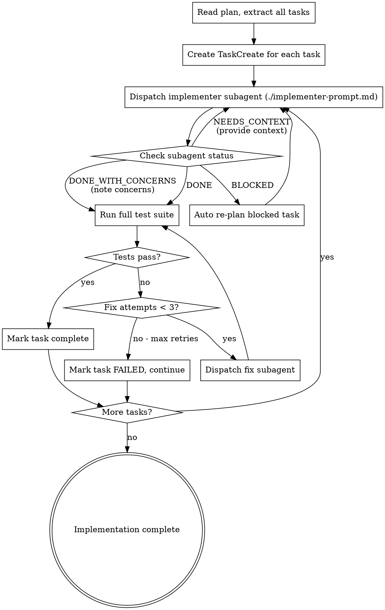

# Auto-Impl

Execute an implementation plan by dispatching a fresh subagent per task, with automatic error recovery and re-planning for blocked tasks.

**Core principle:** Fresh subagent per task (no context pollution) + autonomous error handling (no human escalation) = reliable execution at scale.

<HARD-GATE>
This skill is part of the shipwright pipeline. Do NOT invoke superpowers:subagent-driven-development, superpowers:executing-plans, or any other superpowers orchestration skill. The shipwright handles implementation internally.
</HARD-GATE>

## Iron Laws

```
NO TASK PROCEEDS UNTIL THE PREVIOUS TASK'S TESTS PASS
NO TASK PROCEEDS UNTIL THE PROJECT BUILDS CLEAN
```

Violating the letter of these rules is violating the spirit. A green bar AND a clean build are the gates to the next task.

## When to Use

- After `shipwright:auto-plan` has created a plan
- When invoked by `shipwright:run` as the implementation phase
- When you have an ordered list of implementation tasks with exact file paths and code

## Process



## Dispatching Subagents

**Always provide the full task text** to the subagent. Never make the subagent read the plan file.

**Context to include (in priority order — see context budget):**
- Full task description from plan (copy-paste, not reference)
- **Task lens from architecture map** (max 150 lines — the subagent's structural understanding of the codebase)
- Scene-setting: where this task fits in the overall plan
- What previous tasks have built (files created/modified)
- **Inter-task learning context** (see below)
- The project's test command and conventions
- The working directory

### Architecture Map Context

**If `docs/architecture-map.md` exists**, generate a task-focused lens for each subagent:

1. Identify which modules the task touches (from the plan's file paths)
2. Extract those modules' details from the map (interfaces, responsibilities)
3. Include 1-hop neighbor modules' interfaces (what the task's modules interact with)
4. Include relevant hot spots and patterns
5. Cap at 150 lines

**Pass the lens, not the full map.** The full map (up to 400 lines) is for planning and architecture tasks. Individual implementer subagents get the lens — their context is precious.

**For hot spot tasks** (touching modules flagged in the map's hot spot section): include the full dependency chain and recommend a stronger model.

### Context Budget

Follow this budget when assembling subagent context:

| Context Type | Priority | Max Lines | Always Include? |
|-------------|----------|-----------|----------------|
| Task description | 1 (highest) | unlimited | Yes |
| Task lens (from auto-map) | 2 | 150 | Yes, if map exists |
| Inter-task learning log | 3 | 50 | Yes |
| Previous task interfaces | 4 | 30 | Yes, if tasks depend |
| Full architecture map | 5 (lowest) | 400 | Only for architecture/judgment tasks |

**Total context (excluding task description): max 600 lines.** If over budget, compress the lens or omit the full map.

**Use `./implementer-prompt.md` as the prompt template.**

### Inter-Task Learning

Maintain a running context log across tasks. After each task completes, record:

```
Task N: [name]
- Files created: [list]
- Files modified: [list]
- Interfaces exposed: [exported functions/classes with signatures]
- Patterns established: [naming conventions, error handling patterns, import styles used]
- Surprises: [anything that differed from the plan — different file structure, extra dependency, etc.]
- Integrity check findings: [any concerns from the integrity check]
```

**Feed this forward.** When dispatching Task N+1, include the accumulated log. This means:
- Task 3 knows what interfaces Task 1 and 2 actually created (not what the plan said they'd create)
- If Task 2 deviated from the plan (different function name, extra parameter), Task 3 gets the real interface
- If a pattern was established in Task 1 (e.g., errors are thrown as `AppError` subclasses), Task 3 follows it

**This prevents the #1 cause of subagent failures:** Task N assumes Task N-1 created exactly what the plan said, but it didn't.

## Model Selection

Use the least powerful model that can handle each task:

- **Mechanical tasks** (isolated functions, clear specs, 1-2 files): use `model: "sonnet"` or `model: "haiku"`
- **Integration tasks** (multi-file, pattern matching): use default model
- **Architecture/judgment tasks** (design decisions, broad codebase): use `model: "opus"`

**Signals:**
- Touches 1-2 files with complete spec -> cheap model
- Touches multiple files with integration concerns -> standard model
- Requires design judgment or broad understanding -> most capable model

## Handling Subagent Status

**DONE:** Before trusting the status, run the Implementation Integrity Check (see below). Then run full test suite. If tests pass, mark task complete. If tests fail, invoke `shipwright:auto-debug` with the failure context (test command, output, stack trace). Auto-debug will investigate root cause and apply a fix.

**DONE_WITH_CONCERNS:** Note the concerns. If correctness-related, address before proceeding. If observational, note and proceed to integrity check + test suite.

**NEEDS_CONTEXT:** Provide the missing context. Re-dispatch the same subagent prompt with additional information. If the needed context doesn't exist, investigate the codebase to find it.

**BLOCKED:** This is where auto-impl differs from superpowers. Do NOT escalate to human. Instead:
1. Analyze the blocker
2. If context problem: investigate codebase, provide context, re-dispatch
3. If too complex: break into smaller tasks, re-dispatch each
4. If plan is wrong: re-plan this specific task using auto-plan patterns
5. If still blocked after 2 retries: mark task as FAILED in report, continue with remaining tasks

### Implementation Integrity Check

After a subagent reports DONE, do NOT blindly trust it. Before running the test suite, perform a quick independent verification:

1. **"Did the subagent actually create/modify the files the plan specified?"**
   - Run `git diff --name-only` and compare against the task's file list
   - Missing files = incomplete work. Extra files = scope creep. Both need investigation.

2. **"Does the code look like it implements the acceptance criteria, or does it implement something adjacent?"**
   - Read the key files (not all of them — just the core logic). Spend 30 seconds, not 5 minutes.
   - Does the function signature match what was planned?
   - Does the logic address the actual requirement, or a simplified version of it?

3. **"Did the subagent write tests that test the requirement, or tests that test their own code?"**
   - Glance at the test names. Do they describe behaviors from the acceptance criteria, or do they describe implementation details?
   - If every test is `test_functionName_works` instead of `test_returns_empty_list_when_no_matches`, the tests are likely shallow.

**This is a 1-minute sanity check, not a full review.** The goal is to catch obvious misses before wasting a test suite run on fundamentally wrong code. If the integrity check fails, provide feedback and re-dispatch — do NOT just run the tests hoping they'll catch it.

### Cascading Breakage Detection (Net-Positive Gate)

After each task's tests pass, verify that *previous tasks' tests still pass too* using a formal baseline comparison:

1. **Before dispatching each task**, record the full test suite state as a baseline (passing count, failing count, test names)
2. **After the task completes**, run the full test suite (not just the new task's tests)
3. **Compare against baseline:**
   - All previously-passing tests MUST still pass
   - The task's new tests MUST pass
   - Total passing count must be >= baseline (net-positive)
4. **If a previously-passing test now fails** (regression detected):
   - **Do NOT proceed to Task N+1**
   - **Do NOT attempt to "also fix" the regression** — that leads to circular fixing
   - First, check if the regression is in a module that depends on the changed module (use the architecture map's dependency graph)
   - If it's a simple interface mismatch: fix in the current task's scope
   - If it's a design conflict: the plan decomposed along wrong seams. Re-plan the conflicting tasks as a single task and re-dispatch
   - If the fix for the regression itself causes another regression: STOP. Revert the entire task and re-plan it
5. Record the breakage and resolution in the inter-task log — this informs the Plan Retrospective later

**Why this matters:** Without cascading detection, you can finish all 8 tasks with each passing its own tests, then discover in auto-test that tasks 3 and 5 are incompatible. Catching it immediately saves a full debug cycle.

**Anti-circle rule:** If Task N's fix breaks Task N-K, and fixing that breaks Task N again, you're in a circle. Revert Task N entirely, merge it with Task N-K in the plan, and re-dispatch as a single task. Two tasks that can't exist independently must be implemented together.

### Build Verification Gate

After each task completes and before running the test suite, verify the project builds:

1. **Run the build command** (`buildCommand` from `.shipwright.json`, or auto-detected: `dotnet build`, `npm run build`, `cargo build`, `go build ./...`, etc.)
2. **If the build fails:**
   - The task introduced a compilation/type error
   - Do NOT proceed to the test suite — build errors cascade into meaningless test failures
   - Check if the task modified a shared interface, data model, or upstream module without updating downstream consumers
   - If the task is part of an atomic change group (from the plan), check if the group was incorrectly split
   - Dispatch a fix subagent with the build error + architecture map context showing the build dependency chain
3. **If the build succeeds:** Proceed to test suite

**Why this matters:** In compiled languages and large multi-project solutions, a task that changes an interface in a core library will break the build for every project that depends on it. Running the test suite on a broken build produces hundreds of cascading errors that are impossible to diagnose. Build verification catches this immediately.

### Checkpoint System

After each task passes (build + tests), create a checkpoint:

```bash
git tag "shipwright/checkpoint-task-N" -m "Checkpoint after task N: [task name]"
```

**Checkpoints enable:**
- **Rollback to last known-good state** — if task N+1 fails catastrophically and can't be fixed in 3 attempts, roll back to task N's checkpoint instead of losing all progress
- **Resume from checkpoint** — if the pipeline is interrupted (context limit, timeout), it can resume from the last checkpoint
- **Regression isolation** — if task N+3 reveals a subtle issue introduced by task N+1, you can diff between checkpoints to narrow the investigation

**Rollback procedure:**
```bash
# Roll back to checkpoint after task N
git reset --hard shipwright/checkpoint-task-N
```

**When to rollback:**
- Task has failed 3 attempts (original + 2 retries) AND the failures are getting worse (more tests failing each attempt)
- Task's fix broke more tests than it fixed (net-negative, detected by cascading breakage detection)
- Circular fixing detected between this task and a previous task

**Cleanup:** After the pipeline completes successfully, remove checkpoint tags:
```bash
git tag -l "shipwright/checkpoint-*" | xargs git tag -d
```

## Model Escalation

When a subagent fails or produces low-quality work, escalate to a more capable model before re-dispatching:

| Attempt | Model | When to Escalate |
|---------|-------|-----------------|
| 1st attempt | Original selection (haiku/sonnet/default) | — |
| 2nd attempt (after failure) | Default model | If the failure was a logic or quality issue, not just missing context |
| 3rd attempt (after 2nd failure) | `model: "opus"` | When the task requires judgment the cheaper model couldn't provide |

**Do NOT escalate for context problems** — if the subagent reported NEEDS_CONTEXT, provide context and re-dispatch at the same model level. Escalation is for capability gaps, not information gaps.

**Do NOT downgrade after escalation** — once a task requires a more capable model, keep it there.

## Error Recovery

- Max 3 retries per task (original + 2 recovery attempts)
- Each retry must change something (more context, simpler scope, different approach, or more capable model)
- Never retry the exact same prompt without changes
- If a task fails, assess impact on downstream tasks before continuing
- If downstream tasks depend on the failed task, attempt to re-plan them too

## Integration

Auto-impl is the core execution engine, consuming plans and producing working code:

| Relationship | Skill | Data Flow |
|-------------|-------|-----------|
| **Consumes from** | `auto-plan` | Plan file — ordered tasks with file paths, acceptance criteria, code |
| **Consumes from** | `auto-map` | Architecture map — task-focused lens per subagent (max 150 lines) |
| **Consumes from** | `auto-setup` | Build/test commands, environment fingerprint |
| **Produces for** | `auto-test` | Implementation with initial tests, inter-task learning log |
| **Produces for** | `auto-review` | Git commits with implementation, integrity check findings |
| **Produces for** | `production-readiness` | All code changes on the feature branch |
| **Invokes** | `auto-debug` | When tests fail after a task — passes error context, architecture lens, fix history |

**Invoked by:** `shipwright:run` (Phase 3)
**Invokes:** `shipwright:auto-debug` (on test/build failure)
**Signals produced:** Implementation commits, inter-task learning log, checkpoint tags, cascading breakage incidents
**Signals consumed:** Plan file, architecture map lens, build/test commands, `.shipwright.json` config

## Anti-Patterns

**Parallel subagent dispatch:** Dispatching multiple implementer subagents simultaneously causes file conflicts. One subagent at a time, always.

**Context pollution:** Re-using the same subagent for multiple tasks. Each task gets a fresh subagent with only its own context — no memory of previous tasks except the inter-task learning log.

**Blind trust in DONE status:** A subagent reporting DONE is a claim, not proof. The Implementation Integrity Check must verify files exist, code matches the plan, and tests test behavior (not just shape).

**Skipping the build gate:** Running the test suite on a broken build produces hundreds of cascading errors. Always verify the build compiles before running tests.

**Retrying without change:** Same prompt = same output. Every retry must add context, change scope, or escalate the model.

## Red Flags - STOP

| Thought | Reality |
|---------|---------|
| "I'll dispatch implementers in parallel" | Parallel implementers cause file conflicts. One at a time. |
| "Tests are failing but I'll fix it in the next task" | Failing tests are a hard gate. Fix before proceeding. |
| "Let me retry the same prompt" | Same input = same output. Change something first. |
| "The subagent is BLOCKED but I'll proceed" | BLOCKED means the task isn't done. Resolve or re-plan. |
| "The subagent can read the plan file" | Never. Provide full task text. Subagent context is precious. |
| "I'll skip the test suite, nothing changed" | Something always changed. Run the suite. |
| "The subagent said DONE, so it's done" | DONE is a claim. Verify the files, glance at the code. Trust but verify. |
| "Haiku can handle this" | If the task involves judgment, design, or multi-file coordination, it probably can't. Don't penny-pinch on quality. |
| "The subagent's tests pass, so the code is correct" | Tests passing means the tests pass. Run the integrity check to verify the tests test the right thing. |

## Prompt Template

See `./implementer-prompt.md` for the full subagent prompt template.
