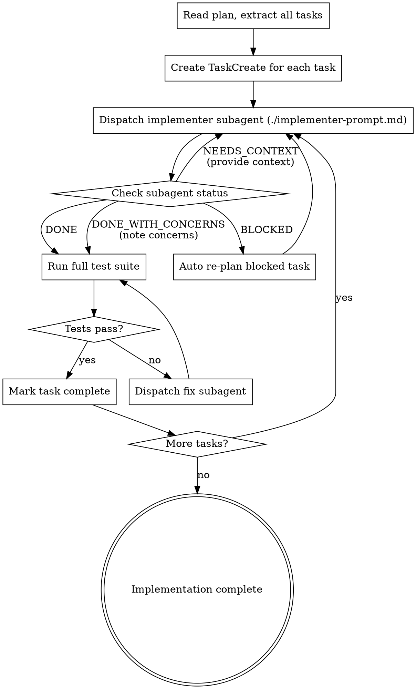

# Auto-Impl

Execute an implementation plan by dispatching a fresh subagent per task, with automatic error recovery and re-planning for blocked tasks.

**Core principle:** Fresh subagent per task (no context pollution) + autonomous error handling (no human escalation) = reliable execution at scale.

## Iron Law

```
NO TASK PROCEEDS UNTIL THE PREVIOUS TASK'S TESTS PASS
```

Violating the letter of this rule is violating the spirit. A green bar is the gate to the next task.

## When to Use

- After `implementor:auto-plan` has created a plan
- When invoked by `implementor:run` as the implementation phase
- When you have an ordered list of implementation tasks with exact file paths and code

## Process



## Dispatching Subagents

**Always provide the full task text** to the subagent. Never make the subagent read the plan file.

**Context to include:**
- Full task description from plan (copy-paste, not reference)
- Scene-setting: where this task fits in the overall plan
- What previous tasks have built (files created/modified)
- The project's test command and conventions
- The working directory

**Use `./implementer-prompt.md` as the prompt template.**

## Model Selection

Use the least powerful model that can handle each task:

- **Mechanical tasks** (isolated functions, clear specs, 1-2 files): use `model: "sonnet"` or `model: "haiku"`
- **Integration tasks** (multi-file, pattern matching): use default model
- **Architecture/judgment tasks** (design decisions, broad codebase): use `model: "opus"`

**Signals:**
- Touches 1-2 files with complete spec -> cheap model
- Touches multiple files with integration concerns -> standard model
- Requires design judgment or broad understanding -> most capable model

## Handling Subagent Status

**DONE:** Run full test suite. If tests pass, mark task complete. If tests fail, dispatch fix subagent with failure details.

**DONE_WITH_CONCERNS:** Note the concerns. If correctness-related, address before proceeding. If observational, note and proceed to test suite.

**NEEDS_CONTEXT:** Provide the missing context. Re-dispatch the same subagent prompt with additional information. If the needed context doesn't exist, investigate the codebase to find it.

**BLOCKED:** This is where auto-impl differs from superpowers. Do NOT escalate to human. Instead:
1. Analyze the blocker
2. If context problem: investigate codebase, provide context, re-dispatch
3. If too complex: break into smaller tasks, re-dispatch each
4. If plan is wrong: re-plan this specific task using auto-plan patterns
5. If still blocked after 2 retries: mark task as FAILED in report, continue with remaining tasks

## Error Recovery

- Max 3 retries per task (original + 2 recovery attempts)
- Each retry must change something (more context, simpler scope, different approach)
- Never retry the exact same prompt without changes
- If a task fails, assess impact on downstream tasks before continuing
- If downstream tasks depend on the failed task, attempt to re-plan them too

## Red Flags - STOP

- Dispatching multiple implementer subagents in parallel (causes conflicts)
- Proceeding to next task while tests are failing
- Retrying the same prompt without changes
- Ignoring BLOCKED status
- Making the subagent read the plan file instead of providing full text
- Skipping the test suite between tasks

## Prompt Template

See `./implementer-prompt.md` for the full subagent prompt template.
