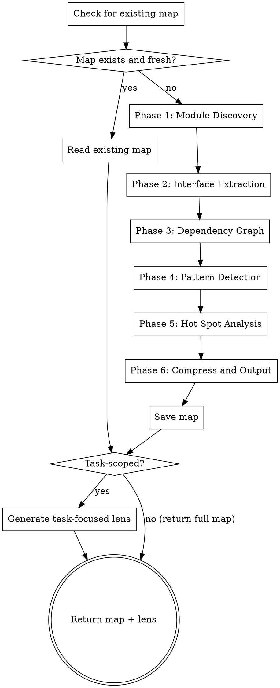

# Auto-Map

Generate a compact, structured architecture map of a codebase that fits in any subagent's context window. The map captures module boundaries, interface contracts, dependency relationships, patterns, and hot spots — everything a subagent needs to understand how the codebase fits together without reading every file.

**Core principle:** A subagent that understands the architecture makes better decisions than one that has read more files. Compression beats volume. Structure beats text.

<HARD-GATE>
This skill is part of the implementor pipeline. Do NOT invoke superpowers skills. The implementor handles mapping internally.

The map is NOT documentation. It is a compressed structural representation optimized for LLM consumption. It should be dense, precise, and actionable — not readable prose.
</HARD-GATE>

## Iron Law

```
THE MAP MUST FIT IN 400 LINES OR LESS
```

A map that exceeds 400 lines defeats its purpose. If the codebase is huge, increase compression — summarize more aggressively, collapse low-importance modules, focus on the parts that matter for the current task. A 400-line map that covers 80% of the architecture is infinitely more useful than a 2000-line map that gets truncated.

## When to Use

- Before `auto-plan` to inform task decomposition along real module boundaries
- Before `auto-impl` to give subagents architectural context
- Before `auto-debug` to enable dependency-graph-guided root cause tracing
- Before `auto-verify` to understand which modules are involved in verification targets
- When invoked by `implementor:run` as Phase 1.25 (between context gathering and setup)
- When the map is stale (codebase has changed significantly since last generation)
- Standalone when exploring an unfamiliar codebase

## Process



## Phase 1: Module Discovery

Identify all logical modules/packages/namespaces in the codebase.

**Scan strategy by language:**

| Language | Module boundary | Scan for |
|----------|----------------|----------|
| JavaScript/TypeScript | Directory with index.ts/js | `**/index.{ts,js}`, `**/package.json` (workspaces) |
| C#/.NET | Project files | `**/*.csproj`, `**/*.sln`, namespace declarations |
| Python | Directories with `__init__.py` | `**/__init__.py`, `setup.py`, `pyproject.toml` |
| Go | Directories with `.go` files | `**/go.mod`, package declarations |
| Rust | `Cargo.toml` members | `**/Cargo.toml`, `mod.rs`, `lib.rs` |
| Java/Kotlin | Package directories | `**/pom.xml`, `**/build.gradle`, package declarations |

**For each module, capture:**

```
Module: <name>
  Path: <relative path>
  Type: library | service | CLI | shared | config | test
  Responsibility: <one sentence — what this module does>
  Size: <file count> files, ~<line count> lines
```

**Collapse rules (to stay under 400 lines):**
- Modules with < 3 files and no external dependents → collapse into parent
- Test directories → summarize as one entry ("Tests: 47 files, jest, 82% coverage")
- Config/build files → summarize as one entry ("Config: webpack, tsconfig, eslint")
- Vendor/generated directories → exclude entirely

## Phase 2: Interface Extraction

For each module, extract its **public interface** — what other modules can use.

**What to capture:**

```
Module: <name>
  Exports:
    - functionName(param: Type): ReturnType — <one-line description>
    - ClassName — <one-line description>
      - method(param: Type): ReturnType
    - TypeName = <type shape summary>
    - CONSTANT_NAME: Type = <value summary>
```

**Rules:**
- Only public/exported items (not internal helpers)
- Function signatures with types (infer if not explicitly typed)
- For classes: constructor + public methods only
- For types/interfaces: shape summary, not full definition
- Skip trivial re-exports
- Max 10 exports per module — if more, list the top 10 by import count and note "... and N more"

**How to extract:**
1. Read the module's entry point (index.ts, __init__.py, mod.rs, etc.)
2. List all exports/public items
3. For each, read just the signature line (not the implementation)
4. Grep for import/usage count across the codebase to rank importance

## Phase 2.5: Data Model / Entity Layer

Identify the data models, entities, schemas, and DTOs that flow between modules. These are the most dangerous things to change in a large codebase — a schema change can silently break every module that consumes that model.

**What to capture:**

```
Data Models:
  User
    Defined in: src/models/User.ts
    Fields: id (uuid), name (string), email (string), role (enum: admin|user), createdAt (datetime)
    Used by: [auth-service, user-service, api-routes, admin-panel] — 4 consumers
    Persisted: yes (database table: users)
    Serialized: yes (JSON API responses, JWT claims)

  OrderItem
    Defined in: src/models/OrderItem.ts
    Fields: id, orderId (fk→Order), productId (fk→Product), quantity (int), price (decimal)
    Used by: [order-service, cart-service, reporting] — 3 consumers
    Persisted: yes (database table: order_items)
    Serialized: yes (API responses)
```

**Detection strategy:**
- Grep for model/entity markers by ecosystem: `@Entity`, `class.*Model`, `interface.*DTO`, `schema`, `dataclass`, `struct`, `record`
- Check ORM config files for model registration
- Check API serialization for DTOs and view models
- Check migration files for schema definitions

**For each model, capture:**
- Name and location
- Key fields with types (not every field — focus on primary keys, foreign keys, and fields used in business logic)
- Which modules consume it (import/reference count)
- Whether it's persisted (database) and/or serialized (API/wire format)

**Flag high-risk models:** Models with > 3 consumers AND that are both persisted and serialized are extremely dangerous to change — a field rename breaks the database, the API, and every consumer simultaneously.

**Collapse rules:** If > 20 models, list the top 10 by consumer count and summarize the rest as "... and N more models with < 3 consumers each."

## Phase 3: Dependency Graph

Map which modules depend on which, directionally. Capture BOTH code dependencies and build dependencies.

**Build the code dependency graph:**

1. For each module, grep for imports from other modules
2. Record: `ModuleA → ModuleB` (A depends on B)
3. Note the nature of the dependency:
   - `uses` — calls functions or uses types
   - `extends` — inherits from classes or implements interfaces
   - `configures` — provides configuration or injection
   - `wraps` — adapts or decorates

**Build the build dependency graph:**

Build-system dependencies are often different from code dependencies and determine compilation/build order. Detect from:

| Build System | Dependency Declaration | How to Parse |
|-------------|----------------------|-------------|
| MSBuild/NuGet | `<ProjectReference>` in `*.csproj` | Grep `*.csproj` for `ProjectReference Include=` |
| npm/yarn workspaces | `dependencies` in `package.json` pointing to workspace packages | Read `package.json` in each workspace |
| Go modules | `require` in `go.mod`, `import` in `.go` files | Parse `go.mod` |
| Cargo workspaces | `[dependencies]` pointing to `path = "../"` | Read `Cargo.toml` members |
| Gradle multi-project | `implementation project(':module')` | Grep `build.gradle` for `project(` |
| Maven multi-module | `<module>` in parent pom, `<dependency>` with same groupId | Parse `pom.xml` |
| Python monorepo | `packages` in `pyproject.toml`, relative imports | Check workspace config |

**Output format (compact):**

```
Code Dependencies:
  api-routes → [auth-middleware, user-service, validation]
  user-service → [database, email-service, user-model]
  auth-middleware → [jwt-utils, user-service]
  database → [config]
  email-service → [config, templates]

Build Dependencies:
  MyApp.API → [MyApp.Core, MyApp.Infrastructure]
  MyApp.Infrastructure → [MyApp.Core]
  MyApp.Tests → [MyApp.API, MyApp.Core]
  Build order: MyApp.Core → MyApp.Infrastructure → MyApp.API → MyApp.Tests
```

**Shared configuration dependencies:**

Identify configuration files that multiple modules depend on:

```
Shared Config:
  appsettings.json — read by [API, Worker, Tests] — connection strings, feature flags
  .env — read by [API, CLI] — secrets, environment-specific settings
  tsconfig.base.json — extended by [all packages] — TypeScript compilation
  docker-compose.yml — defines [db, cache, api, worker] — service topology
```

Shared config files are silent coupling points — changing one affects all consumers. Flag them.

**Detect and flag:**
- **Circular dependencies** — ModuleA → ModuleB → ModuleA (flag as architectural risk)
- **God modules** — Modules with > 5 dependents (flag as hot spots)
- **Orphan modules** — Modules with no dependents and no imports (flag as possibly dead code)
- **Build/code mismatch** — Module A has a build dependency on B but no code imports from B (dead dependency) or vice versa (missing build reference)
- **Shared config hot spots** — Config files consumed by > 3 modules

## Phase 4: Pattern Detection

Identify the conventions and patterns used across the codebase.

**Detect automatically:**

| Pattern Category | What to Look For | How to Detect |
|-----------------|-----------------|---------------|
| Error handling | Exceptions, Result types, error codes | Grep for `throw`, `catch`, `Result<`, `Error` patterns |
| State management | Redux, Context, Zustand, MobX, signals | Grep for store patterns, `createContext`, state libraries |
| Data access | ORM, raw SQL, repository pattern | Grep for query builders, `@Entity`, `Repository` |
| DI/IoC | Constructor injection, service locator | Grep for `@Inject`, `container.resolve`, constructor patterns |
| API style | REST, GraphQL, RPC, message queue | Check route definitions, schema files |
| Auth pattern | JWT, session, OAuth, API key | Grep for auth middleware, token patterns |
| Naming | camelCase, snake_case, PascalCase | Sample 20 identifiers from different modules |
| File organization | By feature, by type, by layer | Check directory structure |
| Testing | Mocks, fixtures, factories, in-memory DB | Check test helper files and setup |

**Output format:**

```
Patterns:
  Error handling: Custom AppError class hierarchy, all errors extend BaseError with code + message
  Data access: Repository pattern with TypeORM, entities in src/entities/
  Auth: JWT middleware on all /api/* routes, refresh token rotation
  Naming: camelCase for files/variables, PascalCase for classes/types
  Testing: jest with factory functions in tests/factories/, no mocks for DB (uses test DB)
```

## Phase 4.5: Test Infrastructure Classification

Classify the project's tests by type and scope. Different test types have vastly different blast radii when they break — an integration test failure after a change means something fundamentally different than a unit test failure.

**Classify each test file/directory:**

| Test Type | Detection Signals | Blast Radius | What Breakage Means |
|-----------|------------------|-------------|-------------------|
| **Unit** | Single file import, no DB/network, fast execution, mocks/stubs | Low — only the tested module | Bug in the changed module |
| **Integration** | Multiple module imports, test DB, test containers, `WebApplicationFactory`, fixtures | Medium — the tested modules + their interactions | Interface contract broken between modules |
| **Contract** | Tests at module boundaries, API schema tests, serialization tests | High — all consumers of the contract | Shared model or API changed incompatibly |
| **E2E** | Browser automation, HTTP client to running server, full stack | Very high — the entire system | User-facing behavior broken |

**Detection heuristics:**

```
Unit tests:
  - Import only from one module
  - Use mocks/stubs for dependencies
  - No database, network, or file system access
  - Usually in tests/ mirroring src/ structure

Integration tests:
  - Import from 2+ modules
  - Use real or in-memory databases (TestContainers, SQLite, in-memory provider)
  - Use application factories (WebApplicationFactory, TestServer, supertest)
  - Often in tests/integration/ or *.integration.test.*

Contract tests:
  - Test serialization/deserialization of shared models
  - Test API request/response shapes
  - Test message queue payloads
  - Often near module boundaries or in shared test directories

E2E tests:
  - Use Playwright, Cypress, Selenium, or HTTP client against running server
  - Often in tests/e2e/ or e2e/
```

**Output format:**

```
Test Infrastructure:
  Unit: 142 tests in 38 files (tests/unit/) — jest, ~8s runtime
  Integration: 23 tests in 8 files (tests/integration/) — jest + testcontainers, ~45s runtime
  Contract: 6 tests in 2 files (tests/contracts/) — jest, ~3s runtime
  E2E: 12 scenarios in 4 files (tests/e2e/) — playwright, ~120s runtime

  Module test coverage:
    auth-service: 18 unit, 4 integration, 1 contract
    user-service: 12 unit, 3 integration, 0 contract ← no contract tests at boundary
    database: 8 unit, 6 integration
    api-routes: 22 unit, 5 integration, 3 contract, 12 e2e
```

**Flag gaps:**
- Modules with integration tests but no contract tests at their boundaries (interface changes won't be caught)
- Modules consumed by 3+ others with no integration tests (cross-module breakage invisible)
- High-churn modules with only unit tests (unit tests can't catch interaction bugs)

## Phase 5: Hot Spot Analysis

Identify files and modules that are high-risk to modify.

**Hot spot criteria:**

| Signal | How to Measure | Why It Matters |
|--------|---------------|----------------|
| High import count | Grep for imports of this module across codebase | Many dependents = high blast radius |
| High churn | `git log --oneline <file> | wc -l` | Frequently changed = frequently broken |
| Large file size | Line count | Large files are harder to understand and modify |
| Many contributors | `git shortlog -s <file>` | Many authors = inconsistent patterns |
| Cross-cutting concern | Module appears in dependency graph of > 50% of modules | Changes ripple everywhere |

**Output format:**

```
Hot Spots (modify with care):
  src/utils/validation.ts — 23 importers, 45 git commits, cross-cutting
  src/middleware/auth.ts — 18 importers, all API routes depend on this
  src/database/connection.ts — 12 importers, singleton, config-sensitive
  src/models/User.ts — 15 importers, 8 contributors, 340 lines
```

## Phase 6: Compress and Output

Assemble the map from all phases into a single document.

**Compression rules:**

1. **400 lines max.** If over, compress further:
   - Collapse small modules (< 3 files) into their parent's description
   - Reduce interface listings to top 5 per module
   - Summarize dependency chains instead of listing every edge
   - Remove patterns that are obvious from the stack (e.g., "uses npm" for a Node.js project)

2. **Prioritize by relevance.** If a task description is available:
   - Modules related to the task get full detail
   - Modules 1-hop away get interface summaries
   - Modules 2+ hops away get one-line descriptions
   - Unrelated modules get collapsed or omitted

3. **Use structured format, not prose.** Bullet points, tables, and code blocks compress better than paragraphs for LLM consumption.

**Save to:** `docs/architecture-map.md`

**Staleness detection:** Include a metadata header:

```markdown
<!-- auto-map generated: YYYY-MM-DD HH:MM -->
<!-- git-sha: abc1234 -->
<!-- file-count: NNN -->
<!-- task-context: "original task description if scoped" -->
```

The map is stale if:
- Git SHA has changed (new commits since generation)
- File count differs by > 10%
- The task context has changed (different task needs different focus)

## Task-Focused Lens

When auto-map is invoked with a specific task context, generate an additional **lens** — a subset of the map focused on what matters for that task.

**Lens generation:**

1. Identify which modules are directly involved in the task (keyword match + file path match)
2. Include those modules with full detail (interfaces, patterns, dependencies)
3. Include 1-hop neighbor modules with interface summaries
4. Include hot spots that overlap with the task's module set
5. Omit everything else

**Lens output format:**

```markdown
## Task Lens: [task description summary]

### Directly Involved Modules
[Full detail for 2-5 modules]

### Neighbor Modules (interfaces only)
[Interface summaries for modules that interact with involved modules]

### Relevant Hot Spots
[Hot spots that overlap with this task]

### Dependency Chain for This Task
[Subset of the dependency graph relevant to this task]

### Relevant Patterns
[Only patterns that affect this task's implementation]
```

**The lens is max 150 lines.** It's what gets passed to individual subagents — they get the lens, not the full map.

## Subagent Context Budget

When the map is used to provide context to subagents, follow this budget:

| Context Type | Priority | Max Lines | Always Include? |
|-------------|----------|-----------|----------------|
| Task description | 1 (highest) | unlimited | Yes |
| Task lens (from auto-map) | 2 | 150 | Yes, if map exists |
| Inter-task learning log | 3 | 50 | Yes, during auto-impl |
| Previous task interfaces | 4 | 30 | Yes, if tasks depend |
| Full architecture map | 5 (lowest) | 400 | Only for architecture/judgment tasks |

**Rule:** A subagent should never receive more than 600 lines of context (excluding the task description itself). If the budget is exceeded, compress the lens further or omit the full map.

## Output Format

```markdown
<!-- auto-map generated: YYYY-MM-DD HH:MM -->
<!-- git-sha: [current HEAD] -->
<!-- file-count: [total files] -->
<!-- task-context: "[task description if scoped]" -->

# Architecture Map

## Tech Stack
[Language, framework, key libraries — 3-5 lines]

## Module Inventory

### [Module Name]
- **Path:** `relative/path/`
- **Type:** library | service | CLI | shared
- **Responsibility:** [one sentence]
- **Exports:** [key public items with signatures]

[Repeat for each module]

## Data Models

| Model | Location | Consumers | Persisted | Serialized | Risk |
|-------|----------|-----------|-----------|------------|------|
| [Name] | [path] | [count] | [yes/no] | [yes/no] | [high if >3 consumers + persisted + serialized] |

## Dependency Graph

### Code Dependencies
```
module-a → [module-b, module-c]
module-b → [module-d]
module-c → [module-d, module-e]
```

### Build Dependencies
```
Build order: [ordered list]
```

### Shared Configuration
| Config File | Consumers | Content Type |
|------------|-----------|-------------|
| [path] | [module list] | [what it configures] |

### Circular Dependencies
[List any, or "None detected"]

### Orphan Modules
[List any, or "None detected"]

## Test Infrastructure

| Type | Count | Location | Runtime |
|------|-------|----------|---------|
| Unit | [N] | [path] | [time] |
| Integration | [N] | [path] | [time] |
| Contract | [N] | [path] | [time] |
| E2E | [N] | [path] | [time] |

### Contract Test Gaps
[Modules with >2 consumers but no contract tests at their boundary]

## Patterns

| Category | Convention |
|----------|-----------|
| Error handling | [pattern] |
| Data access | [pattern] |
| Auth | [pattern] |
| Naming | [pattern] |
| Testing | [pattern] |

## Hot Spots

| File/Module | Importers | Churn | Risk |
|------------|-----------|-------|------|
| [path] | [count] | [commits] | [why] |

## Task Lens: [if task-scoped]
[Focused subset — see Task-Focused Lens section]
```

## Integration

Auto-map is consumed by every downstream skill:

| Consumer | What It Uses | How |
|----------|-------------|-----|
| `auto-plan` | Full map | Decompose along real module boundaries, order by build dependency graph, detect atomic change groups via data models, avoid shared config conflicts |
| `auto-impl` | Task lens per subagent | Each subagent gets the lens for its task. Build order used to verify compilation between tasks. |
| `auto-debug` | Dependency graph + hot spots + data models | Trace root cause through dependency chains. Distinguish public API (model/interface) changes from internal changes for impact analysis. |
| `auto-verify` | Module inventory + dependency graph + shared config | Understand which modules are involved, what stateful resources exist, what config is shared |
| `auto-review` | Patterns + hot spots + dependency direction | Review against established patterns, flag hot spot changes, enforce architectural boundaries |
| `auto-test` | Module inventory + interfaces + test classification + contract test gaps | Identify untested public interfaces, write missing contract tests at module boundaries |

**Signals produced:**
- Architecture map artifact (`docs/architecture-map.md`)
- Task lens (passed inline to subagents, not saved separately)
- Hot spot warnings (modules flagged for extra care)
- Circular dependency warnings (architectural risks)
- Orphan module warnings (possible dead code)

**Signals consumed:**
- Project context from Phase 1 of `implementor:run` (tech stack, conventions)
- Task description (for task-scoped lens generation)
- Git state (for staleness detection)

## Incremental Updates

On subsequent runs, the map doesn't need to be regenerated from scratch:

1. **Check staleness** — compare git SHA and file count
2. **If fresh** — reuse existing map, only regenerate the task lens
3. **If stale** — regenerate only the changed modules:
   - `git diff --name-only <map-git-sha>..HEAD` to find changed files
   - Re-scan only modules containing changed files
   - Update dependency graph edges for changed modules
   - Recalculate hot spots
4. **Save updated map** with new git SHA

**This saves significant time on large codebases.** A 1000-file codebase with 5 changed files only needs 5 modules re-scanned, not 1000 files re-read.

## Red Flags - STOP

| Thought | Reality |
|---------|---------|
| "This codebase is too small to map" | Even small codebases benefit from explicit module boundaries and dependency direction. Map it. |
| "I'll just read all the files instead" | That's what fills the context window. The map is the compressed alternative. |
| "The map is over 400 lines but it's all important" | Nothing is all important. Compress. Prioritize. The budget exists for a reason. |
| "I'll include implementation details" | The map captures structure, not implementation. Interfaces, not function bodies. |
| "I don't need the lens, I'll pass the full map" | Subagents have limited context. The lens is how you stay within budget. |
| "I'll skip hot spot analysis" | Hot spots are how subagents know what NOT to touch carelessly. Don't skip. |
| "The dependency graph is obvious" | Obvious to you in this context. Not obvious to a fresh subagent. Write it down. |

## Anti-Patterns

**Map as documentation:** The map is for LLM consumption, not human documentation. Don't add prose explanations, getting-started guides, or context that's only useful for onboarding humans.

**Map as file listing:** A list of files is not an architecture map. The map captures relationships, boundaries, and patterns — not just what exists.

**Stale map trust:** An outdated map is worse than no map — it gives subagents false confidence about module boundaries that may have changed. Always check staleness.

**Over-detailed interfaces:** Listing every method of every class defeats compression. Prioritize by usage count and relevance.

**Ignoring the task lens:** Sending the full map to every subagent wastes context budget. Always generate a task-scoped lens when a task is known.
