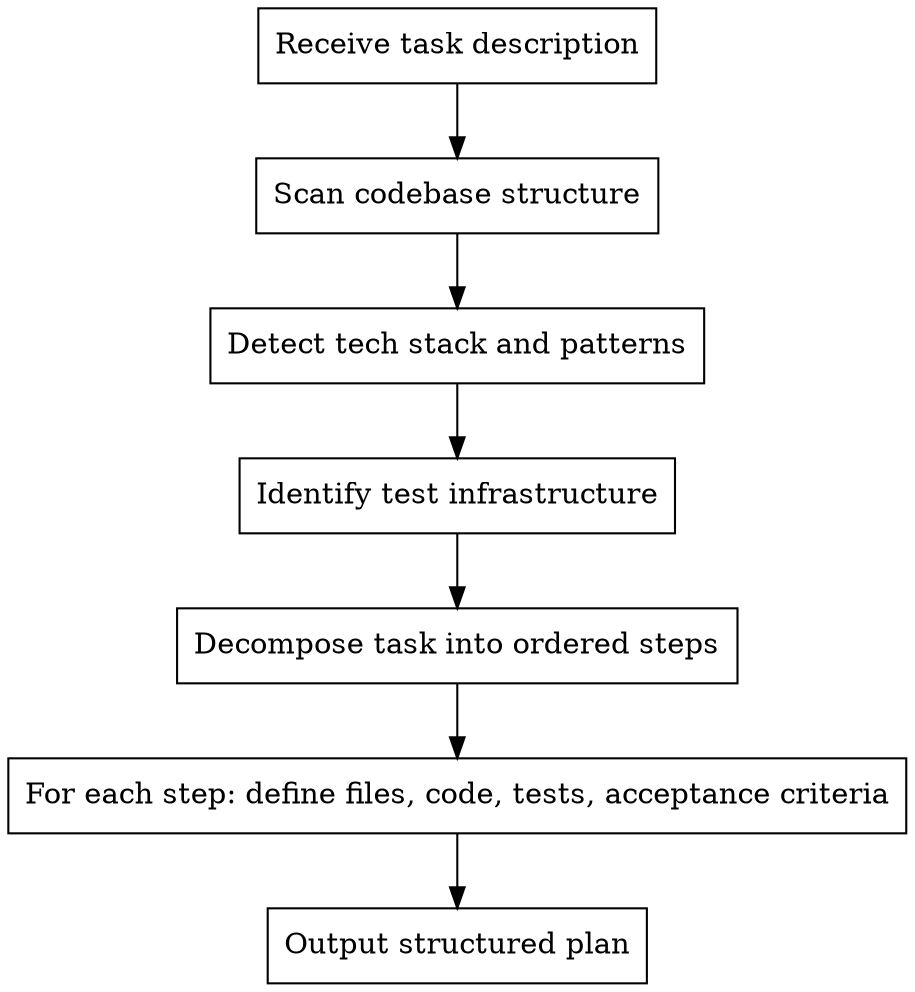

# Auto-Plan

Autonomously analyze a codebase and decompose a development task into an ordered implementation plan with exact file paths, acceptance criteria, and test strategy for every step.

**Core principle:** Understand everything before touching anything. Read first, plan second, implement never (that's auto-impl's job).

## Iron Law

```
NO IMPLEMENTATION WITHOUT A PLAN FIRST
```

No exceptions. Not for "quick fixes." Not for "obvious changes." Not for "just one file." Plan first, always.

## When to Use

- Given a development task of any size
- Before any implementation begins
- When invoked by `implementor:run` as the first phase

## Process



### Phase 1: Codebase Analysis

Use Glob to map the full project structure. Use Grep to find:
- Package manager and dependencies (package.json, requirements.txt, go.mod, Cargo.toml, etc.)
- Test framework configuration (jest.config, pytest.ini, vitest.config, etc.)
- Existing test files and their patterns
- CI/CD configuration (.github/workflows, .gitlab-ci.yml, etc.)
- Linting and formatting config (.eslintrc, .prettierrc, ruff.toml, etc.)
- Entry points and main modules

Read key files to understand:
- Coding conventions (naming, structure, patterns)
- Architecture (monolith, microservices, modules)
- Error handling patterns
- Logging patterns

### Phase 2: Task Decomposition

Break the task into ordered implementation steps where each step is **one action (2-5 minutes)**:

- "Write the failing test" - one step
- "Run it to verify it fails" - one step
- "Implement minimal code to pass" - one step
- "Run tests to verify they pass" - one step
- "Commit" - one step

### Phase 3: Plan Output

Save the plan to `docs/plans/YYYY-MM-DD-<task-name>.md` using this format:

```markdown
# [Task Name] Implementation Plan

**Goal:** [One sentence]
**Architecture:** [2-3 sentences about approach]
**Tech Stack:** [Detected technologies]
**Test Framework:** [Detected test framework and run command]
**Coverage Target:** [80% default or project-specific]

---

### Task N: [Component Name]

**Files:**
- Create: `exact/path/to/file.ext`
- Modify: `exact/path/to/existing.ext:line-range`
- Test: `tests/exact/path/to/test.ext`

**Acceptance Criteria:**
- [Specific, verifiable criterion]
- [Another criterion]

**Step 1: Write the failing test**
[Exact test code]

**Step 2: Run test to verify it fails**
Run: `[exact command]`
Expected: FAIL with "[specific error]"

**Step 3: Write minimal implementation**
[Exact implementation code]

**Step 4: Run test to verify it passes**
Run: `[exact command]`
Expected: PASS

**Step 5: Commit**
[Exact git commands with commit message]
```

## Adaptation Rules

**Small task (1-3 files):** 1-3 plan tasks, minimal context needed
**Medium task (4-10 files):** 3-8 plan tasks, group by component
**Large task (10+ files):** 8+ plan tasks, group by layer/module, identify dependencies between tasks

**Always:**
- Exact file paths (never "in the appropriate directory")
- Complete code (never "add validation logic here")
- Exact test commands with expected output
- Explicit acceptance criteria per task
- Test strategy included in every task (not as an afterthought)

## Red Flags - STOP

| Thought | Reality |
|---------|---------|
| "This is too simple to plan" | Simple tasks have the most assumptions. Plan it. |
| "I already know what to do" | Knowledge isn't a plan. Write it down. |
| "Planning is overhead" | Debugging unplanned code is the real overhead. |
| "Let me just start coding" | That's auto-impl's job. You plan. |
| "The user wants speed" | A 2-minute plan saves 20 minutes of rework. |
| "I can plan as I go" | That's how you miss edge cases and tests. |
