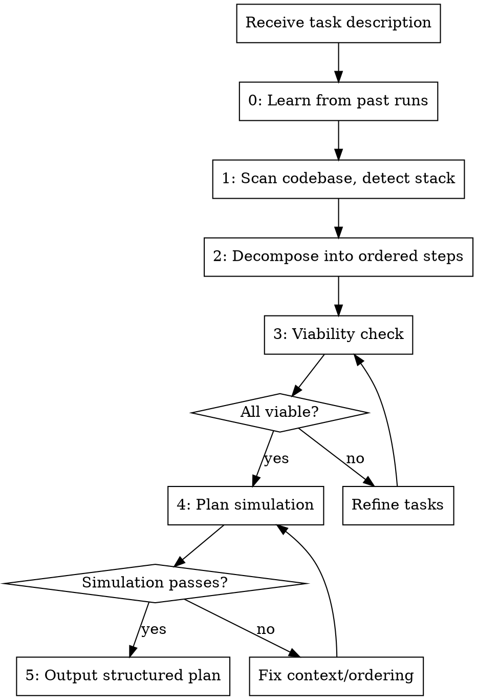

# Auto-Plan

Autonomously analyze a codebase and decompose a development task into an ordered implementation plan with exact file paths, acceptance criteria, and test strategy for every step.

**Core principle:** Understand everything before touching anything. Read first, plan second, implement never (that's auto-impl's job).

<HARD-GATE>
This skill is part of the implementor pipeline. Do NOT invoke superpowers:brainstorming, superpowers:writing-plans, or any other superpowers orchestration skill. The implementor handles planning internally.
</HARD-GATE>

## Iron Law

```
NO IMPLEMENTATION WITHOUT A PLAN FIRST
```

No exceptions. Not for "quick fixes." Not for "obvious changes." Not for "just one file." Plan first, always.

## When to Use

- Given a development task of any size
- Before any implementation begins
- When invoked by `implementor:run` as the first phase

## Process



### Phase 0: Learn from Past Runs

Before analyzing anything, check for lessons from previous pipeline runs:

1. **Read previous plan retrospectives.** Search `docs/plans/` for existing plan files. If any contain a "Plan Retrospective" section (added by `auto-review`), read it. Common lessons:
   - "Decomposition was along wrong seams" → pay attention to actual module boundaries
   - "Acceptance criteria were vague" → be more explicit this time
   - "Frequent NEEDS_CONTEXT" → provide more context per task
   - "Tasks too large/small" → adjust granularity

2. **Read `.implementor-retrospective.md`** if it exists in the project root. This file accumulates cross-run learnings (written by `implementor:run`). It tells you what has gone wrong before in this specific codebase.

3. **Apply lessons.** Don't just read them — adjust your planning approach based on what failed before. If the last retrospective says "tasks that modify `src/utils/` always conflict," plan those modifications as a single task.

**If no retrospectives exist:** This is the first run. Proceed normally but plan conservatively.

### Phase 1: Codebase Analysis

**First: Read the architecture map.** Check `docs/architecture-map.md` for an existing auto-map output. If it exists and is fresh (git SHA matches HEAD), use it as your primary source of structural understanding. The map gives you:
- Module inventory with responsibilities and boundaries
- Interface contracts (public APIs per module)
- Dependency graph (which modules depend on which)
- Established patterns and conventions
- Hot spots (high-risk modules with many dependents)

**If the map exists:** You already know the module boundaries, dependency direction, and patterns. Skip broad scanning — focus your file reading on the specific modules relevant to the task. Use the map's dependency graph to understand how changes will ripple.

**If no map exists:** Fall back to manual scanning:

Use Glob to map the full project structure. Use Grep to find:
- Package manager and dependencies (package.json, requirements.txt, go.mod, Cargo.toml, etc.)
- Test framework configuration (jest.config, pytest.ini, vitest.config, etc.)
- Existing test files and their patterns
- CI/CD configuration (.github/workflows, .gitlab-ci.yml, etc.)
- Linting and formatting config (.eslintrc, .prettierrc, ruff.toml, etc.)
- Entry points and main modules

Read key files to understand:
- Coding conventions (naming, structure, patterns)
- Architecture (monolith, microservices, modules)
- Error handling patterns
- Logging patterns

### Phase 2: Task Decomposition

**If an architecture map exists, use it to guide decomposition:**
- **Decompose along module boundaries** shown in the map, not along feature lines
- **Order tasks by the dependency graph** — build dependencies before dependents
- **Flag hot spot tasks** — any task touching a hot spot module (from the map) gets extra context and a stronger model recommendation
- **Include neighbor interfaces** — when a task modifies a module, include the interfaces of its 1-hop neighbors in the task context so subagents know what they're connecting to
- **Respect patterns** — the map's pattern section tells you how errors are handled, how data is accessed, etc. Task descriptions should reference these patterns explicitly

**Detect atomic change groups** — some changes MUST be made together or not at all:
- **Interface + all implementations**: If you change an interface/abstract class, every implementation must change in the same task. Splitting them guarantees build failures between tasks.
- **Data model + all consumers**: If you change a shared model's fields (from the map's Data Models section), every module that consumes that model must be updated atomically. Splitting means half the codebase sees the old shape and half sees the new.
- **Shared config + all readers**: If you change a config file's structure (from the map's Shared Configuration section), every module that reads it must be updated together.
- **Migration + code**: Database schema changes and the code that depends on them must be in the same task. A migration without code changes = runtime errors. Code without migration = compile but crash.

**Detect shared resource conflicts** — two tasks that touch the same shared resource will conflict:
- Two tasks modifying the same config file → merge into one task or strictly order them
- Two tasks adding database migrations → merge (migration ordering is critical)
- Two tasks modifying the same build file (package.json, .csproj) → merge or order with explicit dependency
- Two tasks modifying the same shared utility → merge (the anti-circle detection will catch this at runtime, but catching it at plan time is cheaper)

**Order tasks by build dependency graph** (not just code dependency):
- If the map has a build order (e.g., `Core → Infrastructure → API → Tests`), tasks that modify downstream projects must come AFTER tasks that modify upstream projects
- A task that changes `Core` must complete and build successfully before any task that depends on `Core` begins

Break the task into ordered implementation steps where each step is **one action (2-5 minutes)**:

- "Write the failing test" - one step
- "Run it to verify it fails" - one step
- "Implement minimal code to pass" - one step
- "Run tests to verify they pass" - one step
- "Commit" - one step

### Phase 3: Plan Viability Check

Before outputting the plan, stress-test it. For each task in the decomposition, answer:

1. **"Can a subagent actually implement this in isolation?"**
   - Does the task have all the context it needs, or does it secretly depend on understanding the whole system?
   - Are the file paths real and the interfaces defined, or is the subagent expected to figure them out?
   - If the task says "integrate with X" — is X already built by a previous task, or is this a circular dependency?

2. **"Are the acceptance criteria actually verifiable?"**
   - Can each criterion be checked by running a command and reading the output?
   - Vague criteria like "handles errors gracefully" are not verifiable. "Returns 400 with `{error: 'missing field'}` when `name` is omitted" is verifiable.
   - If you can't write the test command and expected output for a criterion, the criterion is too vague. Rewrite it.

3. **"Is this decomposition along the right seams?"**
   - Do the task boundaries match the code's actual module boundaries?
   - Will subagents need to modify the same files in multiple tasks? (If yes, you decomposed wrong — group by file, not by feature.)
   - Are there hidden coupling points where Task 3 will silently break Task 1's work?
   - **Do any tasks break an atomic change group?** (interface change split from implementations, model change split from consumers, migration split from code)
   - **Do any tasks have shared resource conflicts?** (two tasks touching the same config, migration, or build file)
   - **Does the task order respect the build dependency graph?** (upstream before downstream)

4. **"Am I planning for tests that prove behavior, or tests that prove structure?"**
   - If the test in the plan asserts that a function exists and returns the right type, that's a structure test. Plan behavioral tests instead.
   - If the test only checks the happy path, the plan is incomplete. Error paths must be planned explicitly.

**Verdicts per task:**
- **VIABLE:** Task is self-contained, criteria are verifiable, a subagent can execute it.
- **NEEDS_REFINEMENT:** Task has vague criteria, hidden dependencies, or wrong boundaries. Refine before outputting.
- **SHOULD_SPLIT:** Task is too large or has mixed concerns. Split into smaller tasks.
- **SHOULD_MERGE:** Task is too small to be useful alone, creates artificial file-conflict boundaries with an adjacent task, or breaks an atomic change group. Merge.
- **WRONG_ORDER:** Task depends on a module that is modified by a later task, or violates build dependency order. Reorder.

**If any task is NEEDS_REFINEMENT:** Fix it now. Do not output a plan with known viability issues.

### Phase 4: Plan Simulation

Mentally execute the plan as a subagent would. For each task, in order:

1. **Pretend you are a fresh subagent** with only the task description, context block, and test command. No access to the plan file, no memory of other tasks.
2. **Ask: "Do I have everything I need to start writing the test?"**
   - Do I know the function signature I'm testing?
   - Do I know the import path?
   - Do I know the expected behavior precisely enough to write an assertion?
   - If I need to call code from a previous task, is that code's interface specified in my context?
3. **Ask: "After I implement, will I know if I succeeded?"**
   - Can I run the test command and get a clear pass/fail?
   - Are the acceptance criteria binary (pass/fail), or are they subjective ("should work well")?
4. **Ask: "Will my work survive the next task?"**
   - Does the next task modify files I created?
   - Does the next task change interfaces I depend on?
   - If yes, is the dependency acknowledged in the next task's context?

**If any task fails the simulation:** Fix it. Add missing context, clarify interfaces, reorder tasks, or merge conflicting tasks.

**This takes 2-3 minutes.** It saves 20 minutes of subagent failures, re-dispatches, and debugging.

### Phase 5: Plan Output

Save the plan to `docs/plans/YYYY-MM-DD-<task-name>.md` using this format:

```markdown
# [Task Name] Implementation Plan

**Goal:** [One sentence]
**Architecture:** [2-3 sentences about approach]
**Architecture Map:** [path to docs/architecture-map.md if exists, or "generated inline"]
**Modules Involved:** [list of modules from the map that this task touches]
**Hot Spots Affected:** [list of hot spot modules, if any — these tasks need extra care]
**Tech Stack:** [Detected technologies]
**Test Framework:** [Detected test framework and run command]
**Coverage Target:** [80% default or project-specific]

---

### Task N: [Component Name]

**Files:**
- Create: `exact/path/to/file.ext`
- Modify: `exact/path/to/existing.ext:line-range`
- Test: `tests/exact/path/to/test.ext`

**Acceptance Criteria:**
- [Specific, verifiable criterion]
- [Another criterion]

**Step 1: Write the failing test**
[Exact test code]

**Step 2: Run test to verify it fails**
Run: `[exact command]`
Expected: FAIL with "[specific error]"

**Step 3: Write minimal implementation**
[Exact implementation code]

**Step 4: Run test to verify it passes**
Run: `[exact command]`
Expected: PASS

**Step 5: Commit**
[Exact git commands with commit message]
```

## Adaptation Rules

**Small task (1-3 files):** 1-3 plan tasks, minimal context needed
**Medium task (4-10 files):** 3-8 plan tasks, group by component
**Large task (10+ files):** 8+ plan tasks, group by layer/module, identify dependencies between tasks

**Always:**
- Exact file paths (never "in the appropriate directory")
- Complete code (never "add validation logic here")
- Exact test commands with expected output
- Explicit acceptance criteria per task
- Test strategy included in every task (not as an afterthought)

## Anti-Patterns

**Do NOT output plans that:**
- Have acceptance criteria you can't write a test command for
- Decompose by feature when the code is organized by module (or vice versa)
- Assume subagents will "figure out" interfaces, imports, or dependencies
- Put "write tests" as a separate task from implementation (TDD means tests come first in every task)
- Have tasks that silently depend on shared files without declaring it
- Use vague language: "add appropriate error handling," "implement validation logic," "connect to the API"
- **Split atomic change groups** — interface change in Task 2, implementation change in Task 5 = guaranteed build failure between them
- **Ignore build order** — Task 3 modifies the core library, Task 2 modifies a project that depends on it = Task 2's subagent can't compile
- **Create shared resource conflicts** — Task 1 and Task 4 both add migrations = migration ordering conflict at merge time
- **Change a data model without updating all consumers** — changing a shared model's fields in one task but updating consumers in separate tasks = runtime errors between tasks

**Do NOT:**
- Skip the viability check because the plan "looks right"
- Output a plan where you couldn't verify every acceptance criterion yourself
- Decompose along clean theoretical boundaries that don't match the actual code structure
- Plan for code you haven't read — always read existing files before planning modifications

## Red Flags - STOP

| Thought | Reality |
|---------|---------|
| "This is too simple to plan" | Simple tasks have the most assumptions. Plan it. |
| "I already know what to do" | Knowledge isn't a plan. Write it down. |
| "Planning is overhead" | Debugging unplanned code is the real overhead. |
| "Let me just start coding" | That's auto-impl's job. You plan. |
| "The user wants speed" | A 2-minute plan saves 20 minutes of rework. |
| "I can plan as I go" | That's how you miss edge cases and tests. |
| "The acceptance criteria are obvious" | If they're obvious, writing them explicitly takes 10 seconds. Do it. |
| "The subagent will figure it out" | Subagents are context-limited. Spell everything out. |
| "This decomposition is clean" | Clean != correct. Does it match the actual code seams? |
