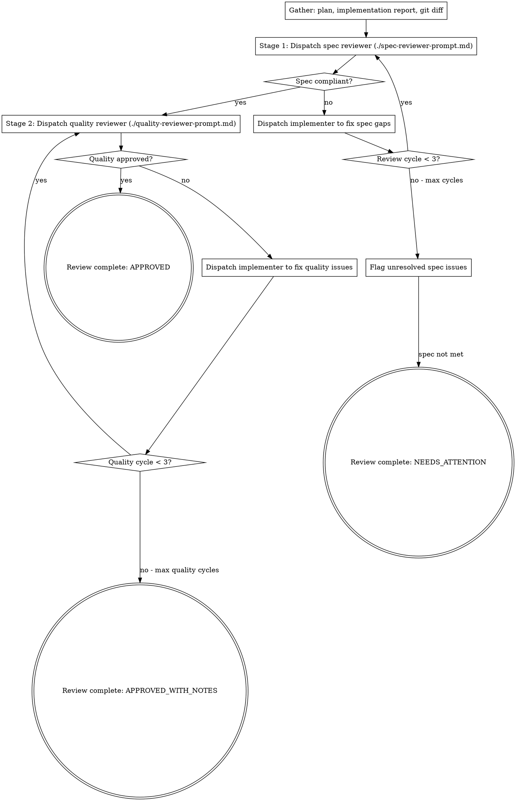

# Auto-Review

Two-stage code review: first verify the code matches the spec (nothing missing, nothing extra), then verify code quality (clean, secure, maintainable). Issues loop back to the implementer for fixes.

**Core principle:** Spec compliance and code quality are orthogonal concerns. Checking them separately catches issues that combined review misses.

<HARD-GATE>
This skill is part of the implementor pipeline. Do NOT invoke superpowers:requesting-code-review or any other superpowers skill. The implementor handles code review internally.
</HARD-GATE>

## Iron Law

```
SPEC COMPLIANCE BEFORE CODE QUALITY. ALWAYS.
```

Never start code quality review before spec compliance passes. Wrong code that's clean is still wrong.

## When to Use

- After `implementor:auto-test` and `implementor:auto-e2e` have passed
- When invoked by `implementor:run` as the review phase
- When code needs verification against a specification

## Process



## Stage 1: Spec Compliance Review

**Purpose:** Does the code do what was requested? Nothing more, nothing less.

**Dispatch spec reviewer subagent** with:
- Full task requirements from the plan
- Implementer's report of what was built
- Instruction to verify by reading code, not trusting the report

**Spec reviewer checks:**
- Missing requirements (things requested but not built)
- Extra features (things built but not requested)
- Misunderstandings (correct intent, wrong interpretation)

**See `./spec-reviewer-prompt.md` for the full prompt template.**

**If issues found:** Dispatch implementer subagent to fix specific gaps. Then re-dispatch spec reviewer. Max 3 cycles.

## Stage 2: Code Quality Review

**Purpose:** Is the code well-built? Clean, secure, maintainable?

**Only dispatch after spec compliance passes.**

**Dispatch quality reviewer subagent** with:
- Implementation summary
- Git diff of all changes (base SHA to HEAD)
- Project conventions and patterns

**Quality reviewer checks:**
- Single responsibility per file
- Clean, readable code with clear names
- No security vulnerabilities (OWASP top 10)
- Error handling at all external boundaries
- No TODO/FIXME/HACK comments in new code
- Appropriate logging for production debugging
- No hardcoded values that should be configurable
- Tests verify behavior, not implementation details
- File structure follows plan and project conventions

**See `./quality-reviewer-prompt.md` for the full prompt template.**

**Issue severity:**
- **Critical:** Security vulnerabilities, data loss risk, broken functionality. Must fix.
- **Important:** Poor patterns, missing error handling, bad naming. Should fix.
- **Minor:** Style issues, minor improvements. Note but don't block.

**If Critical or Important issues found:** Dispatch implementer to fix. Re-dispatch quality reviewer. Max 3 cycles.

**If only Minor issues:** Approve with notes.

## Review Report

After both stages complete:

```markdown
## Code Review Report

### Spec Compliance
- Status: PASS | FAIL
- Cycles: N/3
- Issues found and resolved: [list]
- Unresolved issues: [list, if any]

### Code Quality
- Status: APPROVED | APPROVED_WITH_NOTES
- Cycles: N/3
- Critical issues: [count] (all resolved: yes/no)
- Important issues: [count] (all resolved: yes/no)
- Minor issues: [count] (noted)
- Strengths: [list]

### Overall: APPROVED | APPROVED_WITH_NOTES | NEEDS_ATTENTION
```

## Red Flags - STOP

- Starting quality review before spec compliance passes
- Skipping re-review after implementer fixes
- Accepting "close enough" on spec compliance
- Marking review as passed when critical issues remain
- Letting the implementer self-review replace actual review
- Proceeding when spec reviewer found missing requirements
- Dispatching reviewers without full context (plan + diff + report)

## Dispatching Fix Subagents

When reviewers find issues, dispatch an implementer subagent to fix them. Use the prompt template from `implementor:auto-impl` (`./implementer-prompt.md` in that skill's directory). Provide:
- The specific issues found by the reviewer (with file:line references)
- The original task context
- Instruction to fix only the identified issues, nothing more

## Prompt Templates

- `./spec-reviewer-prompt.md` - Spec compliance reviewer
- `./quality-reviewer-prompt.md` - Code quality reviewer
