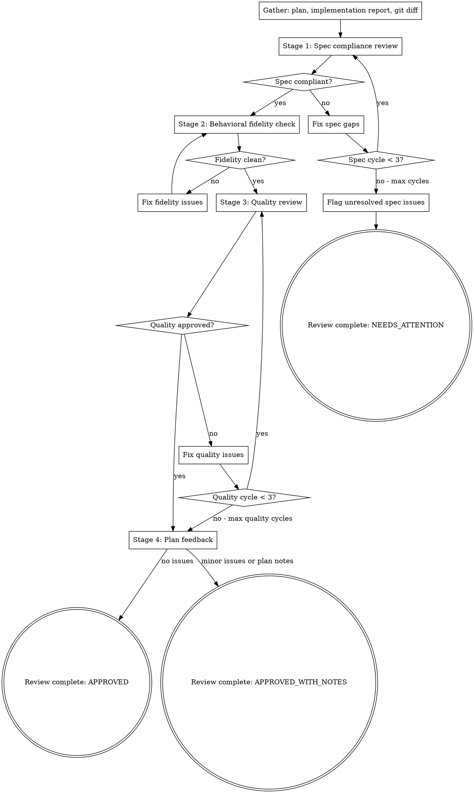

# Auto-Review

Two-stage code review: first verify the code matches the spec (nothing missing, nothing extra), then verify code quality (clean, secure, maintainable). Issues loop back to the implementer for fixes.

**Core principle:** Spec compliance and code quality are orthogonal concerns. Checking them separately catches issues that combined review misses.

<HARD-GATE>
This skill is part of the implementor pipeline. Do NOT invoke superpowers:requesting-code-review or any other superpowers skill. The implementor handles code review internally.
</HARD-GATE>

## Iron Law

```
SPEC COMPLIANCE BEFORE CODE QUALITY. ALWAYS.
```

Never start code quality review before spec compliance passes. Wrong code that's clean is still wrong.

## When to Use

- After `implementor:auto-test` and `implementor:auto-e2e` have passed
- When invoked by `implementor:run` as the review phase
- When code needs verification against a specification

## Process



## Stage 1: Spec Compliance Review

**Purpose:** Does the code do what was requested? Nothing more, nothing less.

**Dispatch spec reviewer subagent** with:
- Full task requirements from the plan
- **The original task description** (the user's actual words, not the plan's interpretation)
- Implementer's report of what was built
- Instruction to verify by reading code, not trusting the report

**Spec reviewer checks (two layers):**

**Layer 1 — Plan compliance:**
- Missing requirements from the plan (things planned but not built)
- Extra features (things built but not planned)
- Misunderstandings (correct intent, wrong interpretation)

**Layer 2 — Original intent compliance:**
- Does the plan itself accurately represent the user's original task?
- Did the plan introduce interpretations, intermediary abstractions, or scope changes that drift from what the user actually asked for?
- Are there requirements in the original task description that the plan didn't capture?

**Why two layers:** The plan is an intermediary. It can introduce its own misinterpretations. If the user asked "add a search feature" and the plan decomposed it into "add search index, add search API, add search UI" but the search UI was never planned (just API), the implementation can be 100% plan-compliant and still miss what the user wanted.

**See `./spec-reviewer-prompt.md` for the full prompt template.**

**If issues found:** Dispatch implementer subagent to fix specific gaps. Then re-dispatch spec reviewer. Max 3 cycles.

## Stage 2: Behavioral Fidelity Check

**Purpose:** Does the code actually do what the tests say it does?

**This catches the gap between "tests pass" and "code is correct."** Tests can pass while the code does the wrong thing — because the tests test the wrong thing, or because the tests and code are both wrong in the same way.

**Scope:** Do not attempt to check every function. Focus on the **top 5 functions by complexity** (most branches, most lines, most dependencies). These are where fidelity issues hide. Simple getters and configuration functions are unlikely to have code/test disagreements.

**How to identify the top 5:** Sort changed functions by cyclomatic complexity (branch count). If you can't compute complexity, use line count as a proxy — longer functions have more logic to get wrong.

**For each selected function/method:**

1. **Read the test.** What does it assert?
2. **Read the code.** What does it actually do?
3. **Are they testing the same thing?** A test that asserts `response.status === 200` while the code returns 200 for *every* input (including invalid) technically passes. The test and the code agree — but they're both wrong.

**Specific checks:**
- **Default-value masking:** Does the code return a sensible-looking default when it should return an error? Tests won't catch this if they only test the happy path.
- **Silent truncation:** Does the code silently truncate, coerce, or transform input in ways the tests don't exercise? (e.g., `parseInt("12abc")` returns 12 in JS — no error, no test failure, wrong behavior.)
- **Error path coverage reality:** The coverage report says error paths are covered. But are the tests asserting the *right* error? A test that catches *any* exception passes even if the code throws the *wrong* exception.
- **Boundary agreement:** Do the tests and code agree on boundaries? If the spec says "max 100 characters" and the code checks `<= 100` but the test checks `< 100`, you have a bug that tests confirm.

**Output:** List of fidelity concerns, or CLEAN if no discrepancies found. Fidelity concerns are treated as CRITICAL issues.

## Stage 3: Code Quality Review

**Purpose:** Is the code well-built? Clean, secure, maintainable?

**Only dispatch after spec compliance and behavioral fidelity pass.**

**Dispatch quality reviewer subagent** with:
- Implementation summary
- Git diff of all changes (base SHA to HEAD)
- Project conventions and patterns
- Behavioral fidelity findings (if any were found and fixed)

**Quality reviewer checks:**
- Single responsibility per file
- Clean, readable code with clear names
- No security vulnerabilities (OWASP top 10)
- Error handling at all external boundaries
- No TODO/FIXME/HACK comments in new code
- Appropriate logging for production debugging
- No hardcoded values that should be configurable
- Tests verify behavior, not implementation details
- File structure follows plan and project conventions

**See `./quality-reviewer-prompt.md` for the full prompt template.**

**Issue severity:**
- **Critical:** Security vulnerabilities, data loss risk, broken functionality. Must fix.
- **Important:** Poor patterns, missing error handling, bad naming. Should fix.
- **Minor:** Style issues, minor improvements. Note but don't block.

**If Critical or Important issues found:** Dispatch implementer to fix. Re-dispatch quality reviewer. Max 3 cycles.

**If only Minor issues:** Approve with notes.

## Stage 4: Plan Feedback (NEW — feedback to upstream)

**Purpose:** Surface structural issues that are plan problems, not implementation problems.

After reviewing the code, identify any patterns that suggest the *plan* was wrong, not just the implementation:
- Multiple tasks modifying the same files (decomposition was along wrong seams)
- Acceptance criteria that couldn't be verified as written (criteria were vague)
- Subagent reports showing repeated NEEDS_CONTEXT (plan lacked critical information)
- Over-engineering or under-engineering caused by task scope being wrong

**This doesn't block the current pipeline** — the code is already reviewed and fixed. But the feedback is included in the final report so the plan quality improves over time. Output as a "Plan Retrospective" section in the review report.

## Review Report

After all stages complete:

```markdown
## Code Review Report

### Spec Compliance
- Status: PASS | FAIL
- Cycles: N/3
- Issues found and resolved: [list]
- Unresolved issues: [list, if any]

### Behavioral Fidelity
- Status: CLEAN | CONCERNS_FOUND
- Discrepancies found: [list — code/test mismatches, boundary disagreements, masked defaults]
- Resolved: [yes/no]

### Code Quality
- Status: APPROVED | APPROVED_WITH_NOTES
- Cycles: N/3
- Critical issues: [count] (all resolved: yes/no)
- Important issues: [count] (all resolved: yes/no)
- Minor issues: [count] (noted)
- Strengths: [list]

### Plan Retrospective
- Decomposition quality: [good / had wrong seams / tasks too large / tasks too small]
- Acceptance criteria quality: [verifiable / some vague / frequently unclear]
- Context sufficiency: [subagents had what they needed / frequent NEEDS_CONTEXT]
- Suggestions for future plans: [list]

### Overall: APPROVED | APPROVED_WITH_NOTES | NEEDS_ATTENTION
```

## Red Flags - STOP

| Thought | Reality |
|---------|---------|
| "Tests pass, so the code is correct" | Tests passing means tests pass. Check behavioral fidelity — do the tests test what they claim? |
| "Spec compliance passed, skip fidelity" | Spec compliance checks requirements exist. Fidelity checks they work correctly. Different things. |
| "The quality review will catch everything" | Quality review catches code issues. Fidelity catches logic issues. Don't conflate them. |
| "Plan feedback is optional" | It's not. Every pipeline run is a learning opportunity. Capture what went wrong. |
| "Close enough on spec compliance" | Close enough is not compliant. Fix it or document why it can't be fixed. |
| "The implementer self-reviewed" | Self-review is for the implementer's benefit. Independent review is for the project's benefit. |
| "I'll skip re-review after fixes" | Fixes introduce new issues 30% of the time. Always re-review. |

## Dispatching Fix Subagents

When reviewers find issues, dispatch an implementer subagent to fix them. Use the prompt template from `implementor:auto-impl` (`./implementer-prompt.md` in that skill's directory). Provide:
- The specific issues found by the reviewer (with file:line references)
- The original task context
- Instruction to fix only the identified issues, nothing more

## Prompt Templates

- `./spec-reviewer-prompt.md` - Spec compliance reviewer
- `./quality-reviewer-prompt.md` - Code quality reviewer
