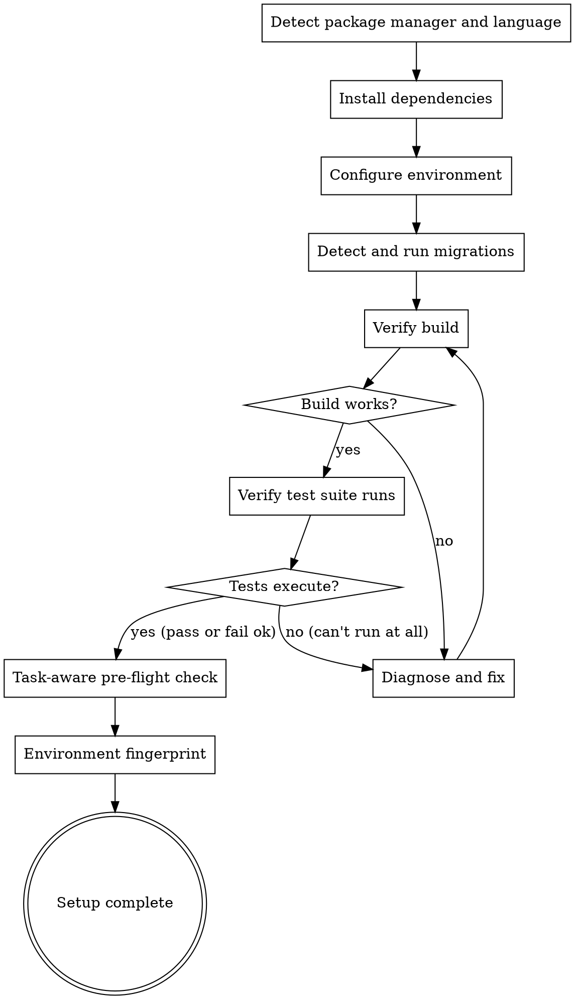

# Auto-Setup

Detect and execute environment setup: install dependencies, configure environment files, run database migrations, and verify the project builds and tests can run.

**Core principle:** A project that can't build can't be tested. A project that can't be tested can't be verified. Setup is the foundation.

<HARD-GATE>
This skill is part of the implementor pipeline. Do NOT invoke any superpowers orchestration skill. The implementor handles setup internally.
</HARD-GATE>

## Iron Law

```
NO IMPLEMENTATION UNTIL THE PROJECT BUILDS AND TESTS RUN
```

If the test suite can't execute (even if tests fail), setup is incomplete.

## When to Use

- After Phase 1 (Gather Context) in the `implementor:run` pipeline
- Before any implementation or testing begins
- When entering a new project for the first time

## Process



### Phase 1: Dependency Installation

Detect and run the appropriate install command:

| Indicator | Package Manager | Install Command |
|-----------|----------------|-----------------|
| `package-lock.json` | npm | `npm ci` |
| `yarn.lock` | yarn | `yarn install --frozen-lockfile` |
| `pnpm-lock.yaml` | pnpm | `pnpm install --frozen-lockfile` |
| `bun.lockb` | bun | `bun install --frozen-lockfile` |
| `package.json` (no lock) | npm | `npm install` |
| `requirements.txt` | pip | `pip install -r requirements.txt` |
| `Pipfile.lock` | pipenv | `pipenv install` |
| `pyproject.toml` + `uv.lock` | uv | `uv sync` |
| `pyproject.toml` + `poetry.lock` | poetry | `poetry install` |
| `pyproject.toml` (no lock) | pip | `pip install -e .` |
| `go.mod` | go | `go mod download` |
| `Cargo.toml` | cargo | `cargo build` |
| `Gemfile.lock` | bundler | `bundle install` |
| `composer.lock` | composer | `composer install` |

**Priority:** If multiple indicators exist, use the most specific (lock file > manifest).

### Phase 2: Environment Configuration

1. Check for `.env.example`, `.env.template`, or `.env.sample`
2. If found and no `.env` exists, copy to `.env`
3. Check `.implementor.json` for custom environment setup commands
4. Look for `docker-compose.yml` — note required services but do NOT auto-start Docker (report as prerequisite)

### Phase 3: Database Migrations

Detect and run migrations if applicable:

| Framework | Detection | Migration Command |
|-----------|-----------|-------------------|
| Django | `manage.py` | `python manage.py migrate` |
| Rails | `db/migrate/` | `bundle exec rails db:migrate` |
| Laravel | `database/migrations/` | `php artisan migrate` |
| Prisma | `prisma/schema.prisma` | `npx prisma migrate dev` |
| Drizzle | `drizzle.config.*` | `npx drizzle-kit migrate` |
| Knex | `knexfile.*` | `npx knex migrate:latest` |
| Alembic | `alembic.ini` | `alembic upgrade head` |
| Flyway | `flyway.conf` | `flyway migrate` |

**Only run if a local database is detected** (SQLite file, or connection string pointing to localhost). Skip if database requires external service not running.

### Phase 4: Build Verification

Run the build command:

| Stack | Build Command |
|-------|---------------|
| Node.js (with build script) | `npm run build` |
| TypeScript (no build script) | `npx tsc --noEmit` |
| Go | `go build ./...` |
| Rust | `cargo build` |
| Python | `python -m py_compile [main files]` |

If no explicit build step, verify the entry point imports cleanly.

### Phase 5: Test Suite Verification

Run the test suite once to verify it executes:

```bash
[detected test command from Phase 1 context or .implementor.json]
```

**Success criteria:** The test runner starts and completes (tests may pass or fail — we just need the suite to execute). If the runner can't start (missing dependencies, import errors, config issues), setup is incomplete.

### Phase 6: Task-Aware Pre-Flight Check

Generic setup verifies the project builds. This phase verifies the project is ready for the *specific task at hand*.

1. **Read the task description** (passed from `implementor:run`). Identify what the task will need:
   - New external APIs? → Check if API keys/env vars are configured
   - Database changes? → Verify migration tools are installed and DB is accessible
   - File processing (PDF, images, CSV)? → Check for native dependencies (`wkhtmltopdf`, `sharp`, `Pillow`, `imagemagick`)
   - Email sending? → Check for SMTP config or test mail service
   - Browser automation? → Check for Playwright browsers installed
   - Specific framework features? → Verify the framework version supports them

2. **Scan the plan** (if available from `auto-plan`). For each task that creates new files:
   - Does the import it plans to use actually exist in the installed packages?
   - Does the framework version support the API being used?
   - Are there peer dependencies that need to be added?

3. **Output a pre-flight verdict:**

| Requirement | Status | Action Needed |
|-------------|--------|---------------|
| PostgreSQL client | READY | `pg` already installed |
| Redis | MISSING | Task needs Redis but no Redis client installed. Install `ioredis`. |
| Sharp (image processing) | MISSING | Task needs image resizing. Install `sharp` (requires native build tools). |
| Playwright browsers | NOT_INSTALLED | E2E testing will need browsers. Run `npx playwright install`. |

**If anything is MISSING:** Install it now. If it requires system-level packages that can't be auto-installed (native compilers, system libraries), report as a prerequisite.

**If the task description is not available** (standalone invocation), skip this phase.

### Phase 7: Environment Fingerprint

Capture the environment state for debugging downstream failures:

```bash
# Runtime
node --version 2>/dev/null; python --version 2>/dev/null; go version 2>/dev/null; dotnet --version 2>/dev/null; rustc --version 2>/dev/null

# Package manager
npm --version 2>/dev/null; yarn --version 2>/dev/null; pnpm --version 2>/dev/null

# OS
uname -a 2>/dev/null || ver 2>/dev/null

# Key env vars (NO secrets)
echo "NODE_ENV=$NODE_ENV CI=$CI"
```

**Store the fingerprint** in the setup report. If `auto-debug` is invoked later, this fingerprint helps distinguish code bugs from environment bugs — "it worked in setup but fails now" points to a code problem, not a setup problem.

## Reading .implementor.json

If `.implementor.json` exists in the project root, read these fields:

- `setupCommand`: Custom setup command to run after dependency installation
- `testCommand`: Override for the test command
- `buildCommand`: Override for the build command
- `startCommand`: Override for the app start command
- `envFile`: Custom env file name (default: `.env`)

## Red Flags - STOP

| Thought | Reality |
|---------|---------|
| "Dependencies are probably installed" | Verify. Don't assume. Run the install. |
| "I'll skip the build check" | A project that doesn't build can't be tested. |
| "Tests fail, setup must be broken" | Failing tests are fine. Tests that can't RUN are not. |
| "Docker services are needed, I'll start them" | Never auto-start Docker. Report as prerequisite. |
| "I'll install globally" | Never install globally. Use project-local installs only. |
| "The project builds, so setup is done" | Building generically isn't enough. Is the environment ready for *this specific task*? |
| "The task doesn't need special dependencies" | Read the task. Image processing needs native libs. PDF needs renderers. Check. |
| "The environment is fine, I just ran setup" | Capture the fingerprint anyway. When debugging fails later, you'll need it. |
