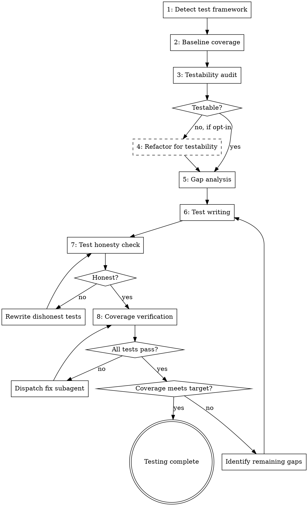

# Auto-Test

Analyze implementation for test coverage gaps and write comprehensive tests to meet coverage targets. Covers unit tests, integration tests, edge cases, error paths, and boundary conditions.

**Core principle:** Tests are the proof that code works. No proof, no confidence. No confidence, no production.

<HARD-GATE>
This skill is part of the implementor pipeline. Do NOT invoke superpowers:test-driven-development or any other superpowers skill. The implementor enforces TDD internally via subagent prompts.
</HARD-GATE>

## Iron Law

```
NO CODE WITHOUT TESTS. NO GREEN BAR WITHOUT RED BAR FIRST.
```

Every line of implementation must be exercised by at least one test. Every test must have been red before it was green.

## When to Use

- After `implementor:auto-impl` has completed implementation
- When invoked by `implementor:run` as the testing phase
- When you need to verify and improve test coverage on any codebase

## Process



### Phase 1: Framework Detection

Detect the test framework by reading project config:

| File | Framework | Coverage Command |
|------|-----------|-----------------|
| `jest.config.*` / `package.json[jest]` | Jest | `npx jest --coverage` |
| `vitest.config.*` | Vitest | `npx vitest run --coverage` |
| `pytest.ini` / `pyproject.toml[pytest]` | Pytest | `pytest --cov --cov-report=term-missing` |
| `go.mod` | Go test | `go test -coverprofile=coverage.out ./...` |
| `Cargo.toml` | Cargo test | `cargo tarpaulin` |
| `.rspec` | RSpec | `bundle exec rspec --format documentation` |

If no test framework detected, select the standard framework for the detected language and set it up.

### Phase 2: Baseline Coverage

Run the full test suite with coverage. Capture:
- Total line coverage percentage
- Total branch coverage percentage
- Per-file coverage breakdown
- Specific uncovered lines/branches

### Phase 3: Testability Audit

Before writing a single test, audit the code under test. For each file with coverage below the target:

1. **Read the source code** and answer these questions:
   - Can the critical paths be tested with the available tools (mocking libs, DI, visibility)?
   - Are there private/static methods hiding critical logic that should be exposed?
   - Are there classes with too many injected dependencies to mock without a library?
   - Are there tight couplings (direct `new` of dependencies, static calls to external systems) that prevent isolated testing?
   - Does the code depend on global state, singletons, or ambient context?

2. **Identify external contracts:** If the code replicates or wraps an external system's contract (API client, protocol implementation, data format):
   - Name the external contract being replicated
   - Search for authoritative documentation (official docs, specs, RFCs)
   - Flag any divergence between the implementation and the documented contract as a potential bug
   - Note: This is opportunistic — only flag contracts you can positively identify. Do not guess.

3. **Output a testability verdict per file:**

| File | Verdict | Blockers | Proposed Changes |
|------|---------|----------|-----------------|
| `src/foo.ts` | TESTABLE | — | — |
| `src/bar.ts` | PARTIALLY_TESTABLE | Private method `compute()` contains core logic | Extract to internal/package-private |
| `src/baz.ts` | UNTESTABLE | 8 constructor dependencies, no DI container | Add mocking library or extract pure functions |

If all files are TESTABLE, proceed to Phase 5. If any are PARTIALLY_TESTABLE or UNTESTABLE, proceed to Phase 4 (if enabled) or proceed to Phase 5 with the testable subset and document what couldn't be tested and why.

### Phase 4: Refactor for Testability (opt-in)

**Only runs when `refactorForTestability: true` in `.implementor.json`.** When disabled, skip to Phase 5 and report untestable code in the final output.

Execute the changes proposed by the testability audit. Authorized refactors:

- **Visibility changes:** `private` → `internal`/`protected` (with `[InternalsVisibleTo]` for .NET, package-private for Java, etc.)
- **Extract pure functions:** Pull logic out of classes with heavy dependencies into standalone, testable functions
- **Add mocking library:** If no mocking library exists and tests require one, add the standard library for the ecosystem (Moq for .NET, unittest.mock for Python, jest built-in for JS/TS, etc.)
- **Break static coupling:** Replace direct static calls with injectable abstractions where the static call is the only barrier to testing
- **Wire DI:** Add constructor injection for dependencies that are currently `new`'d internally

**Constraints:**
- Every refactor must preserve existing behavior — run the full test suite after each change
- Do not change public API signatures
- Do not refactor code that is already testable
- Commit refactors separately from test additions with clear commit messages

### Phase 4.5: Module Boundary Contract Analysis

**If an architecture map exists** (`docs/architecture-map.md`), analyze module boundaries for missing contract tests. Contract tests verify that the interface between two modules works correctly — they catch the class of bugs where module A changes its output format and module B silently receives wrong data.

**For each module boundary in the dependency graph where the changed code is involved:**

1. **Identify the contract** — what does module A promise to provide to module B?
   - Function signatures and return types
   - Data model shapes (from the map's Data Models section)
   - API request/response formats
   - Event/message payload shapes
   - Error types and error handling expectations

2. **Check if contract tests exist:**
   - Search for tests that import from BOTH modules involved in the boundary
   - Search for serialization/deserialization round-trip tests for shared models
   - Search for API schema validation tests
   - Check the map's Test Infrastructure Classification for "Contract" test count per module

3. **Flag missing contract tests:**
   ```
   Contract Test Gaps:
   - auth-service → user-service: No tests verify that the user object auth-service
     produces matches what user-service expects. If auth-service changes the user
     shape, user-service will break with no test catching it.
   - api-routes → order-service: API response format is tested in E2E but no
     contract test verifies the serialization independently. A serialization change
     would only be caught by slow E2E tests, not fast contract tests.
   ```

4. **Prioritize contract test writing:**
   - Boundaries involving changed code (highest priority — these are at risk RIGHT NOW)
   - Boundaries involving data models with > 3 consumers (high risk)
   - Boundaries involving hot spot modules (high blast radius)
   - Boundaries with no existing tests at all (invisible breakage)

### Phase 5: Gap Analysis

For each file with coverage below the target (default 80%):
1. Read the file
2. Identify uncovered code paths:
   - Untested functions/methods
   - Untested branches (if/else, switch cases)
   - Untested error handling paths
   - Untested edge cases (empty input, null, overflow, boundary values)
   - Untested integration points
3. Cross-reference with testability audit — skip paths marked UNTESTABLE (if Phase 4 was skipped)
4. If an external contract was identified in Phase 3, ensure gap analysis includes contract-conformance test gaps (not just code coverage gaps)
5. **Include contract test gaps from Phase 4.5** — missing module boundary tests are the highest-priority gaps because they catch cross-module breakage that unit tests miss

### Phase 6: Test Writing

Dispatch test writer subagents (see `./test-writer-prompt.md`) for each gap cluster. Group related gaps to avoid writing scattered, unfocused tests.

**Test categories to cover:**
- **Happy path:** Normal expected behavior
- **Edge cases:** Empty input, single element, max values, unicode, special characters
- **Error paths:** Invalid input, missing data, network failures, timeout
- **Boundary conditions:** Off-by-one, min/max values, empty/full collections
- **Integration:** Components working together correctly
- **Contract conformance:** If an external contract was identified, tests that assert against the documented contract behavior, not just the current implementation
- **Module boundary contracts:** For each contract gap identified in Phase 4.5, write tests that verify the interface between modules:
  - Serialization round-trip tests for shared data models (serialize → deserialize → compare)
  - Tests that call module A's output function and feed the result to module B's input function
  - Tests that verify error contracts (module A throws ErrorType X, module B handles ErrorType X)
  - These tests import from BOTH modules and verify they agree on the contract

### Phase 7: Test Honesty Check

After writing tests and before declaring coverage achieved, every test batch must pass the honesty gate. For each test file written, the agent must answer:

1. **"Does this test actually call the production code, or is it testing its own fixtures?"**
   - Flag any test where the expected value is a literal constructed inside the test that mirrors the production logic. Example: a test that builds a dictionary and then asserts the function returns that exact dictionary — but the dictionary *is* the implementation.
   - These tests prove nothing. They must be rewritten to exercise real code paths or explicitly marked as `contract-shape-only` with a comment explaining why.

2. **"If I introduced a bug in the implementation, would this test catch it?"**
   - Mentally mutate the production code (flip a conditional, change a return value, remove a line). Would the test fail?
   - If the answer is "probably not," the test is asserting shape, not behavior. Rewrite or flag.

3. **"Is this testing shape or behavior?"**
   - Shape tests (asserting types, keys exist, response has certain fields) are valid only as contract tests. They must not count toward behavioral coverage.
   - Behavioral tests must assert on *computed values* that depend on inputs.

**Verdicts:**
- **HONEST:** Test exercises production code and would catch real bugs.
- **SHAPE_ONLY:** Test validates structure but not behavior. Acceptable for contract tests only. Mark with comment.
- **DISHONEST:** Test is self-referential or wouldn't catch any real bug. Must be rewritten.

If any tests are DISHONEST, rewrite them and re-run the honesty check. Max 2 honesty iterations — after that, drop the dishonest tests rather than ship them (zero tests > misleading tests).

**Mechanical honesty verification (when available):** If the project has a mutation testing tool installed or easily installable, use it to verify test honesty mechanically instead of cognitively:

| Ecosystem | Tool | Command |
|-----------|------|---------|
| JavaScript/TypeScript | Stryker | `npx stryker run` |
| Python | mutmut | `mutmut run` |
| Go | go-mutesting | `go-mutesting ./...` |
| Java | PIT | `mvn org.pitest:pitest-maven:mutationCoverage` |
| C#/.NET | Stryker.NET | `dotnet stryker` |

Mutation testing introduces small changes (mutants) to the production code and verifies that tests catch them. A surviving mutant = a test that wouldn't catch a real bug.

**Only use if already installed or installable in <1 minute.** Do not spend significant setup time on mutation testing. The cognitive honesty check is the primary gate; mutation testing is a mechanical confirmation when available.

### Phase 8: Coverage Verification

Run the full suite again. If coverage target met, complete. If not, repeat Phase 5-7 for remaining gaps.

**Max 3 iterations.** If coverage target still not met after 3 rounds, report the gap with specific uncovered paths in the final report. Distinguish between:
- Gaps from untestable code (documented in testability audit)
- Gaps from insufficient test writing (actual coverage shortfall)
- Gaps from dishonest tests that were dropped

## Coverage Targets

| Metric | Default Target | Config Key |
|--------|---------------|-----------|
| Line coverage | 80% | `coverage.line` |
| Branch coverage | 80% | `coverage.branch` |
| Function coverage | 90% | `coverage.function` |

**Configuration:** Read `.implementor.json` in the project root for overrides. See `implementor:auto-setup` (`./implementor-config.md`) for the full config reference. Also honors `testCommand` and `coverageCommand` fields.

## Anti-Patterns

**Do NOT write tests that:**
- Test implementation details (private methods, internal state)
- Mock everything (test real behavior where possible)
- Test trivial getters/setters with no logic
- Duplicate existing test coverage
- Test framework code (trust your framework)
- Use sleep/timeouts for async (use proper async patterns)
- Assert against values the test itself constructed (self-referential tests)
- Only check that a function returns *something* without verifying it's the *right* something

**Do NOT:**
- Skip running the test suite between writing batches
- Write tests without running them
- Accept a green bar without seeing red first
- Lower the coverage target to pass
- Write tests for untestable code without first auditing testability
- Ship tests that wouldn't catch a real bug just to hit a coverage number
- Count shape-only tests toward behavioral coverage

## Red Flags - STOP

| Thought | Reality |
|---------|---------|
| "80% is good enough" | Check the missing 20%. Is it error handling? That's the most important part. |
| "This code is too simple to test" | Simple code breaks when assumptions change. Test it. |
| "I'll just test the happy path" | Happy paths rarely fail in production. Error paths do. |
| "Mocking is faster" | Mocked tests prove your mocks work, not your code. |
| "Integration tests are slow" | Slow tests that catch bugs beat fast tests that don't. |
| "The test passes, so it works" | A test that can't fail is not a test. Would it catch a real bug? |
| "I'll construct the expected output" | If you built both the input and expected output, you tested your own logic, not the code. |
| "This code can't be tested" | It can — you just need to refactor it first. Audit before giving up. |

## Prompt Template

See `./test-writer-prompt.md` for the subagent prompt template.
