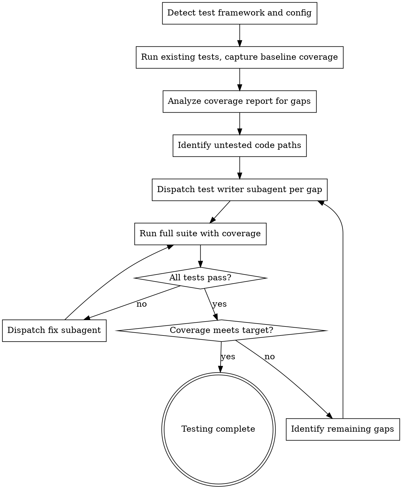

# Auto-Test

Analyze implementation for test coverage gaps and write comprehensive tests to meet coverage targets. Covers unit tests, integration tests, edge cases, error paths, and boundary conditions.

**Core principle:** Tests are the proof that code works. No proof, no confidence. No confidence, no production.

<HARD-GATE>
This skill is part of the implementor pipeline. Do NOT invoke superpowers:test-driven-development or any other superpowers skill. The implementor enforces TDD internally via subagent prompts.
</HARD-GATE>

## Iron Law

```
NO CODE WITHOUT TESTS. NO GREEN BAR WITHOUT RED BAR FIRST.
```

Every line of implementation must be exercised by at least one test. Every test must have been red before it was green.

## When to Use

- After `implementor:auto-impl` has completed implementation
- When invoked by `implementor:run` as the testing phase
- When you need to verify and improve test coverage on any codebase

## Process



### Phase 1: Framework Detection

Detect the test framework by reading project config:

| File | Framework | Coverage Command |
|------|-----------|-----------------|
| `jest.config.*` / `package.json[jest]` | Jest | `npx jest --coverage` |
| `vitest.config.*` | Vitest | `npx vitest run --coverage` |
| `pytest.ini` / `pyproject.toml[pytest]` | Pytest | `pytest --cov --cov-report=term-missing` |
| `go.mod` | Go test | `go test -coverprofile=coverage.out ./...` |
| `Cargo.toml` | Cargo test | `cargo tarpaulin` |
| `.rspec` | RSpec | `bundle exec rspec --format documentation` |

If no test framework detected, select the standard framework for the detected language and set it up.

### Phase 2: Baseline Coverage

Run the full test suite with coverage. Capture:
- Total line coverage percentage
- Total branch coverage percentage
- Per-file coverage breakdown
- Specific uncovered lines/branches

### Phase 3: Gap Analysis

For each file with coverage below the target (default 80%):
1. Read the file
2. Identify uncovered code paths:
   - Untested functions/methods
   - Untested branches (if/else, switch cases)
   - Untested error handling paths
   - Untested edge cases (empty input, null, overflow, boundary values)
   - Untested integration points

### Phase 4: Test Writing

Dispatch test writer subagents (see `./test-writer-prompt.md`) for each gap cluster. Group related gaps to avoid writing scattered, unfocused tests.

**Test categories to cover:**
- **Happy path:** Normal expected behavior
- **Edge cases:** Empty input, single element, max values, unicode, special characters
- **Error paths:** Invalid input, missing data, network failures, timeout
- **Boundary conditions:** Off-by-one, min/max values, empty/full collections
- **Integration:** Components working together correctly

### Phase 5: Coverage Verification

Run the full suite again. If coverage target met, complete. If not, repeat Phase 3-4 for remaining gaps.

**Max 3 iterations.** If coverage target still not met after 3 rounds, report the gap with specific uncovered paths in the final report.

## Coverage Targets

| Metric | Default Target | Config Key |
|--------|---------------|-----------|
| Line coverage | 80% | `coverage.line` |
| Branch coverage | 80% | `coverage.branch` |
| Function coverage | 90% | `coverage.function` |

**Configuration:** Read `.implementor.json` in the project root for overrides. See `implementor:auto-setup` (`./implementor-config.md`) for the full config reference. Also honors `testCommand` and `coverageCommand` fields.

## Anti-Patterns

**Do NOT write tests that:**
- Test implementation details (private methods, internal state)
- Mock everything (test real behavior where possible)
- Test trivial getters/setters with no logic
- Duplicate existing test coverage
- Test framework code (trust your framework)
- Use sleep/timeouts for async (use proper async patterns)

**Do NOT:**
- Skip running the test suite between writing batches
- Write tests without running them
- Accept a green bar without seeing red first
- Lower the coverage target to pass

## Red Flags - STOP

| Thought | Reality |
|---------|---------|
| "80% is good enough" | Check the missing 20%. Is it error handling? That's the most important part. |
| "This code is too simple to test" | Simple code breaks when assumptions change. Test it. |
| "I'll just test the happy path" | Happy paths rarely fail in production. Error paths do. |
| "Mocking is faster" | Mocked tests prove your mocks work, not your code. |
| "Integration tests are slow" | Slow tests that catch bugs beat fast tests that don't. |

## Prompt Template

See `./test-writer-prompt.md` for the subagent prompt template.
