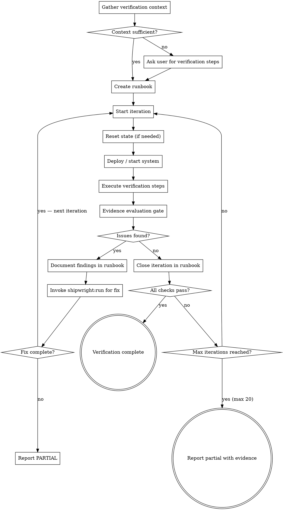

# Auto-Verify

Iterative verification of code changes against a real running system. Deploys, verifies behavior through browser/API/CLI, documents findings in a runbook, fixes issues discovered during verification, and repeats until the system behaves correctly. Zero assumptions — only verified behavior counts.

**Core principle:** Code that passes tests is not code that works. Code that works in a real system, verified through the same interface a user would use, is code that works. The gap between these two is where bugs live.

<HARD-GATE>
This skill is part of the shipwright plugin. Do NOT invoke any superpowers orchestration skill. The shipwright handles verification internally.

This skill is NOT auto-e2e. Auto-e2e writes test scenarios for new code before deployment. Auto-verify iteratively verifies code changes against a real deployed system, discovers issues that only manifest at runtime, fixes them, and re-verifies. Auto-e2e proves features work in isolation. Auto-verify proves features work in the real environment.
</HARD-GATE>

## Iron Law

```
NO ITERATION CLOSES WITHOUT VERIFIED EVIDENCE FROM THE RUNNING SYSTEM
```

A build that passes, a test suite that's green, a code review that approves — none of these close an iteration. Only evidence captured from the running system closes an iteration. Screenshots, response bodies, database queries, CLI output — from the real system, not from tests.

## When to Use

- After implementation and unit tests are complete, when behavior must be verified in a real system
- When changes affect import/export, data pipelines, or integrations where unit tests can't catch format issues
- When the verification requires a running external system (CMS, database, third-party service)
- When previous iterations revealed runtime issues that unit tests missed
- When the user describes a verification workflow or asks to "test this in the real system"
- When invoked standalone or by other shipwright skills that need runtime verification

## Process



## Phase 0: Gather Verification Context

<HARD-GATE>
If you do not know HOW to verify the changes — what system to deploy to, what URL to hit, what to check, what "correct" looks like — you MUST ask the user before proceeding. Do not guess verification steps. Do not invent test procedures. Ask.
</HARD-GATE>

### Architecture Map Consumption

**Before gathering verification context, read the architecture map.** Check `docs/architecture-map.md` — if it exists:

1. **Identify involved modules** — match the changed files to modules in the map
2. **Trace the dependency chain** — which modules depend on the changed modules? These are potential blast radius targets for verification
3. **Note hot spots** — if any changed module is a hot spot, verification needs to be more thorough (more checks, deeper data verification)
4. **Understand interfaces** — the map's interface contracts tell you what the system's expected behavior should be at module boundaries
5. **Build a verification scope** — from the dependency graph, determine which parts of the system could be affected by the changes

**Record this in the runbook** as "Architecture Context" — it tells fix subagents exactly which modules are involved and how they connect.

**Sources of verification context (check in order):**

1. **Architecture map** — Module boundaries, dependency graph, interface contracts, hot spots
2. **User's message** — Did the user describe how to verify?
3. **Project documentation** — Check `docs/`, `README.md`, runbooks, `CLAUDE.md` for verification procedures, deployment steps, test environments
4. **`.shipwright.json`** — Check `startCommand`, `verifyCommand`, `verifyUrl` fields
5. **Previous runbooks** — Check `docs/*RUNBOOK*` for established verification patterns from prior iterations
6. **Project tools** — Scan `tools/`, `scripts/`, `bin/`, `Makefile`, `package.json` scripts for deploy/verify/validate commands

**What you need before proceeding:**

| Required | Example |
|----------|---------|
| How to deploy/start the system | `dotnet run --project src/Site`, `docker compose up`, `npm start` |
| How to access the system | `https://localhost:9250`, `http://localhost:3000`, CLI command |
| What to verify | "pages appear in tree", "API returns 200 with correct body", "output file is valid" |
| What "correct" looks like | "only 4 items in the page tree", "response contains user object with email field", "exit code 0 and output contains 3 rows" |
| How to reset state (if needed) | "drop database", "clear cache", `docker volume rm`, "delete output directory" |

**Good verification context vs bad:**

| Bad (too vague to act on) | Good (specific and verifiable) |
|--------------------------|-------------------------------|
| "Check that it works" | "Import the .episerverdata file via /api/import, then navigate to /optimizely/cms and verify only 4 pages appear in the page tree" |
| "Test the API" | "POST to /api/users with `{name: 'test'}`, verify 201 response with `id` field. GET /api/users, verify the new user appears in the array." |
| "Make sure the output is correct" | "Run `cli convert -i input.zip -o output.dat`, then run `tools/validator output.dat` and verify exit code 0 with 'PASSED' in stdout" |
| "Deploy and check" | "Run `docker compose up -d`, wait for health check at localhost:8080/health, then verify /dashboard shows 3 charts with non-zero data" |

**If context is insufficient:** Ask the user with specific questions:

```
I need to verify these changes against a running system. I found [what I found]
in the project docs, but I still need:

1. How do I access the system? (URL, port, credentials)
2. What specific behavior should I check? ("pages appear" is too vague —
   which pages, how many, with what properties?)
3. How do I reset the system between iterations? (database reset, cache clear, etc.)
```

## Phase 1: Create Runbook

Create a runbook at `docs/<FEATURE>-VERIFY-RUNBOOK.md` to track iterations:

```markdown
# [Feature] Verification Runbook

**Date:** YYYY-MM-DD
**Branch:** [branch name]
**System under test:** [URL/path/description]
**Changes being verified:** [1-2 sentence summary]

## Architecture Context

**Modules involved:** [list of modules from the architecture map that are being changed]
**Dependency chain:**
```
changed-module → [dependent-module-1, dependent-module-2]
dependent-module-1 → [downstream-module]
```
**Hot spots affected:** [list any hot spot modules, or "none"]
**Blast radius:** [which parts of the system could be affected, derived from dependency graph]
**Key interfaces:** [interface contracts at the boundaries — what "correct" looks like structurally]
**Relevant patterns:** [error handling, data access, or other patterns from the map that affect verification]

This section is consumed by fix subagents to understand the codebase without reading it from scratch.

## Verification Checklist

- [ ] [Check 1: specific behavior and expected result]
- [ ] [Check 2: ...]
- [ ] [Check N: ...]

## Setup Steps

[How to deploy/start/reset the system — exact commands, copy-pasteable]

## Iteration Log

### Iteration 1 — [date/time]
- **Baseline:** [N] checks passing, [M] unit tests passing
- **State reset:** [yes/no, what was reset]
- **Deployed:** [exact command or steps]
- **Checks performed:**
  - [x] Check 1: PASS — [evidence: screenshot path, query result, response body]
  - [ ] Check 2: FAIL — [what was wrong, expected vs actual]
- **Anti-regression comparison:** [all previous passes still pass? any regressions?]
- **Issues found:** [list with root cause analysis and dependency chain trace]
- **Fixes applied:** [commit hashes and descriptions]
- **Fix reverted?** [yes/no — if yes, what regressed and why]
- **Regression tests added:** [test names]
- **Status:** PROGRESS | STALL | REGRESSION_REVERTED | BLOCKED

## Fix History

| Iteration | Files Changed | Checks Fixed | Checks Regressed | Net | Reverted? |
|-----------|--------------|-------------|-------------------|-----|-----------|
| [N] | [files] | [checks] | [checks] | [+/-N] | [yes/no] |
```

**The runbook is the single source of truth.** Every finding, fix, and re-verification is documented here. It survives context compression and can be resumed in future conversations.

### Codebase Learnings Section

The runbook MUST include a "Codebase Learnings" section that accumulates runtime knowledge across iterations:

```markdown
## Codebase Learnings

Runtime behaviors discovered during verification that weren't obvious from the code or architecture map:

- [Iteration 1] ContentSerializer silently drops properties with null values — not documented anywhere
- [Iteration 2] Auth middleware returns 302 redirect to /login, not 401, for unauthenticated API requests
- [Iteration 3] Database connection pool maxes out at 5 connections in dev config — causes timeouts with concurrent imports
- [Iteration 4] The import endpoint is async — returns 202 immediately, actual import runs in background job
```

**Why this matters:** Each iteration discovers something about how the real system behaves. Without recording these learnings:
- Fix subagents waste time rediscovering the same behaviors
- Later iterations can't build on earlier knowledge when context is compressed
- The architecture map stays incomplete about runtime behaviors

**Update this section after every iteration,** even if no issues are found. "The import completed in 3 seconds with 50 items" is useful context for later iterations that might see timeouts.

**These learnings can feed back into the architecture map** — after verification completes, significant learnings should be incorporated into `docs/architecture-map.md` as runtime behavior annotations.

## Phase 1.5: Stateful Resource Inventory

Before entering the iteration loop, inventory ALL stateful resources the system depends on. Stateful resources are the #1 source of false passes and mysterious failures — a test that passes against stale data proves nothing.

**Build the inventory:**

```markdown
## Stateful Resources

| Resource | Type | Location/Connection | Reset Command | Verify Clean Command |
|----------|------|-------------------|---------------|---------------------|
| [Main DB] | Database | [connection string or container name] | [drop + recreate or migrate:fresh] | [SELECT COUNT(*) from key tables = 0] |
| [Cache] | Cache | [Redis URL or in-memory] | [FLUSHALL or restart] | [DBSIZE = 0] |
| [Blob storage] | File system | [path or container] | [rm -rf or clear container] | [ls shows empty] |
| [Search index] | External service | [URL] | [DELETE index + recreate] | [count = 0] |
| [Message queue] | External service | [URL] | [purge queues] | [queue length = 0] |
| [Output files] | File system | [path] | [rm -rf output/] | [directory empty or absent] |
| [Session/auth state] | In-memory/cookie | [browser or server] | [clear cookies + restart server] | [no active sessions] |
```

**Detection from architecture map:**
- Check the Data Models section — any persisted model implies a database
- Check the Shared Configuration section — look for connection strings, cache URLs, storage paths
- Check the module inventory — modules with type "service" often have stateful dependencies
- Check the patterns section — data access patterns reveal what databases/caches are used

**Record the inventory in the runbook** — it persists across iterations and informs fix subagents about what state exists.

### Verification Prerequisites

Before each iteration, verify that the system CAN be verified:

```
Pre-iteration checklist:
- [ ] All stateful resources are accessible (DB connects, cache responds, storage writable)
- [ ] All stateful resources are in clean state (verified with "Verify Clean Command")
- [ ] The application builds successfully
- [ ] The application starts without errors
- [ ] Health check endpoints respond (if applicable)
```

**If any prerequisite fails:** Fix it BEFORE entering the iteration. Don't waste an iteration discovering the database is down.

## Phase 2: Deploy and Verify (Iteration Loop)

Each iteration follows the same structure. Max 20 iterations.

### Step 1: Reset State

Before every iteration, reset ALL stateful resources from the inventory to a known state. Use the reset commands from the Stateful Resource Inventory, then verify each with the "Verify Clean Command":

- Drop and recreate databases (verify: count queries return 0)
- Clear blob storage, caches, temp files (verify: empty)
- Remove previous import/output artifacts (verify: absent)
- Purge message queues (verify: queue length 0)
- Clear browser state/cookies (verify: no sessions)
- Restart services if needed (verify: health check passes)

**Verify the reset worked.** Running the reset command is not enough — confirm with the verify command. A reset that silently fails leaves stale state that produces false passes.

**Never verify against stale state.** A fix that appears to work against leftover data from a previous iteration is not verified.

### Step 2: Deploy or Prepare

Execute the deployment/preparation steps:
- Build the project (`dotnet build`, `npm run build`, `cargo build`)
- Start the system or import data
- Wait for readiness — poll until the system responds:

```bash
# Poll pattern: wait for HTTP 200/302
for i in $(seq 1 30); do
    code=$(curl -sk -o /dev/null -w "%{http_code}" $URL 2>&1)
    if [ "$code" = "200" ] || [ "$code" = "302" ]; then break; fi
    sleep 10
done
```

### Step 3: Execute Verification

Verify each checklist item using the strategy appropriate to the system type.

#### CMS / Content Management Systems

See `references/verification-strategies.md` for CMS-specific verification sequences including Playwright navigation, content property verification, and database SQL queries.

#### Web Applications

**Playwright MCP verification sequence:**

```
1. browser_navigate → target page
2. browser_snapshot → capture accessibility tree
   → VERIFY: expected elements present with correct text/values
   → VERIFY: no error messages, no "undefined", no empty containers
3. browser_click / browser_fill_form → interact with feature
4. browser_snapshot → capture post-interaction state
   → VERIFY: state changed as expected (new items, updated values, navigation)
5. browser_take_screenshot → visual evidence of correct state
6. browser_console_messages → zero errors (warnings OK)
7. browser_network_requests → all API calls returned 2xx
   → VERIFY: no failed requests, no 500s, no timeouts
```

**Multi-page journey verification:**
- Navigate through a complete user flow (e.g., list → detail → edit → save → verify)
- Capture snapshot at each step to prove state transitions
- Verify data persists across navigation (not just renders once)

#### API Endpoints

```bash
# Verify endpoint returns correct data
response=$(curl -sk -w "\n%{http_code}" https://localhost:9250/api/endpoint)
status=$(echo "$response" | tail -1)
body=$(echo "$response" | head -n -1)

# Assert status
[ "$status" = "200" ] && echo "PASS: status $status" || echo "FAIL: status $status"

# Assert body content (use jq for JSON)
echo "$body" | jq '.items | length'  # Verify array length
echo "$body" | jq '.items[0].name'   # Verify specific values
```

**API verification checklist:**
- Correct status code (not just "not 500")
- Response body has expected shape and values
- Pagination works (if applicable)
- Error responses have useful messages
- Authentication/authorization enforced

#### CLI Tools and Data Pipelines

```bash
# Run the tool
output=$(dotnet run --project src/CLI -- convert -i input.zip -o output.dat 2>&1)
exit_code=$?

# Verify exit code
[ $exit_code -eq 0 ] && echo "PASS: exit code 0" || echo "FAIL: exit code $exit_code"

# Validate output with project tools
validation=$(dotnet run --project tools/Validator -- output.dat 2>&1)
echo "$validation"  # Capture as evidence

# Inspect output contents
python3 -c "
import zipfile
z = zipfile.ZipFile('output.dat')
for name in z.namelist():
    print(f'{name}: {z.getinfo(name).file_size} bytes')
"
```

**Data pipeline verification:**
- Input → output transformation produces expected results
- Output format matches spec (schema, encoding, structure)
- Edge cases handled (empty input, large input, special characters)
- Project's own validation tools report zero errors

### Step 4: Evidence Evaluation Gate

<HARD-GATE>
Before marking any check as PASS, honestly evaluate whether the evidence actually proves the feature works — not just that something rendered or didn't crash.
</HARD-GATE>

For each piece of evidence, answer these three questions:

1. **"Does this evidence prove the feature works, or just that the system responds?"**
   - A screenshot of a page loading proves the page renders. It does not prove the content is correct.
   - A 200 OK proves the server responded. It does not prove the response body is right.
   - An exit code of 0 proves the process didn't crash. It does not prove the output is valid.

2. **"Did I verify the DATA, not just the CONTAINER?"**
   - For web: Did I check that the page shows the right items with the right values, or just that "a page loaded"?
   - For API: Did I check the response body has correct data, or just that the status was 200?
   - For CLI: Did I check the output content, or just that something was printed?
   - For DB: Did I check specific values and relationships, or just row counts?

3. **"Would this evidence convince someone who didn't write the code?"**
   - If a teammate asked "how do you know the import worked?", would your evidence be convincing?
   - "I took a screenshot" is not convincing. "I took a screenshot showing exactly 4 pages in the tree matching the expected names" is.

**Evidence verdicts:**

| Verdict | Meaning | Action |
|---------|---------|--------|
| **PROVEN** | Evidence demonstrates correct behavior with verified data | Mark check as PASS |
| **SUPERFICIAL** | Evidence shows system runs but doesn't verify correctness | Add deeper verification — query specific data, check specific values |
| **INSUFFICIENT** | Evidence doesn't demonstrate anything meaningful | Redo verification with concrete assertions |

### Step 5: Document in Runbook

For each check, record in the runbook:
- **PASS** — Evidence proves correct behavior. Describe what was verified and link evidence.
- **FAIL** — Evidence shows incorrect behavior. Document expected vs actual, with root cause if known.
- **BLOCKED** — Cannot verify. Document why (system down, access denied, missing dependency).

### Step 6: Fix (if issues found)

When verification reveals issues, **delegate the fix to `shipwright:run`** — auto-verify's job is to verify, not to implement fixes. This keeps responsibilities clean: auto-verify finds problems, shipwright:run solves them with proper planning, testing, and review.

1. **Document the finding** in the runbook with evidence (screenshot, query result, error message)
2. **Trace the root cause using the dependency graph** — Don't grep blindly. Use the architecture map's dependency graph to trace from the symptom to the likely source:
   - Identify which module the symptom manifests in
   - Follow the dependency chain backward — which modules feed data/control to this one?
   - Check interface contracts at each boundary — is the contract being violated?
   - The root cause is usually in the module that produces incorrect input, not the one that fails on it
   - Document your dependency-chain analysis in the runbook
3. **Invoke `shipwright:run`** with the fix task:
   - Include the root cause analysis from step 2 (with dependency chain trace)
   - Include the evidence (what was expected vs what was observed)
   - Include the runbook path so shipwright:run can reference the verification context
   - **Include the Architecture Context section from the runbook** — this gives the fix subagent structural understanding without re-reading the whole codebase
   - Example: `shipwright:run "Fix idmap.xml filtering: uses <guid> elements but actual format is <SerialiazableGuidEntry>. Root cause in DataExporter module (feeds ContentSerializer via dependency chain). See docs/SUBTREE-VERIFY-RUNBOOK.md iteration 1 for evidence and architecture context."`
4. **Wait for shipwright:run to complete** — It will plan, implement, test, and review the fix
5. **Return to Step 1** — Reset state, re-deploy, re-verify ALL checks from scratch with the fix applied

**If the fix is trivial** (one-line change, obvious typo, wrong constant) and invoking the full pipeline would be disproportionate, you may fix it directly:
- Apply the minimal fix
- Add a regression test
- Run the full unit test suite
- Commit with a descriptive message

**Use this escape hatch rarely.** Most "trivial" fixes turn out to have non-obvious implications. When in doubt, delegate to shipwright:run.

**Do NOT skip re-verification after a fix.** A fix for one issue can regress another. Verify everything again, not just the fixed item.

**Do NOT fix multiple issues before re-verifying.** Fix one issue, verify, then fix the next. Batching fixes makes it impossible to tell which fix resolved which issue — or which fix introduced a new problem.

## Architecture-Guided Root Cause Tracing

When verification reveals an issue, trace the root cause through the architecture map's dependency graph instead of grep-based guessing. See `references/verification-strategies.md` for the full trace algorithm, worked example, and recording format.

**Key rule:** Follow the dependency chain backward from the symptom module to the source. At each hop, verify the interface contract. The root cause is where the contract breaks.

## Iteration Budget and Progress Tracking

**Max 20 iterations.** Complex integrations (CMS imports, data pipelines) often need many cycles as runtime issues surface layer by layer.

**Each iteration MUST make progress.** Track this explicitly:

| Iteration | Checks Passing | Issues Found | Issues Fixed | New Issues |
|-----------|---------------|-------------|-------------|------------|
| 1 | 2/6 | 4 | — | — |
| 2 | 4/6 | 2 | 2 | 0 |
| 3 | 5/6 | 1 | 1 | 0 |
| 4 | 5/6 | 1 | 1 | 1 |
| ... | | | | |

**Progress stall detection:**
- If an iteration finds the **same issues** as the previous one, the fix was wrong. Don't retry — investigate deeper or try a different approach.
- If an iteration **fixes N issues but introduces N new ones**, the approach may be fundamentally wrong. Step back and reassess.
- If **3 consecutive iterations** make no progress, report PARTIAL with evidence and ask the user for guidance.

### Anti-Regression Gate (Per Iteration)

<HARD-GATE>
Every iteration must be compared against the previous iteration's results. A fix that passes its own checks but regresses a previously-passing check is NOT progress — it's circular fixing. Detect and stop this immediately.
</HARD-GATE>

**Before each iteration, record the full state:**
```
Iteration N Baseline:
- Passing checks: [list check names]
- Failing checks: [list check names]
- Unit tests passing: [count]
- Unit tests failing: [count]
```

**After the fix and re-verification, compare:**
```
Iteration N Results:
- Previously passing, still passing: [list] ← MUST be ALL of them
- Previously passing, now failing: [list] ← REGRESSIONS — fix is net-negative
- Previously failing, now passing: [list] ← PROGRESS
- Previously failing, still failing: [list] ← UNCHANGED
- New issues discovered: [list] ← may or may not be related to fix
```

**Apply the anti-regression gate:**

| Result | Verdict | Action |
|--------|---------|--------|
| All previous passes hold + some failures now pass | **PROGRESS** | Continue to next iteration |
| All previous passes hold + no failures fixed | **STALL** | Fix was ineffective. Don't repeat it — investigate differently |
| Some previous passes now fail (regressions) | **REGRESSION — REVERT FIX** | The fix broke something that was working. Revert the fix commit, record what regressed and why, then investigate the shared dependency between the fixed and regressed behavior |
| New issues appeared that weren't in any previous iteration | **SIDE EFFECT** | The fix introduced new problems. Revert unless the new issues are clearly unrelated to the fix (e.g., flaky test, environment change) |

### Circular Fix Detection (Across Iterations)

Track a **fix history** across all iterations:

```markdown
## Fix History

| Iteration | Files Changed | Checks Fixed | Checks Regressed | Net | Reverted? |
|-----------|--------------|-------------|-------------------|-----|-----------|
| 2 | src/serializer.ts | Check 1 | — | +1 | No |
| 3 | src/importer.ts | Check 2 | — | +1 | No |
| 4 | src/serializer.ts | Check 3 | Check 1 | 0 | YES |
```

**Circle detection rules:**

| Signal | Meaning | Action |
|--------|---------|--------|
| Same file changed in 2+ iterations | Fixes are fighting over the same code | STOP. Revert to before the first fix touching this file. The file needs a single coherent change, not incremental patches. |
| A check that was fixed in iteration N fails again in iteration M | Circular regression | STOP. The two fixes are incompatible. Find the shared dependency and fix it once. |
| 3+ reverts in the fix history | The approach is fundamentally wrong | STOP. Report PARTIAL. The remaining issues likely require a different architectural approach, not more iteration. |
| Net progress across last 3 iterations is 0 or negative | Treading water | STOP. Report PARTIAL. Include the full fix history — it shows exactly where the approach breaks down. |

**When circular fixing is detected:**
1. Revert to the last state where all currently-passing checks were passing (the "high water mark")
2. Read the fix history — it reveals the conflict pattern
3. Instead of fixing each issue independently, look for the single change that resolves the underlying conflict
4. If that's not possible within the verification scope, report PARTIAL with the conflict analysis — this is actionable information for the user

## Specialized Verification Strategies

For domain-specific verification patterns, read `references/verification-strategies.md`. It covers:
- **File format and package verification** — ZIP, XML, JSON, binary format validation and round-trip testing
- **Database state verification** — count, relationship, value, constraint, and absence checks
- **Multi-service integration** — health checks, data flow, error propagation, timing, idempotency
- **CMS content management** — import verification, page tree, content properties, media, SQL queries

Load this reference when the system under test matches one of these patterns.

## Dispatch as Subagent

When other skills need runtime verification, use the dispatch template in `references/dispatch-template.md`. The template includes the full subagent prompt with architecture context, verification checklist, and the complete iteration process.

## Integration

Auto-verify is a standalone skill, independently invocable:

- **`shipwright:auto-verify`** — Direct invocation for runtime verification
- Can be called by `shipwright:run` when task description mentions external system verification
- Can be called by `shipwright:auto-debug` for Layer 2 runtime verification after a fix

**Signals consumed:**
- From auto-map: architecture map (module boundaries, dependency graph, interfaces, hot spots, patterns)
- From auto-impl: files changed, features implemented
- From auto-test: test results, coverage data
- From auto-e2e: E2E evidence (may inform what to verify in the real system)
- From user: verification context (system URL, deploy steps, what to check)

**Signals produced:**
- Runbook artifact (`docs/<feature>-VERIFY-RUNBOOK.md`) with full iteration history, architecture context, and codebase learnings
- List of runtime issues discovered (not caught by unit tests or E2E)
- Verification verdict: VERIFIED | PARTIAL | FAILED
- Regression tests for every runtime issue fixed
- **Codebase learnings** — runtime behaviors discovered during verification that weren't in the architecture map (these can feed back into the map for future runs)

## Adaptation Rules

Scale verification depth based on change scope:

| Change Scope | Iterations Expected | Verification Depth |
|-------------|--------------------|--------------------|
| Single bug fix, known behavior | 1-3 | Verify the fix + quick regression check |
| Feature addition, known system | 3-7 | Full checklist, data verification, UI walkthrough |
| Integration change, format update | 5-15 | Deep format validation, cross-reference checks, import/export round-trip |
| Major refactor, system migration | 10-20 | Exhaustive verification, comparison against reference, multi-service checks |

## Report Format

After all iterations complete:

```markdown
## Verification Report

### Status: VERIFIED | PARTIAL | FAILED

### System: [what was tested against]
### Iterations: N/20

### Checklist Results

| Check | Status | Evidence | Notes |
|-------|--------|----------|-------|
| [Check 1] | PASS | [evidence description] | |
| [Check 2] | PASS | [evidence description] | Fixed in iteration 2 (commit abc123) |
| [Check 3] | FAIL | [evidence description] | [why it still fails] |

### Issues Discovered and Fixed
1. **[Issue]** — Found in iteration N.
   - Dependency trace: [ModuleA] → [ModuleB] → [symptom module]
   - Root cause: [explanation, in which module]
   - Fixed by [commit]. Regression test: [test name].
2. **[Issue]** — ...

### Issues Remaining
1. **[Issue]** — [evidence of failure, dependency trace so far, what's needed to resolve]

### Codebase Learnings
[Runtime behaviors discovered during verification — accumulated across all iterations]

### Runtime Issues Not Caught by Unit Tests
[List of issues that only manifested when running against the real system.
 These are the most valuable findings — they prove why runtime verification matters.]

### Progress Tracking

| Iteration | Checks Passing | Issues Found | Issues Fixed | New Issues |
|-----------|---------------|-------------|-------------|------------|
| 1 | X/Y | N | — | — |
| ... | | | | |

### Fix History

| Iteration | Files Changed | Checks Fixed | Checks Regressed | Net | Reverted? |
|-----------|--------------|-------------|-------------------|-----|-----------|
| [N] | [files] | [checks] | [checks] | [+/-N] | [yes/no] |

### Circular Fix Incidents
[Any detected circular patterns — files modified twice, regressions of previously-fixed checks, etc.]

### Runbook: [path to runbook file]
```

## Red Flags - STOP

| Thought | Reality |
|---------|---------|
| "Unit tests pass, so it works" | Unit tests prove code logic. Runtime verification proves system behavior. Different. |
| "I'll skip the reset and just re-run" | Stale state hides bugs. Reset before every iteration. |
| "The fix broke check 2 but fixed check 3" | That's not progress — that's trading problems. Revert and find a fix that doesn't regress. |
| "Same error as last iteration, let me try harder" | Same error = same root cause not fixed. Investigate deeper, don't retry. |
| "I'll batch these fixes and verify once" | Fix one, verify, fix the next. Batching hides causality. |

## Anti-Patterns

**Verify-and-forget:** Running verification once without fixing issues and re-verifying. The iterative loop is the point.

**Screenshot-as-proof:** Taking a screenshot and declaring victory without verifying the content is correct. Screenshots prove rendering, not correctness.

**Skipping the runbook:** Verifying in your head without documenting findings. The runbook is how findings survive context compression and team handoffs.

**Testing against stale state:** Verifying after a fix without resetting the system. The old broken state may mask or hide new issues.

**Inventing verification steps:** Guessing what "correct" looks like instead of asking the user or reading documentation. Wrong expectations produce false passes.

**Batch-fixing:** Making multiple fixes before re-verifying. When you verify and find a new problem, you don't know which fix caused it.

**Evidence inflation:** Capturing 20 screenshots as "evidence" when none of them actually verify the specific behavior in question. Fewer, targeted evidence is better than volume.

**Circular fixing:** Fix A breaks check B, fix B breaks check A — round and round. The fix history detects this. When detected: revert to the high water mark and find a single change that resolves both. If that's impossible, report PARTIAL with the conflict analysis.

**Regression tolerance:** Accepting that "the fix broke something else but we'll fix that next iteration." No. A fix that introduces regressions is net-negative. Revert it and find a better approach. The anti-regression gate enforces this.

**Ignoring the fix history:** Not checking whether you've already modified the same file or regressed the same check before. The fix history exists to break cycles — use it.
