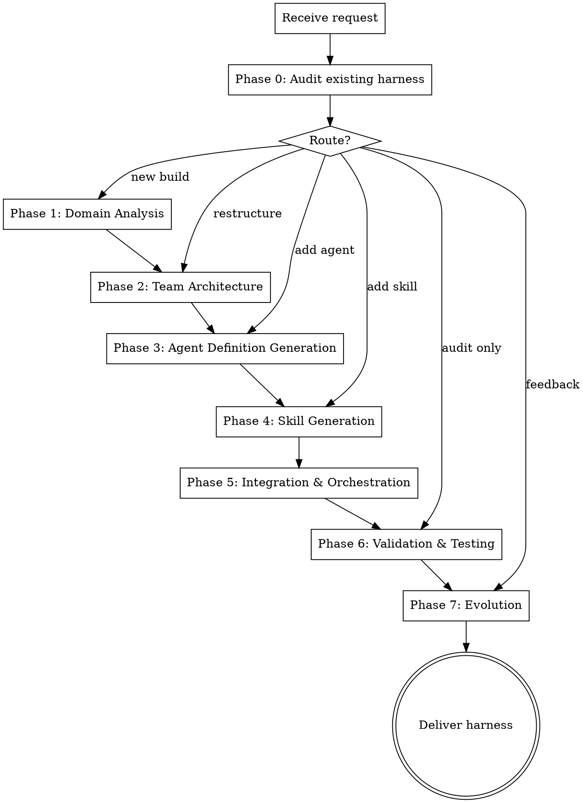

# Harness

Agent Team & Skill Architect. Analyzes a project's domain, tech stack, and workflows, then generates a complete agent team infrastructure — agent definitions in `.claude/agents/`, skills in `.claude/skills/`, and an orchestrator that ties them together. The harness is a living system: it evolves through feedback and iteration.

**Core principle:** Understand the domain deeply, then generate the minimal agent team that covers it completely. Every agent must justify its existence. Every skill must earn its token cost.

<HARD-GATE>
When shipwright:harness is active, it is the sole orchestrator. Do NOT invoke shipwright:run, shipwright:auto-plan, or any other shipwright pipeline skill. The harness generates infrastructure — it does not execute development tasks. If the user's request is "build X" (a feature), route them to shipwright:run. If their request is "build a harness for this project" or "design an agent team," this is the right skill.

Do NOT generate agent definitions as inline prompts in Agent tool calls. Agent definitions MUST be files in `.claude/agents/`. Do NOT generate skills without testing their triggers. Do NOT skip CLAUDE.md registration — without it, the harness is invisible in future sessions.
</HARD-GATE>

## Iron Law

```
EVERY AGENT MUST JUSTIFY ITS EXISTENCE WITH A UNIQUE CAPABILITY THAT NO OTHER AGENT PROVIDES.
```

Agent sprawl is worse than no agents at all. If two agents overlap, merge them. If an agent's role can be handled by a skill alone, it doesn't need to be an agent. Fewer, sharper agents beat many, blurry ones.

## When to Use

- When you need to generate a project-specific agent team
- When auditing or extending an existing harness
- When the user says "build a harness," "design agent team," "add an agent," etc.
- When a project would benefit from specialized agents for its domain

## The Pipeline



## Phase 0: Audit Existing Harness

Before generating anything, inspect the current state:

1. **Check for existing harness artifacts:**
   - `.claude/agents/*.md` — existing agent definitions
   - `.claude/skills/*/SKILL.md` — existing skill definitions
   - `CLAUDE.md` — harness registration section
   - `_workspace/harness/` — intermediate artifacts from previous runs

2. **Classify the request:**

| State | User Intent | Route |
|-------|------------|-------|
| No harness exists | "Build a harness" | Full pipeline (Phase 1-7) |
| Harness exists | "Add an agent for X" | Phase 0 → 3 → 5 → 6 |
| Harness exists | "Add a skill for Y" | Phase 0 → 4 → 5 → 6 |
| Harness exists | "Restructure the team" | Phase 0 → 2 → 3 → 4 → 5 → 6 |
| Harness exists | "Audit/inspect harness" | Phase 0 → 6 |
| Harness exists | "Here's feedback on X" | Phase 0 → 7 |

3. **Save audit state:**
   - Create `_workspace/harness/` if it doesn't exist
   - Write `_workspace/harness/audit.md` with findings: what exists, what's missing, what's stale
   - This directory is the harness's working memory — never delete it

4. **Output:**
   ```
   [harness] Phase 0: Audit complete — [new build | extending existing | restructuring | audit only]
   [harness] Found: [N agents, M skills, orchestrator: yes/no, CLAUDE.md: registered/not]
   ```

## Phase 1: Domain Analysis

Deeply understand the project before designing anything:

### 1.1 Technical Stack Detection

Scan the project to identify:
- **Languages and frameworks** — package.json, requirements.txt, go.mod, Cargo.toml, *.csproj, etc.
- **Architecture** — monolith, microservices, monorepo, plugin system, etc.
- **Build system** — npm/yarn/pnpm, pip/poetry, make, cargo, msbuild, etc.
- **Test infrastructure** — frameworks, coverage tools, E2E setup
- **CI/CD** — GitHub Actions, GitLab CI, Azure DevOps, etc.
- **Infrastructure** — Docker, Kubernetes, cloud services, databases
- **Domain-specific tools** — CMS, ORM, API framework, state management, etc.

### 1.2 Workflow Analysis

Read the project to understand how work flows through it:
- **Development workflow** — how features go from idea to production
- **Common task types** — what kinds of work happen repeatedly?
- **Pain points** — what's slow, error-prone, or tedious?
- **Integration points** — external APIs, databases, services, third-party systems
- **Content/data flow** — how data enters, transforms, and exits the system

### 1.3 User Profile Assessment

Understand who will use this harness:
- **Skill level** — junior, mid, senior, mixed team?
- **Team size** — solo developer, small team, large team?
- **Domain knowledge** — deep domain expert, generalist, learning?
- **Autonomy preference** — wants full control, or prefers delegation?

### 1.4 Domain Complexity Mapping

Identify the axes of complexity that agents need to cover:

| Axis | Questions |
|------|-----------|
| **Breadth** | How many distinct concern areas? (auth, payments, content, search, etc.) |
| **Depth** | How deep is domain knowledge per area? (shallow CRUD vs. complex business rules) |
| **Integration** | How many external systems? (APIs, databases, message queues) |
| **Quality** | What quality gates exist? (testing, review, compliance, accessibility) |
| **Operations** | What operational concerns? (monitoring, deployment, scaling, security) |

Save analysis to `_workspace/harness/domain-analysis.md`.

**Output:**
```
[harness] Phase 1: Domain analysis complete
[harness] Stack: [languages] + [frameworks] | Architecture: [type]
[harness] Identified [N] concern areas, [M] integration points
```

## Phase 2: Team Architecture

Design the agent team structure based on domain analysis.

### 2.1 Execution Mode Selection

Choose the execution model. Read `references/agent-design-patterns.md` for the full taxonomy.

**Decision tree:**
- 2+ agents that MUST communicate with each other during execution → **Agent Teams** (`TeamCreate` + `SendMessage`)
- Agents work independently and only report to a coordinator → **Subagents** (`Agent` tool)
- Single specialist agent → **Subagent** (simplest)

**Default: Agent Teams.** Subagents are appropriate when agents are truly independent and don't need to share discoveries mid-execution.

### 2.2 Architecture Pattern Selection

Choose from the 6 patterns in `references/agent-design-patterns.md`:

| Pattern | When to Use |
|---------|------------|
| **Pipeline** | Sequential dependent phases (build → test → deploy) |
| **Fan-out/Fan-in** | Parallel independent analysis (multi-angle research, parallel reviews) |
| **Expert Pool** | Context-dependent routing (different specialists for different file types) |
| **Producer-Reviewer** | Generate-then-validate loops (write code → review → fix → re-review) |
| **Supervisor** | Dynamic task distribution (batch processing, migration) |
| **Hierarchical** | Top-down delegation (project lead → team leads → workers) |

**Composite patterns** are common and encouraged. A development pipeline might use Pipeline (overall) + Fan-out (parallel reviews) + Producer-Reviewer (implementation).

### 2.3 Agent Separation Criteria

For each candidate agent, verify it passes all 4 axes:

| Axis | Test | Fail → Action |
|------|------|---------------|
| **Expertise** | Does this agent need specialized domain knowledge distinct from others? | Merge with closest neighbor |
| **Parallelism** | Can this agent's work run in parallel with others? | If always sequential, consider merging |
| **Context burden** | Would including this agent's context overload another agent? | Keep separate |
| **Reusability** | Will this agent be useful across multiple workflows? | If not, make it a skill instead |

### 2.4 Team Size Constraints

| Project Size | Recommended Team | Reasoning |
|-------------|-----------------|-----------|
| Small (1-5 files) | 1-2 agents | Overhead of coordination > benefit |
| Medium (5-20 files) | 2-4 agents | Sweet spot for specialization |
| Large (20+ files) | 3-6 agents | More than 6 creates coordination overhead |

**Never exceed 8 agents.** If you think you need more, you need a hierarchical pattern with sub-teams.

### 2.5 Architecture Document

Save the team design to `_workspace/harness/team-architecture.md`:

```markdown
# Team Architecture

## Execution Mode
[Agent Teams | Subagents]

## Pattern
[Pattern name] (+ [composite patterns if any])

## Agent Roster

### [Agent Name]
- **Role:** [one sentence]
- **Justification:** [why this can't be merged with another agent]
- **Type:** [general-purpose | Explore | Plan | custom]
- **Inputs:** [what it receives]
- **Outputs:** [what it produces]
- **Communicates with:** [other agents, if Agent Teams mode]

## Data Flow
[How information flows between agents]

## Error Handling
[What happens when an agent fails]
```

**Output:**
```
[harness] Phase 2: Architecture designed
[harness] Mode: [Agent Teams/Subagents] | Pattern: [name]
[harness] Agents: [list of agent names and roles]
```

## Phase 3: Agent Definition Generation

Generate `.claude/agents/{name}.md` files for each agent in the roster.

### 3.1 Agent Definition Structure

Every agent definition MUST include these sections:

```markdown
# [Agent Name]

[One paragraph: who this agent is, what it does, and why it exists]

## Core Role

[2-3 sentences defining the agent's primary responsibility]

## Work Principles

1. [Principle 1 — the most important behavioral rule]
2. [Principle 2]
3. [Principle 3]
...

## Input Protocol

**Receives:**
- [Input 1]: [description and format]
- [Input 2]: [description and format]

**Required context:**
- [What must be provided for the agent to function]

## Output Protocol

**Produces:**
- [Output 1]: [description and format]
- [Output 2]: [description and format]

**Completion signal:**
- [How the agent signals it is done]
- [What constitutes success vs failure]

## Team Communication Protocol

*(Only for Agent Teams mode)*

**Reports to:** [agent name or "orchestrator"]
**Receives from:** [agent names]
**Shares discoveries with:** [agent names]
**Escalates to:** [agent name — for blockers]

**Communication format:**
- Status updates: `[agent-name] STATUS: [working | blocked | complete]`
- Discovery sharing: `[agent-name] DISCOVERY: [finding that other agents need]`
- Escalation: `[agent-name] BLOCKED: [reason] — need [specific help]`

## Error Handling

| Error Type | Action |
|-----------|--------|
| Missing input | [specific response] |
| External service failure | [specific response] |
| Quality gate failure | [specific response] |
| Timeout | [specific response] |

## Domain Knowledge

[Domain-specific knowledge this agent needs — coding patterns, conventions,
business rules, API contracts, etc. This section can be extensive for
specialized agents.]
```

### 3.2 Model Selection

Specify the model for each agent based on task complexity:

| Task Type | Model | Reasoning |
|-----------|-------|-----------|
| Deep analysis, architecture decisions | `opus` | Needs strongest reasoning |
| Standard implementation, review | default (inherits parent) | Good balance |
| Mechanical tasks, formatting, simple transforms | `haiku` | Fast, cheap, sufficient |

**Include model in every Agent tool call.** Explicitly. Never assume the default is right.

### 3.3 Writing Quality Standards

Agent definitions must be:
- **Command tone** — imperative verbs, direct instructions
- **Why-first** — explain reasons, not just rules. "Check imports because circular dependencies break the build" not just "Check imports."
- **Specific** — exact file paths, exact commands, exact formats. Never "appropriate" or "relevant."
- **Honest about limitations** — if the agent can't handle a case, say so and define the escalation path.

### 3.4 CLAUDE.md Incremental Sync

After generating ALL agent definitions, register them in `CLAUDE.md`:

```markdown
## Agent Team

This project uses a harness-generated agent team. The following agents are available:

| Agent | Role | File |
|-------|------|------|
| [name] | [one-line role] | `.claude/agents/[name].md` |
| ... | ... | ... |

To invoke the team, use: `/[orchestrator-skill-name]`
```

**Why incremental sync?** If the harness crashes mid-generation, the already-generated agents are still registered and usable. Don't wait until Phase 5 to register anything.

**Output:**
```
[harness] Phase 3: Generated [N] agent definitions
[harness] Agents: [list with file paths]
[harness] CLAUDE.md updated with agent roster
```

## Phase 4: Skill Generation

Generate `.claude/skills/{name}/SKILL.md` files for each workflow the team supports.

### 4.1 Skill Categories

Every harness needs at minimum:

| Category | Purpose | Example |
|----------|---------|---------|
| **Orchestrator** | Invokes and coordinates the agent team | `project:run`, `project:review` |
| **Domain skills** | Specialized workflows for the project's domain | `project:deploy`, `project:migrate` |
| **Utility skills** | Common operations that don't need the full team | `project:lint`, `project:check` |

### 4.2 Skill Writing Standards

Follow the guide in `references/skill-writing-guide.md`. Key rules:

**Description is the trigger mechanism.** Claude only sees name + description to decide whether to load a skill. The description MUST be aggressive — list every phrase that should trigger it. Err on the side of triggering too often (the skill can decline) rather than never triggering.

**Progressive Disclosure.** Three tiers of context loading:
1. **Metadata** (always loaded): name + description (~100 words max in description)
2. **SKILL.md body** (loaded on trigger): the main instructions (<500 lines)
3. **References** (loaded on demand): `references/*.md` — detailed guides, templates, examples

This matters because context window is a shared resource. A skill that loads 2000 lines of instructions on every trigger wastes tokens on every conversation, even when the skill isn't used.

**Structure every skill with:**
- YAML frontmatter (name, description)
- One-paragraph summary
- Iron Law (the one rule that overrides everything)
- Process flow (dot graph for complex skills)
- Detailed phase descriptions
- Red Flags table (common mistakes to avoid)
- Integration section (how it connects to other skills/agents)

### 4.3 Orchestrator Skill Generation

The orchestrator is the most important skill. It coordinates the agent team. Read `references/orchestrator-template.md` for full templates.

**The orchestrator MUST:**
1. Accept a task description
2. Decompose it into agent assignments
3. Invoke agents (via TeamCreate/SendMessage or Agent tool)
4. Monitor progress
5. Handle failures (retry, reassign, escalate)
6. Collect and integrate outputs
7. Deliver the final result

**The orchestrator MUST NOT:**
- Do the actual work itself (delegate to agents)
- Make domain decisions (agents have the domain knowledge)
- Skip error handling ("it usually works" is not a strategy)

### 4.4 CLAUDE.md Incremental Sync

After generating skills, register them:

```markdown
## Skills

| Skill | Purpose | Trigger |
|-------|---------|---------|
| `[prefix]:[name]` | [one-line purpose] | `/[prefix]:[name]` |
| ... | ... | ... |
```

**Output:**
```
[harness] Phase 4: Generated [N] skills
[harness] Skills: [list with trigger commands]
[harness] CLAUDE.md updated with skill roster
```

## Phase 5: Integration & Orchestration

Wire everything together.

### 5.1 Data Flow Verification

For every agent-to-agent data flow in the architecture:
1. Verify the producing agent's output format matches the consuming agent's input format
2. Verify the orchestrator passes data correctly (not just invokes agents and hopes)
3. Verify error propagation — if Agent A fails, does Agent B know?

### 5.2 CLAUDE.md Final Registration

Write the complete harness section to `CLAUDE.md`:

```markdown
## Harness

This project's agent team was generated by `shipwright:harness`.

### Agents
[Full agent table from Phase 3]

### Skills
[Full skill table from Phase 4]

### Architecture
- **Pattern:** [pattern name]
- **Execution mode:** [Agent Teams | Subagents]

### Usage
- Full pipeline: `/[orchestrator-skill]`
- Individual skills: `/[prefix]:[skill-name]`
- To update the harness: `/shipwright:harness`

### Configuration
[Any project-specific configuration the harness uses]
```

### 5.3 Workspace Artifact Preservation

Save the complete harness blueprint to `_workspace/harness/blueprint.md`:
- Domain analysis
- Team architecture
- Agent roster with justifications
- Skill inventory
- Data flow diagram
- Design decisions and rationale

This is the audit trail. It explains *why* the harness was designed this way, not just *what* it contains.

**Output:**
```
[harness] Phase 5: Integration complete
[harness] Data flows verified, CLAUDE.md registered, blueprint saved
```

## Phase 6: Validation & Testing

Verify the harness actually works.

### 6.1 Structural Validation

| Check | Pass Condition |
|-------|---------------|
| Agent files exist | Every agent in roster has `.claude/agents/{name}.md` |
| Skill files exist | Every skill has `.claude/skills/{name}/SKILL.md` |
| CLAUDE.md registered | Harness section present with correct paths |
| No orphan agents | Every agent is referenced by at least one skill |
| No orphan skills | Every skill is listed in CLAUDE.md |
| Model specified | Every Agent tool call in orchestrator specifies model |
| Agent definitions complete | Every agent has all required sections |
| Descriptions are aggressive | Every skill description includes trigger phrases |

### 6.2 Trigger Testing

For each skill, verify the description triggers correctly:

1. **Should-trigger prompts** (5+ per skill):
   - Explicit: "run the [skill name]"
   - Implicit: natural-language requests that should activate the skill
   - Variations: formal, casual, terse, verbose

2. **Should-NOT-trigger prompts** (5+ per skill):
   - Adjacent: requests that are close but belong to a different skill
   - Unrelated: requests that shouldn't activate any harness skill
   - Ambiguous: requests where the right skill is non-obvious

**Test method:** For each prompt, read the skill description and honestly assess: would Claude trigger this skill? If the answer is "maybe not," the description needs strengthening.

### 6.3 Dry Run

If the project has a real codebase, perform a dry run:
1. Pick a simple, representative task for the domain
2. Mentally walk through the orchestrator with that task
3. For each agent invocation, verify:
   - The agent has enough context to start
   - The expected output format is clear
   - The orchestrator knows what to do with the output
4. Identify gaps: missing context, unclear handoffs, unhandled errors

### 6.4 With-Skill vs Without-Skill Comparison

For the orchestrator skill specifically:
- **With harness:** How would Claude handle a domain task using the agent team?
- **Without harness:** How would Claude handle the same task with no agent infrastructure?
- **Expected delta:** The harness should produce higher quality through specialization, parallelism, and structured review.

If the harness doesn't clearly improve over baseline Claude, the harness is adding overhead without value. Simplify it.

### 6.5 Validation Report

Save to `_workspace/harness/validation.md`:

```markdown
# Harness Validation Report

## Structural Checks
| Check | Status | Notes |
|-------|--------|-------|
| ... | PASS/FAIL | ... |

## Trigger Test Results
| Skill | Should-Trigger (N/N) | Should-NOT-Trigger (N/N) |
|-------|---------------------|-------------------------|
| ... | ... | ... |

## Dry Run
- Task: [description]
- Result: [passed | identified gaps]
- Gaps: [list]

## Verdict: [READY | NEEDS_FIXES]
```

**Output:**
```
[harness] Phase 6: Validation complete — [READY | NEEDS_FIXES]
[harness] Structural: [N/M passed] | Triggers: [N/M passed] | Dry run: [passed | gaps found]
```

**If NEEDS_FIXES:** Loop back to the appropriate phase (3, 4, or 5) and fix the issues. Max 2 fix cycles.

## Phase 7: Evolution

The harness is a living system. This phase sets up the feedback loop.

### 7.1 Feedback Collection

After each use of the harness (tracked in `_workspace/harness/run-log.md`):
- What worked well?
- What agent struggled or produced low-quality output?
- What skill triggered incorrectly or failed to trigger?
- What data flow broke or was missing?

### 7.2 Feedback-to-Action Mapping

| Feedback Type | Target | Action |
|--------------|--------|--------|
| Agent produced wrong output | Agent definition | Refine instructions, add examples |
| Agent missed edge case | Agent domain knowledge | Add domain knowledge section |
| Skill didn't trigger | Skill description | Add trigger phrases |
| Skill triggered incorrectly | Skill description | Add NOT-trigger conditions |
| Wrong agent for the task | Team architecture | Reassign responsibilities |
| Missing capability | Agent roster | Add new agent or extend existing |
| Too many agents | Team architecture | Merge overlapping agents |
| Orchestrator lost track | Orchestrator skill | Add checkpoints, improve error handling |

### 7.3 Change Log

Append to `_workspace/harness/changelog.md`:

```markdown
## [Date] — [Change Type]

**Trigger:** [What feedback prompted this change]
**Change:** [What was modified]
**Files affected:** [list]
**Rationale:** [Why this change addresses the feedback]
```

### 7.4 Harness Health Check

Periodically (or when auditing), score the harness:

| Dimension | Score (1-5) | Criteria |
|-----------|------------|----------|
| **Coverage** | | Does the team cover all domain concerns? |
| **Efficiency** | | Are agents well-utilized, not idle or redundant? |
| **Quality** | | Do agents produce high-quality output? |
| **Resilience** | | Does the team handle failures gracefully? |
| **Ergonomics** | | Is the harness easy to invoke and understand? |

**Score < 3 in any dimension:** The harness needs attention in that area. Route to the appropriate phase.

**Output:**
```
[harness] Phase 7: Evolution setup complete
[harness] Feedback loop configured, changelog initialized
```

## Progress Updates

Output progress at every phase transition:

```
[harness] Phase 0: Audit complete — new build
[harness] Phase 1: Domain analysis — [stack] + [framework] | [N] concern areas
[harness] Phase 2: Architecture — [pattern] with [N] agents
[harness] Phase 3: Generating agent [1/N]: [name] ✅
[harness] Phase 3: Generating agent [2/N]: [name] ✅
[harness] Phase 3: CLAUDE.md synced with agent roster
[harness] Phase 4: Generating skill [1/M]: [name] ✅
[harness] Phase 4: CLAUDE.md synced with skill roster
[harness] Phase 5: Integration verified, blueprint saved
[harness] Phase 6: Validation — [READY | NEEDS_FIXES]
[harness] Phase 7: Evolution configured
[harness] COMPLETE: Harness delivered — [N] agents, [M] skills
```

## Adaptation Rules

### Project Size Scaling

| Signal | Small Project | Medium Project | Large Project |
|--------|--------------|----------------|---------------|
| Agent count | 1-2 | 2-4 | 3-6 |
| Skill count | 1-2 (orchestrator + 1) | 3-5 | 5-10 |
| Reference docs | Inline in agent defs | Shared references | Extensive domain guides |
| Orchestrator complexity | Simple sequential | Parallel with sync | Multi-phase with checkpoints |
| Validation depth | Structural + spot check | Full trigger tests | Full validation + dry run |

### Domain Complexity Scaling

| Domain | Agent Focus | Example |
|--------|-----------|---------|
| **CRUD app** | Quality (testing, review) | Implementer + reviewer |
| **Data pipeline** | Correctness (validation, monitoring) | Ingester + validator + monitor |
| **Content platform** | Content quality (generation, moderation) | Writer + editor + moderator |
| **API service** | Reliability (testing, security, ops) | Developer + security auditor + ops |
| **Full-stack app** | Coverage (frontend, backend, infra) | Frontend + backend + infra + QA |

## Anti-Patterns

**Do NOT generate harnesses that:**
- Have agents with overlapping responsibilities (merge them)
- Have agents that only run once in the entire workflow (make them skills instead)
- Use Agent Teams when agents don't communicate (use Subagents)
- Use Subagents when agents need to share discoveries (use Agent Teams)
- Have orchestrators that do the actual work instead of delegating
- Skip CLAUDE.md registration (harness becomes invisible next session)
- Have agent definitions without error handling (agents will fail — plan for it)
- Optimize for the demo case instead of the real workflow
- Generate more agents than the project's complexity warrants

**Do NOT:**
- Copy-paste agent definitions with minor variations (each agent is unique)
- Generate skills without testing triggers (untested triggers don't fire)
- Design for hypothetical future workflows (design for current reality, evolve later)
- Put domain knowledge in the orchestrator (put it in the specialist agents)
- Assume agents will "figure out" communication patterns (specify protocols explicitly)

## Red Flags — STOP

| Thought | Reality |
|---------|---------|
| "This project needs 10 agents" | No it doesn't. Start with 3-4 and prove you need more. |
| "Every workflow needs its own agent" | Workflows share agents. Skills define workflows, agents provide capabilities. |
| "The orchestrator can handle this itself" | If it can, you don't need agents for it. But if it's complex, delegate. |
| "Agent Teams are always better" | For independent parallel work, Subagents are simpler and sufficient. |
| "Skip validation, the structure looks right" | Structure isn't correctness. Test the triggers. Run the dry run. |
| "CLAUDE.md can wait until the end" | If you crash at Phase 4, everything from Phase 3 is lost without CLAUDE.md sync. |
| "This agent overlaps with that one, but that's fine" | It's not fine. Merge them or sharpen the boundary. |
| "The user will figure out how to invoke it" | If it's not in CLAUDE.md with clear instructions, it won't be used. |
| "I'll add agents for future needs" | YAGNI. Generate for current reality. Phase 7 handles evolution. |
| "The domain is simple, minimal harness" | Even simple domains benefit from structured agent teams. Don't under-build. |

## Integration

This skill is standalone but complements the shipwright pipeline:

- **shipwright:harness** — generates the agent team infrastructure (this skill)
- **shipwright:run** — executes development tasks (can use harness-generated agents)
- **shipwright:auto-verify** — can verify harness-generated systems against real running instances

The harness generates infrastructure. The shipwright executes within that infrastructure.

## References

Detailed guides are available in `references/`:
- `agent-design-patterns.md` — 6 architecture patterns with decision trees
- `orchestrator-template.md` — complete orchestrator templates for both execution modes
- `team-examples.md` — 5 worked examples across different domains
- `skill-writing-guide.md` — skill authoring best practices and Progressive Disclosure
- `skill-testing-guide.md` — testing methodology for skills and agents
- `qa-agent-guide.md` — QA agent integration and boundary-mismatch patterns

Load these on demand when generating specific components. Do NOT load all references at once — Progressive Disclosure applies to the harness itself.
