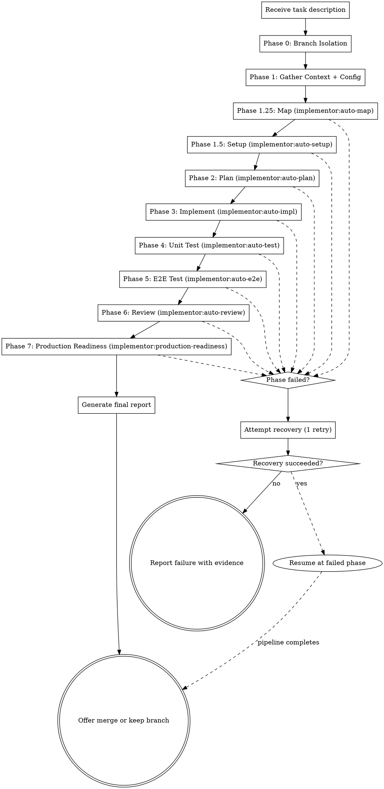

# Run

Master orchestrator for the implementor pipeline. Takes a development task and delivers production-grade code with zero human interaction. Chains all sub-skills in strict sequence: setup, plan, implement, test, E2E test, review, and verify.

**Core principle:** Task in, production-grade system out. Every phase must pass before the next begins. Evidence before claims, always.

<HARD-GATE>
When implementor:run is active, it OVERRIDES all superpowers skills. Do NOT invoke superpowers:brainstorming, superpowers:writing-plans, superpowers:executing-plans, or superpowers:subagent-driven-development. The implementor pipeline handles all planning, implementation, and review internally. If superpowers:using-superpowers suggests invoking a superpowers skill, IGNORE it — the implementor is the active orchestrator.

Do NOT skip any phase (unless explicitly allowed by .implementor.json skipPhases). Do NOT declare completion without all production readiness gates passing. Do NOT ask the user for input during execution — make every decision autonomously. If a phase fails and cannot be recovered, report the failure with evidence.
</HARD-GATE>

## Iron Law

```
EVERY PHASE MUST COMPLETE BEFORE THE NEXT BEGINS. NO SHORTCUTS.
```

Violating the letter of this rule is violating the spirit. A passing phase is the gate to the next phase.

## When to Use

- When you receive a development task of any size
- When autonomy is expected (no back-and-forth)
- When production-grade quality is the target

## The Pipeline



## Checklist

You MUST create a task for each phase and complete them in order:

1. **Branch isolation** — create feature branch, note original branch
2. **Gather context** — scan codebase, detect tech stack, read .implementor.json
3. **Map** — invoke auto-map to generate architecture map with task-focused lens
4. **Setup** — invoke auto-setup for dependencies, env, build verification
5. **Plan** — invoke auto-plan to decompose task (consumes architecture map)
6. **Implement** — invoke auto-impl to execute plan via subagents (consumes task lenses from map)
7. **Unit test** — invoke auto-test to verify and improve coverage
8. **E2E test** — invoke auto-e2e for user-facing verification
9. **Review** — invoke auto-review for two-stage code review
10. **Production readiness** — invoke production-readiness for final gate
11. **Report** — generate report, offer merge/keep branch

## Progress Updates

Output progress at every phase transition and within long-running phases:

```
[implementor] Phase 0/9: Creating branch implementor/add-user-auth
[implementor] Phase 1/10: Gathering context (detected: Node.js + Vitest + Express)
[implementor] Phase 1.25/10: Mapping architecture (12 modules, 3 hot spots, task lens: 120 lines)
[implementor] Phase 1.5/10: Setting up environment (npm ci)
[implementor] Phase 2/10: Planning (decomposed into 5 tasks)
[implementor] Phase 3/10: Implementing task 1/5 — UserModel
[implementor] Phase 3/10: Implementing task 2/5 — AuthService
[implementor] Phase 3/10: Implementing task 3/5 — AuthController
[implementor] Phase 3/10: Implementing task 4/5 — AuthMiddleware
[implementor] Phase 3/10: Implementing task 5/5 — Routes
[implementor] Phase 4/10: Testing (coverage: 62% -> 84%)
[implementor] Phase 5/10: E2E testing (web app detected, 8 scenarios)
[implementor] Phase 6/10: Reviewing (spec: ✅, quality: cycle 1/3)
[implementor] Phase 7/10: Production readiness (8/10 gates passed, fixing...)
[implementor] COMPLETE: All gates passed. Branch: implementor/add-user-auth
```

**Output these as plain text between tool calls.** The user should see continuous progress, not silence.

## Phase Tracking (MANDATORY)

Before executing ANY phase, you MUST:
1. Create a task via TaskCreate: "Phase N: [name]"
2. Set task status to `in_progress` via TaskUpdate
3. Invoke the sub-skill via the `Skill` tool (NOT by reading the SKILL.md and following it inline)
4. Wait for the skill invocation to complete
5. Update the task status to `completed` via TaskUpdate
6. **Create a checkpoint:** `git tag "implementor/phase-N-[name]"` — so the pipeline can roll back or resume if a later phase fails
7. Output the progress update text
8. Only then proceed to the next phase

**NEVER skip the Skill tool invocation.** Reading a skill's SKILL.md file and following its instructions inline is NOT the same as invoking it as a skill. Inline execution pollutes the orchestrator's context and breaks isolation between phases.

## Pipeline Adaptation

The pipeline runs all phases every time, but the *depth* of each phase adapts to the task size:

| Signal | Small Task (1-3 files) | Medium Task (4-10 files) | Large Task (10+ files) |
|--------|----------------------|------------------------|----------------------|
| Plan tasks | 1-3 | 3-8 | 8+ |
| Impl model default | sonnet | default | opus for architecture tasks |
| Test coverage iterations | Max 2 | Max 3 | Max 3 |
| E2E scenarios | 2-3 focused | 5-8 with adversarial | 10+ with stateful journeys |
| Review fidelity scope | Top 2 functions | Top 5 functions | Top 5 + all public APIs |
| Load testing | Skip (unless server) | Light (20 users, 30s) | Full (100 users, 60s) |
| Gate 11 depth | Quick sentence check | Full requirement table | Full table + implicit requirements |

**Detection:** Estimate task size from the plan's file count and task count. If the plan has 2 tasks touching 2 files, it's small. If it has 12 tasks touching 15 files, it's large.

**This is not about skipping gates.** Every gate still runs. But a 1-file bug fix doesn't need 10 E2E scenarios and a load test. Adapt the depth, not the breadth.

## Cross-Phase Signal Propagation

Each phase produces signals that downstream phases should use. The orchestrator is responsible for passing these signals forward:

| Source Phase | Signal | Consuming Phase | How Used |
|-------------|--------|----------------|----------|
| Map | Architecture map (full) | Plan, Review, Test | Module boundaries, dependency graph, patterns, hot spots |
| Map | Task-focused lens | Impl (per subagent), Debug, Verify | Compressed context for subagent consumption (max 150 lines) |
| Map | Hot spot warnings | Plan, Impl, Review | Flag high-risk modules for stronger models and extra review |
| Map | Dependency graph (code + build) | Debug, Verify, Plan, Impl | Trace root causes, order tasks by build deps, verify compilation between tasks |
| Map | Data models + consumers | Plan, Debug, Review, Test | Detect atomic change groups, assess change blast radius, write contract tests |
| Map | Test classification | Debug, Test | Distinguish unit/integration/contract/e2e for targeted verification |
| Map | Shared configuration | Plan, Debug, Review, Verify | Detect shared config conflicts, assess config change impact |
| Map | Contract test gaps | Test | Write missing contract tests at module boundaries |
| Setup | Environment fingerprint | Debug | Distinguishes code bugs from env bugs |
| Setup | Task-specific pre-flight findings | Plan, Impl | Informs task decomposition, reveals constraints |
| Plan | Plan retrospective from previous runs | Plan | Avoids repeating past mistakes |
| Plan | Task viability verdicts | Impl | Flagged tasks get more context or stronger models |
| Impl | Inter-task learning log | Impl (next task) | Real interfaces, patterns, and surprises |
| Impl | Cascading breakage incidents | Review (plan feedback) | Indicates wrong decomposition |
| Test | Testability audit results | Review | Reviewer knows which code was untestable and why |
| Test | Honesty check results | Review, Prod Readiness | Downstream knows which tests are shape-only |
| Test | Dropped dishonest tests | Prod Readiness | Coverage gap is explained, not mysterious |
| E2E | Evidence evaluation verdicts | Prod Readiness | Gate 3 knows which evidence is proven vs superficial |
| Review | Behavioral fidelity findings | Prod Readiness | Gate 11 knows if code/test agreement was verified |
| Review | Plan retrospective | Plan (next run) | Written to retrospective file for future use |

**Implementation:** After each phase completes, extract the signals listed above and include them in the context for the next phase's skill invocation. Don't just invoke skills blindly — pass what was learned.

## Pipeline Checkpoint System

After each phase completes successfully, create a checkpoint. Checkpoints enable rollback to the last known-good state and resumption after interruption.

### Creating Checkpoints

After each phase passes its gate:

```bash
git tag "implementor/phase-N-[phase-name]" -m "Phase N complete: [summary]"
```

Example checkpoint sequence:
```
implementor/phase-1.25-map
implementor/phase-1.5-setup
implementor/phase-2-plan
implementor/phase-3-impl
implementor/phase-4-test
implementor/phase-5-e2e
implementor/phase-6-review
implementor/phase-7-readiness
```

### Rollback to Checkpoint

When a phase fails and recovery also fails:

1. Identify the last successful checkpoint: `git tag -l "implementor/phase-*" | tail -1`
2. Roll back: `git reset --hard [checkpoint-tag]`
3. Report what was lost and why
4. If the failure is in a late phase (review, readiness), the rollback preserves all implementation work — only the failing phase's changes are lost

### Resume from Checkpoint

If the pipeline is interrupted (context limit, timeout, crash):

1. On restart, check for existing checkpoint tags: `git tag -l "implementor/phase-*"`
2. If checkpoints exist, identify the last completed phase
3. Resume from the next phase — don't re-run completed phases
4. Re-read the plan from `docs/plans/` and the architecture map from `docs/architecture-map.md` to restore context

### Cleanup

After pipeline completes (success or failure):
```bash
git tag -l "implementor/phase-*" | xargs git tag -d
```

Checkpoint tags are internal bookkeeping — they should not persist after the pipeline run.

## Phase 0: Branch Isolation

Before any work begins, isolate the changes:

1. Verify clean working tree (`git status`). If dirty, report and abort.
2. Note the current branch as `originalBranch`
3. Generate branch name: `implementor/<task-slug>` (lowercase, hyphens, max 50 chars)
   - Read `branch.prefix` from `.implementor.json` if present (default: `implementor`)
4. Create and checkout the feature branch: `git checkout -b implementor/<task-slug>`
5. Output: `[implementor] Phase 0/9: Creating branch implementor/<task-slug>`

**On pipeline failure:** All commits stay on the feature branch. The original branch is untouched. Report the branch name so the user can inspect or delete it.

**On pipeline success:** Offer the user a choice (unless `branch.autoMerge` is true in config):
- Merge into original branch
- Keep the feature branch for PR
- Discard the branch

## Phase 1: Gather Context + Config

Before anything else, understand the battlefield:

1. **Config:** Read `.implementor.json` if it exists. Pass config to all subsequent phases.
2. **Project structure:** Use Glob to map all directories and files
3. **Tech stack:** Read package.json/requirements.txt/go.mod/Cargo.toml/etc.
4. **Test infrastructure:** Find test config, existing tests, coverage setup
5. **Conventions:** Read CLAUDE.md, .editorconfig, linting config
6. **Git state:** Note current branch (should be the new feature branch)
7. **CI/CD:** Check for existing pipelines
8. **Entry points:** Find main files, server start commands, CLI entry points

**Output:** Mental model of the project + parsed config. Used to inform all subsequent phases.

## Phase 1.25: Map

Invoke `implementor:auto-map` with:
- The original task description (for task-scoped lens generation)
- Project context from Phase 1 (tech stack, conventions)

**Output:** Architecture map saved to `docs/architecture-map.md` + task-focused lens for subagent consumption.

**Progress:** `[implementor] Phase 1.25/10: Mapping architecture (N modules, N hot spots, task lens: N lines)`

**The map is passed to every downstream phase.** It is the compressed structural understanding that keeps subagents oriented in large codebases.

## Phase 1.5: Setup

Invoke `implementor:auto-setup` to:
- Install dependencies
- Configure environment files
- Run database migrations (if applicable)
- Verify the project builds
- Verify the test suite can execute

**Output:** Environment ready for implementation and testing.

**Skip if:** `.implementor.json` has `"setup"` in `skipPhases`.

## Invoking Sub-Skills

Use the `Skill` tool to invoke each sub-skill. This ensures proper context isolation. Do NOT read sub-skill SKILL.md files and follow them inline — invoke them as skills.

## Phase 2: Plan

Invoke `implementor:auto-plan` with:
- The original task description
- Context gathered in Phase 1 (tech stack, conventions, test framework)
- Any constraints from the user's request

**Output:** Implementation plan saved to `docs/plans/`.

## Phase 3: Implement

Invoke `implementor:auto-impl` with:
- The plan from Phase 2
- Project context from Phase 1

**Output progress per task:** `[implementor] Phase 3/10: Implementing task N/M — TaskName`

**Output:** Working implementation with initial tests, committed to git.

## Phase 4: Unit Test

Invoke `implementor:auto-test` to:
- Run existing + new tests
- Analyze coverage gaps
- Write additional tests to meet coverage target
- Verify all tests pass

**Output progress:** `[implementor] Phase 4/10: Testing (coverage: X% -> Y%)`

**Output:** Comprehensive test suite meeting coverage targets.

## Phase 5: E2E Test

Invoke `implementor:auto-e2e` to:
- Detect app type (web/API/CLI/library)
- Generate test scenarios from task description
- Execute E2E tests with evidence capture
- Report results

**Output:** E2E test results with screenshots/captures as evidence.

**If app type is library or `skipPhases` includes `"e2e"`:** Skip with documented justification.

## Phase 6: Review

Invoke `implementor:auto-review` to:
- Stage 1: Verify spec compliance
- Stage 2: Verify code quality
- Fix any issues found (max 3 cycles per stage)

**Output progress:** `[implementor] Phase 6/10: Reviewing (spec: ✅, quality: cycle N/3)`

**Output:** Review report (APPROVED / APPROVED_WITH_NOTES).

## Phase 7: Production Readiness

Invoke `implementor:production-readiness` to:
- Run all 10 gates
- Generate load test (if applicable)
- Produce final report with evidence

**Output:** Production readiness verdict with full evidence.

## Error Recovery

If any phase fails, invoke `implementor:auto-debug` to diagnose and resolve:

1. Pass the full error context to auto-debug (command, output, stack trace, files)
2. Auto-debug executes its 6-phase process: reproduce, isolate, trace, hypothesize, fix, verify
3. If auto-debug reports RESOLVED: resume the pipeline from the failed phase
4. If auto-debug reports UNRESOLVED: attempt one manual recovery:
   - Setup phase: try alternative install commands, check prerequisites
   - Plan phase: re-analyze with broader context
   - Impl phase: re-plan the failed task(s) and retry
   - Test phase: investigate test assumptions
   - E2E phase: fix app startup or interaction issues
   - Review phase: fix identified issues and re-review
   - Readiness phase: address failing gates
5. If recovery fails:
   - **Roll back to the last successful checkpoint:** `git reset --hard [last-checkpoint-tag]` — this preserves all work from completed phases while removing the failed phase's broken changes
   - Generate a failure report with:
     - What was accomplished before failure (list completed phases with checkpoint tags)
     - Auto-debug investigation evidence (root cause analysis, hypotheses tested)
     - Exact failure details
     - What would need to change for success
     - All work done so far (committed to the feature branch, rolled back to last good checkpoint)
     - The feature branch name for inspection
     - Which checkpoint the branch is rolled back to

## Autonomous Decision Making

When faced with decisions, apply these defaults:
- **Naming:** Follow existing project conventions, or language idioms if greenfield
- **Architecture:** Match existing patterns, or use the simplest pattern that works
- **Dependencies:** Prefer standard library, add external deps only when clearly needed
- **Test framework:** Use what's already in the project, or the standard for the language
- **Error handling:** Fail fast with useful messages, never swallow errors
- **Logging:** Structured JSON for services, simple for CLIs
- **File organization:** One responsibility per file, group by feature not by type

## Pipeline Integrity Reflection

After all phases complete but before generating the final report, perform one honest self-assessment:

1. **"Did this pipeline produce real quality, or did it just check boxes?"**
   - Did any phase rubber-stamp its output? (e.g., review approved on first pass with zero findings — either the code was perfect or the review was shallow)
   - Did the test suite catch any real bugs during the pipeline, or did everything pass on the first try? (If everything passed first try, either the implementation was flawless or the tests aren't testing hard enough)
   - Did E2E evidence actually prove features work, or just prove pages load?

2. **"Where did the pipeline struggle, and what does that mean?"**
   - If auto-debug was invoked multiple times, the plan may have been wrong
   - If review found many issues, the implementer subagent may have been underpowered
   - If coverage was hard to achieve, the code may have testability problems
   - Document these signals — they make future pipeline runs better

3. **"Would I ship this with my name on it?"**
   - Read the git diff one more time. Not for individual issues (review already covered that) — for overall coherence.
   - Does the code feel like one person wrote it, or like it was assembled by committee?
   - Is the overall approach something a senior engineer would approve, or would they say "this works but I'd do it differently"?

**This reflection is included in the final report as a "Pipeline Quality" section.** It's not a gate — it doesn't block shipping. But it's honest documentation that improves the pipeline over time.

## Retrospective File (Feedback Loop)

After the pipeline completes (success or failure), append learnings to `.implementor-retrospective.md` in the project root. This file is read by `auto-plan` in future runs.

**Format:**

```markdown
## Run: YYYY-MM-DD — [task slug]

**Status:** COMPLETE | PARTIAL | FAILED
**Task size:** small | medium | large

### What went well
- [Phase] — [what worked]

### What went wrong
- [Phase] — [what failed and why]

### Plan quality
- [From auto-review's Plan Retrospective section]

### Signals for future runs
- [Concrete lessons: "tasks touching src/utils always conflict", "this codebase needs mocking library for testability", "API endpoints need auth context in every subagent prompt"]
```

**Rules:**
- Append, never overwrite. The file is a growing log.
- Keep each entry concise (10-15 lines max).
- Only record *actionable* lessons — things that would change how a future run is planned or executed.
- If the file exceeds 100 entries, summarize the oldest 50 into a "Historical Summary" section and remove the individual entries.
- Do not record session-specific details (exact error messages, specific file contents). Record patterns.

## Report Format

After all phases complete, output:

```markdown
# Implementation Report

## Task
[Original task description]

## Status: COMPLETE | PARTIAL | FAILED

## Branch
- Feature branch: `implementor/<task-slug>`
- Original branch: `<original-branch>`

## Summary
[2-3 sentences: what was built, key decisions made]

## Changes
- Files created: [list]
- Files modified: [list]
- Total: +[added] -[removed] lines

## Pipeline Results

| Phase | Status | Details |
|-------|--------|---------|
| Map | ✅ | [module count] modules, [data model count] models, [hot spot count] hot spots, [contract gap count] contract gaps |
| Setup | ✅ | [dependencies installed, build verified] |
| Plan | ✅ | [task count] tasks, [atomic group count] atomic groups, [shared resource conflict count] conflicts resolved |
| Implement | ✅ | [task count] tasks completed, [checkpoint count] checkpoints, [build verification count] builds verified |
| Unit Tests | ✅ | [X] tests, [Y]% line coverage, [Z] contract tests written |
| E2E Tests | ✅/N/A | [X] scenarios passed |
| Code Review | ✅ | Spec: ✅, Fidelity: ✅, Architecture: ✅, Quality: ✅ |
| Prod Readiness | ✅ | [X]/[Y] gates passed |

## Production Readiness Gates
[Full gate table from production-readiness]

## Evidence
[Test output, coverage numbers, screenshots, load test results]

## Pipeline Quality
- Phases that flagged issues: [list — indicates the pipeline is actually catching things]
- Phases that passed first try: [list — either quality was high or the phase wasn't rigorous enough]
- Model escalations: [count and which tasks]
- Dishonest tests dropped: [count, if any]
- Behavioral fidelity concerns found: [count, if any]
- Plan retrospective highlights: [key learnings]
- Symptomatic fixes applied: [count, locations, and deeper fix suggestions]
- Definition of Done verdict: [SOLVED / PARTIALLY_SOLVED / WRONG_PROBLEM]

## Commits
[List of commits made during implementation]
```

## Red Flags - STOP

| Thought | Reality |
|---------|---------|
| "Phase 5 is overkill for this" | The pipeline is the pipeline. All phases, every time. |
| "I'll skip the plan, it's obvious" | Obvious tasks have hidden complexity. Plan it. |
| "Tests pass, let's call it done" | Tests are phase 4 of 9. Keep going. |
| "The user said it's urgent" | Shipping broken code is never urgent. |
| "I need to ask the user about X" | No. Make the decision. Document why. |
| "Recovery failed, try again" | One recovery attempt. Then report failure. |
| "This gate doesn't apply" | Mark N/A with justification. Don't skip silently. |
| "I'll work on the main branch" | Never. Create a feature branch first. |
| "Setup isn't needed, it probably works" | Verify. Don't assume. Run setup. |
| "Every phase passed first try" | Either the code is perfect or the pipeline isn't probing hard enough. Reflect on which. |
| "The pipeline is done, skip the reflection" | The reflection is how the pipeline gets better. Write it. |
| "All gates green means quality" | Green gates mean the gates passed. Quality means the user's problem is solved. Check Gate 11. |

## Integration

This skill is the entry point. It invokes:
- **implementor:auto-map** — Phase 1.25
- **implementor:auto-setup** — Phase 1.5
- **implementor:auto-plan** — Phase 2
- **implementor:auto-impl** — Phase 3
- **implementor:auto-test** — Phase 4
- **implementor:auto-e2e** — Phase 5
- **implementor:auto-review** — Phase 6
- **implementor:production-readiness** — Phase 7
- **implementor:auto-debug** — Error recovery (any phase)
- **implementor:auto-verify** — Iterative runtime verification (standalone, invoke when task involves external system integration)

Each sub-skill is independently usable but designed to chain in this order.

**Configuration:** See `implementor:auto-setup` (`./implementor-config.md`) for `.implementor.json` reference.
