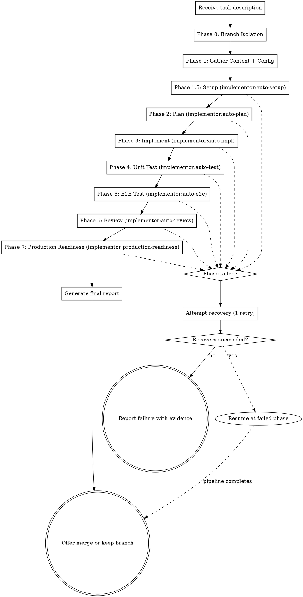

# Run

Master orchestrator for the implementor pipeline. Takes a development task and delivers production-grade code with zero human interaction. Chains all sub-skills in strict sequence: setup, plan, implement, test, E2E test, review, and verify.

**Core principle:** Task in, production-grade system out. Every phase must pass before the next begins. Evidence before claims, always.

<HARD-GATE>
Do NOT skip any phase (unless explicitly allowed by .implementor.json skipPhases). Do NOT declare completion without all production readiness gates passing. Do NOT ask the user for input during execution — make every decision autonomously. If a phase fails and cannot be recovered, report the failure with evidence.
</HARD-GATE>

## Iron Law

```
EVERY PHASE MUST COMPLETE BEFORE THE NEXT BEGINS. NO SHORTCUTS.
```

Violating the letter of this rule is violating the spirit. A passing phase is the gate to the next phase.

## When to Use

- When you receive a development task of any size
- When autonomy is expected (no back-and-forth)
- When production-grade quality is the target

## The Pipeline



## Checklist

You MUST create a task for each phase and complete them in order:

1. **Branch isolation** — create feature branch, note original branch
2. **Gather context** — scan codebase, detect tech stack, read .implementor.json
3. **Setup** — invoke auto-setup for dependencies, env, build verification
4. **Plan** — invoke auto-plan to decompose task
5. **Implement** — invoke auto-impl to execute plan via subagents
6. **Unit test** — invoke auto-test to verify and improve coverage
7. **E2E test** — invoke auto-e2e for user-facing verification
8. **Review** — invoke auto-review for two-stage code review
9. **Production readiness** — invoke production-readiness for final gate
10. **Report** — generate report, offer merge/keep branch

## Progress Updates

Output progress at every phase transition and within long-running phases:

```
[implementor] Phase 0/9: Creating branch implementor/add-user-auth
[implementor] Phase 1/9: Gathering context (detected: Node.js + Vitest + Express)
[implementor] Phase 1.5/9: Setting up environment (npm ci)
[implementor] Phase 2/9: Planning (decomposed into 5 tasks)
[implementor] Phase 3/9: Implementing task 1/5 — UserModel
[implementor] Phase 3/9: Implementing task 2/5 — AuthService
[implementor] Phase 3/9: Implementing task 3/5 — AuthController
[implementor] Phase 3/9: Implementing task 4/5 — AuthMiddleware
[implementor] Phase 3/9: Implementing task 5/5 — Routes
[implementor] Phase 4/9: Testing (coverage: 62% -> 84%)
[implementor] Phase 5/9: E2E testing (web app detected, 8 scenarios)
[implementor] Phase 6/9: Reviewing (spec: ✅, quality: cycle 1/3)
[implementor] Phase 7/9: Production readiness (8/10 gates passed, fixing...)
[implementor] COMPLETE: All gates passed. Branch: implementor/add-user-auth
```

**Output these as plain text between tool calls.** The user should see continuous progress, not silence.

## Phase 0: Branch Isolation

Before any work begins, isolate the changes:

1. Verify clean working tree (`git status`). If dirty, report and abort.
2. Note the current branch as `originalBranch`
3. Generate branch name: `implementor/<task-slug>` (lowercase, hyphens, max 50 chars)
   - Read `branch.prefix` from `.implementor.json` if present (default: `implementor`)
4. Create and checkout the feature branch: `git checkout -b implementor/<task-slug>`
5. Output: `[implementor] Phase 0/9: Creating branch implementor/<task-slug>`

**On pipeline failure:** All commits stay on the feature branch. The original branch is untouched. Report the branch name so the user can inspect or delete it.

**On pipeline success:** Offer the user a choice (unless `branch.autoMerge` is true in config):
- Merge into original branch
- Keep the feature branch for PR
- Discard the branch

## Phase 1: Gather Context + Config

Before anything else, understand the battlefield:

1. **Config:** Read `.implementor.json` if it exists. Pass config to all subsequent phases.
2. **Project structure:** Use Glob to map all directories and files
3. **Tech stack:** Read package.json/requirements.txt/go.mod/Cargo.toml/etc.
4. **Test infrastructure:** Find test config, existing tests, coverage setup
5. **Conventions:** Read CLAUDE.md, .editorconfig, linting config
6. **Git state:** Note current branch (should be the new feature branch)
7. **CI/CD:** Check for existing pipelines
8. **Entry points:** Find main files, server start commands, CLI entry points

**Output:** Mental model of the project + parsed config. Used to inform all subsequent phases.

## Phase 1.5: Setup

Invoke `implementor:auto-setup` to:
- Install dependencies
- Configure environment files
- Run database migrations (if applicable)
- Verify the project builds
- Verify the test suite can execute

**Output:** Environment ready for implementation and testing.

**Skip if:** `.implementor.json` has `"setup"` in `skipPhases`.

## Invoking Sub-Skills

Use the `Skill` tool to invoke each sub-skill. This ensures proper context isolation. Do NOT read sub-skill SKILL.md files and follow them inline — invoke them as skills.

## Phase 2: Plan

Invoke `implementor:auto-plan` with:
- The original task description
- Context gathered in Phase 1 (tech stack, conventions, test framework)
- Any constraints from the user's request

**Output:** Implementation plan saved to `docs/plans/`.

## Phase 3: Implement

Invoke `implementor:auto-impl` with:
- The plan from Phase 2
- Project context from Phase 1

**Output progress per task:** `[implementor] Phase 3/9: Implementing task N/M — TaskName`

**Output:** Working implementation with initial tests, committed to git.

## Phase 4: Unit Test

Invoke `implementor:auto-test` to:
- Run existing + new tests
- Analyze coverage gaps
- Write additional tests to meet coverage target
- Verify all tests pass

**Output progress:** `[implementor] Phase 4/9: Testing (coverage: X% -> Y%)`

**Output:** Comprehensive test suite meeting coverage targets.

## Phase 5: E2E Test

Invoke `implementor:auto-e2e` to:
- Detect app type (web/API/CLI/library)
- Generate test scenarios from task description
- Execute E2E tests with evidence capture
- Report results

**Output:** E2E test results with screenshots/captures as evidence.

**If app type is library or `skipPhases` includes `"e2e"`:** Skip with documented justification.

## Phase 6: Review

Invoke `implementor:auto-review` to:
- Stage 1: Verify spec compliance
- Stage 2: Verify code quality
- Fix any issues found (max 3 cycles per stage)

**Output progress:** `[implementor] Phase 6/9: Reviewing (spec: ✅, quality: cycle N/3)`

**Output:** Review report (APPROVED / APPROVED_WITH_NOTES).

## Phase 7: Production Readiness

Invoke `implementor:production-readiness` to:
- Run all 10 gates
- Generate load test (if applicable)
- Produce final report with evidence

**Output:** Production readiness verdict with full evidence.

## Error Recovery

If any phase fails:
1. Analyze the failure
2. Attempt one recovery:
   - Setup phase: try alternative install commands, check prerequisites
   - Plan phase: re-analyze with broader context
   - Impl phase: re-plan the failed task(s) and retry
   - Test phase: fix failing tests or implementation bugs
   - E2E phase: fix app startup or interaction issues
   - Review phase: fix identified issues and re-review
   - Readiness phase: address failing gates
3. If recovery succeeds, resume the pipeline from the recovered phase
4. If recovery fails, generate a failure report with:
   - What was accomplished before failure
   - Exact failure details with evidence
   - What would need to change for success
   - All work done so far (committed to the feature branch)
   - The feature branch name for inspection

## Autonomous Decision Making

When faced with decisions, apply these defaults:
- **Naming:** Follow existing project conventions, or language idioms if greenfield
- **Architecture:** Match existing patterns, or use the simplest pattern that works
- **Dependencies:** Prefer standard library, add external deps only when clearly needed
- **Test framework:** Use what's already in the project, or the standard for the language
- **Error handling:** Fail fast with useful messages, never swallow errors
- **Logging:** Structured JSON for services, simple for CLIs
- **File organization:** One responsibility per file, group by feature not by type

## Report Format

After all phases complete, output:

```markdown
# Implementation Report

## Task
[Original task description]

## Status: COMPLETE | PARTIAL | FAILED

## Branch
- Feature branch: `implementor/<task-slug>`
- Original branch: `<original-branch>`

## Summary
[2-3 sentences: what was built, key decisions made]

## Changes
- Files created: [list]
- Files modified: [list]
- Total: +[added] -[removed] lines

## Pipeline Results

| Phase | Status | Details |
|-------|--------|---------|
| Setup | ✅ | [dependencies installed, build verified] |
| Plan | ✅ | [task count] tasks in plan |
| Implement | ✅ | [task count] tasks completed |
| Unit Tests | ✅ | [X] tests, [Y]% line coverage |
| E2E Tests | ✅/N/A | [X] scenarios passed |
| Code Review | ✅ | Spec: ✅, Quality: ✅ |
| Prod Readiness | ✅ | [X]/[Y] gates passed |

## Production Readiness Gates
[Full gate table from production-readiness]

## Evidence
[Test output, coverage numbers, screenshots, load test results]

## Commits
[List of commits made during implementation]
```

## Red Flags - STOP

| Thought | Reality |
|---------|---------|
| "Phase 5 is overkill for this" | The pipeline is the pipeline. All phases, every time. |
| "I'll skip the plan, it's obvious" | Obvious tasks have hidden complexity. Plan it. |
| "Tests pass, let's call it done" | Tests are phase 4 of 9. Keep going. |
| "The user said it's urgent" | Shipping broken code is never urgent. |
| "I need to ask the user about X" | No. Make the decision. Document why. |
| "Recovery failed, try again" | One recovery attempt. Then report failure. |
| "This gate doesn't apply" | Mark N/A with justification. Don't skip silently. |
| "I'll work on the main branch" | Never. Create a feature branch first. |
| "Setup isn't needed, it probably works" | Verify. Don't assume. Run setup. |

## Integration

This skill is the entry point. It invokes:
- **implementor:auto-setup** — Phase 1.5
- **implementor:auto-plan** — Phase 2
- **implementor:auto-impl** — Phase 3
- **implementor:auto-test** — Phase 4
- **implementor:auto-e2e** — Phase 5
- **implementor:auto-review** — Phase 6
- **implementor:production-readiness** — Phase 7

Each sub-skill is independently usable but designed to chain in this order.

**Configuration:** See `implementor:auto-setup` (`./implementor-config.md`) for `.implementor.json` reference.
